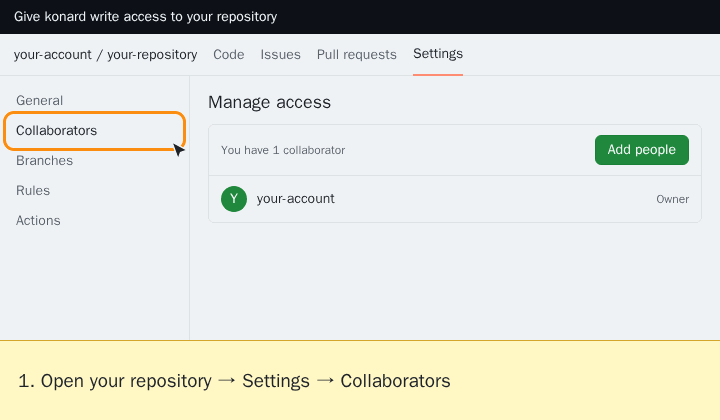

# Giving Hive Mind access to a repository (languages: en • [zh](GITHUB-ACCESS.zh.md) • [hi](GITHUB-ACCESS.hi.md) • [ru](GITHUB-ACCESS.ru.md))

Hive Mind works through an ordinary GitHub account. To work on a private repository, or to push branches and open pull requests in a repository it does not own, that account needs **write access**. When it is missing, Hive Mind replies with "Repository '…' is not accessible" (GitHub answers 404 for private repositories an account cannot see) or with a "cannot push" message. Both name the account to invite and link the steps below.

The examples use the account `konard`. Replace it with the account named in the message; the bot shows it in the reply, and `gh api user --jq .login` prints it on the host.

## Personal repository



1. Open `https://github.com/OWNER/REPO/settings/access` (**Settings → Collaborators**).
2. Click **Add people**, search for the account and click **Add … to REPO**. Collaborators on a personal repository can always push, so there is no role to choose.
3. Run the command again. Hive Mind accepts the pending invitation automatically (`--auto-accept-invite` is on by default). Otherwise, sign in as that account and accept it at `https://github.com/OWNER/REPO/invitations`, or send `/accept_invites` to the bot.

GitHub Docs: [Inviting a collaborator to a personal repository](https://docs.github.com/en/repositories/managing-your-repositorys-settings-and-features/repository-access-and-collaboration/inviting-collaborators-to-a-personal-repository#inviting-a-collaborator-to-a-personal-repository) · [Collaborator access](https://docs.github.com/en/repositories/managing-your-repositorys-settings-and-features/repository-access-and-collaboration/permission-levels-for-a-personal-account-repository#collaborator-access-for-a-repository-owned-by-a-personal-account)

## Organization repository


1. Open `https://github.com/OWNER/REPO/settings/access` (**Settings → Collaborators and teams**).
2. Click **Add people**, search for the account, choose the **Write** role and click **Add … to REPO**.
3. Run the command again, as above.

If the account already has **Read** access, Hive Mind can see the repository but cannot push. Find the account under **Manage access** and change its role to **Write**.

GitHub Docs: [Inviting a team or person](https://docs.github.com/en/repositories/managing-your-repositorys-settings-and-features/managing-repository-settings/managing-teams-and-people-with-access-to-your-repository#inviting-a-team-or-person) · [Changing permissions for a team or person](https://docs.github.com/en/repositories/managing-your-repositorys-settings-and-features/managing-repository-settings/managing-teams-and-people-with-access-to-your-repository#changing-permissions-for-a-team-or-person) · [Permissions for each role](https://docs.github.com/en/organizations/managing-user-access-to-your-organizations-repositories/managing-repository-roles/repository-roles-for-an-organization#permissions-for-each-role)

## Animations for your own account

The animations above were recorded for `konard`. A Hive Mind host renders the same animation for the account it runs as, once per account, owner type and language, and reuses the file afterwards. The Telegram bot sends it along with the "not accessible" reply. Files are kept in `~/.hive-mind/guides/github-access/`, or in `$HIVE_MIND_GUIDES_DIR/github-access/` when that variable is set. Rendering uses [browser-commander](https://github.com/link-foundation/browser-commander) and the Playwright Chromium that ships with the Hive Mind images.

To render one by hand:

```bash
node src/github-access-animation.lib.mjs --login my-bot --locale en                        # cached in the guides folder
node src/github-access-animation.lib.mjs --login my-bot --locale ru --owner-type Organization --output org-ru.gif
```

The animation is a simplified mock of GitHub's settings page, not a screenshot, so it never contains anyone's real repositories. If a language's script cannot be rendered on the host (missing fonts), the captions fall back to English.

## Other GitHub settings Hive Mind may ask about

Other messages link GitHub Docs where a GitHub setting is the fix:

- [Allowing edits by maintainers](https://docs.github.com/en/pull-requests/how-tos/work-with-forks/allowing-changes-to-a-pull-request-branch-created-from-a-fork#enabling-repository-maintainer-permissions-on-existing-pull-requests), for pull requests from forks
- [Managing the forking policy](https://docs.github.com/en/repositories/managing-your-repositorys-settings-and-features/managing-repository-settings/managing-the-forking-policy-for-your-repository), when a fork cannot be created
- [Token scopes](https://docs.github.com/en/apps/oauth-apps/building-oauth-apps/scopes-for-oauth-apps#available-scopes), when `gh` lacks a scope (`gh auth refresh -s SCOPE`)
- [Rate limits](https://docs.github.com/en/rest/using-the-rest-api/rate-limits-for-the-rest-api), when GitHub throttles requests
- [Protected branches](https://docs.github.com/en/repositories/configuring-branches-and-merges-in-your-repository/managing-protected-branches/about-protected-branches) and [rulesets](https://docs.github.com/en/repositories/configuring-branches-and-merges-in-your-repository/managing-rulesets/about-rulesets), when a push or merge is rejected

Links open in the reader's language where GitHub Docs publishes one (en, es, ja, pt, zh, ru, fr, ko, de), and in English otherwise.
