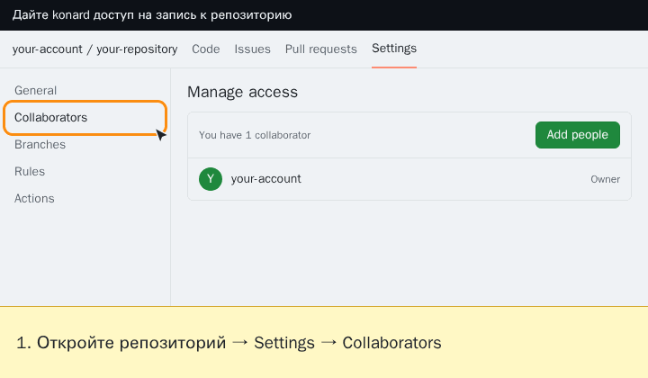
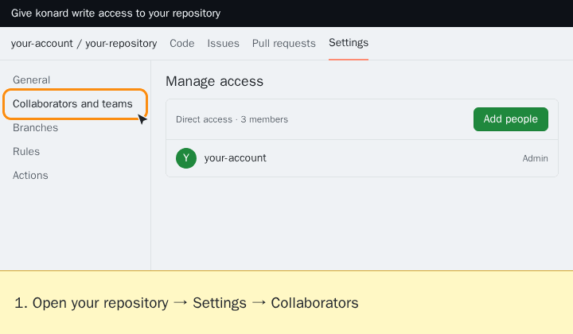

# Как дать Hive Mind доступ к репозиторию (languages: [en](GITHUB-ACCESS.md) • [zh](GITHUB-ACCESS.zh.md) • [hi](GITHUB-ACCESS.hi.md) • ru)

Hive Mind работает через обычный аккаунт GitHub. Чтобы работать с приватным репозиторием или отправлять ветки и открывать pull request в чужом репозитории, этому аккаунту нужен **доступ на запись**. Если его нет, Hive Mind отвечает «Репозиторий '…' недоступен» (для приватных репозиториев, которые аккаунт не видит, GitHub возвращает 404) или сообщением о том, что отправка изменений невозможна. В обоих сообщениях указан аккаунт, который нужно пригласить, и ссылка на шаги ниже.

В примерах используется аккаунт `konard`. Замените его на аккаунт из сообщения: бот называет его в ответе, а на хосте его выводит `gh api user --jq .login`.

## Личный репозиторий



1. Откройте `https://github.com/OWNER/REPO/settings/access` (**Settings → Collaborators**).
2. Нажмите **Add people**, найдите аккаунт и нажмите **Add … to REPO**. Соавторы личного репозитория всегда могут отправлять изменения, поэтому роль выбирать не нужно.
3. Запустите команду ещё раз. Hive Mind примет приглашение сам (`--auto-accept-invite` включён по умолчанию). Иначе войдите в этот аккаунт и примите приглашение на `https://github.com/OWNER/REPO/invitations` или отправьте боту `/accept_invites`.

GitHub Docs: [Приглашение соавтора в личный репозиторий](https://docs.github.com/ru/repositories/managing-your-repositorys-settings-and-features/repository-access-and-collaboration/inviting-collaborators-to-a-personal-repository#inviting-a-collaborator-to-a-personal-repository) · [Доступ соавторов](https://docs.github.com/ru/repositories/managing-your-repositorys-settings-and-features/repository-access-and-collaboration/permission-levels-for-a-personal-account-repository#collaborator-access-for-a-repository-owned-by-a-personal-account)

## Репозиторий организации



1. Откройте `https://github.com/OWNER/REPO/settings/access` (**Settings → Collaborators and teams**).
2. Нажмите **Add people**, найдите аккаунт, выберите роль **Write** и нажмите **Add … to REPO**.
3. Запустите команду ещё раз, как описано выше.

Если у аккаунта уже есть доступ **Read**, Hive Mind видит репозиторий, но не может отправлять изменения. Найдите аккаунт в разделе **Manage access** и смените роль на **Write**.

GitHub Docs: [Приглашение команды или пользователя](https://docs.github.com/ru/repositories/managing-your-repositorys-settings-and-features/managing-repository-settings/managing-teams-and-people-with-access-to-your-repository#inviting-a-team-or-person) · [Изменение разрешений](https://docs.github.com/ru/repositories/managing-your-repositorys-settings-and-features/managing-repository-settings/managing-teams-and-people-with-access-to-your-repository#changing-permissions-for-a-team-or-person) · [Разрешения каждой роли](https://docs.github.com/ru/organizations/managing-user-access-to-your-organizations-repositories/managing-repository-roles/repository-roles-for-an-organization#permissions-for-each-role)

## Анимация для вашего аккаунта

Анимации выше записаны для `konard`. Хост Hive Mind рисует такую же анимацию для аккаунта, от имени которого он работает, — один раз для каждого сочетания аккаунта, типа владельца и языка, — и дальше использует готовый файл. Telegram-бот отправляет её вместе с ответом «недоступен». Файлы хранятся в `~/.hive-mind/guides/github-access/` или в `$HIVE_MIND_GUIDES_DIR/github-access/`, если переменная задана. Для отрисовки используются [browser-commander](https://github.com/link-foundation/browser-commander) и Chromium из Playwright, который входит в образы Hive Mind.

Отрисовать вручную:

```bash
node src/github-access-animation.lib.mjs --login my-bot --locale ru                        # сохраняется в папке guides
node src/github-access-animation.lib.mjs --login my-bot --locale ru --owner-type Organization --output org-ru.gif
```

Анимация — упрощённый макет страницы настроек GitHub, а не снимок экрана, поэтому в ней никогда не видны чьи-то настоящие репозитории. Если на хосте нет шрифтов для письменности языка, подписи выводятся на английском.

## Другие настройки GitHub, о которых может попросить Hive Mind

Другие сообщения ссылаются на GitHub Docs, когда исправление — это настройка GitHub:

- [Разрешение правок сопровождающим](https://docs.github.com/ru/pull-requests/how-tos/work-with-forks/allowing-changes-to-a-pull-request-branch-created-from-a-fork#enabling-repository-maintainer-permissions-on-existing-pull-requests) — для pull request из форков
- [Политика создания форков](https://docs.github.com/ru/repositories/managing-your-repositorys-settings-and-features/managing-repository-settings/managing-the-forking-policy-for-your-repository) — когда форк не создаётся
- [Области действия токена](https://docs.github.com/ru/apps/oauth-apps/building-oauth-apps/scopes-for-oauth-apps#available-scopes) — когда у `gh` не хватает области (`gh auth refresh -s SCOPE`)
- [Ограничения скорости](https://docs.github.com/ru/rest/using-the-rest-api/rate-limits-for-the-rest-api) — когда GitHub ограничивает запросы
- [Защищённые ветки](https://docs.github.com/ru/repositories/configuring-branches-and-merges-in-your-repository/managing-protected-branches/about-protected-branches) и [наборы правил](https://docs.github.com/ru/repositories/configuring-branches-and-merges-in-your-repository/managing-rulesets/about-rulesets) — когда отправка или слияние отклонены

Ссылки открываются на языке читателя, если GitHub Docs опубликован на нём (en, es, ja, pt, zh, ru, fr, ko, de), иначе — на английском.
