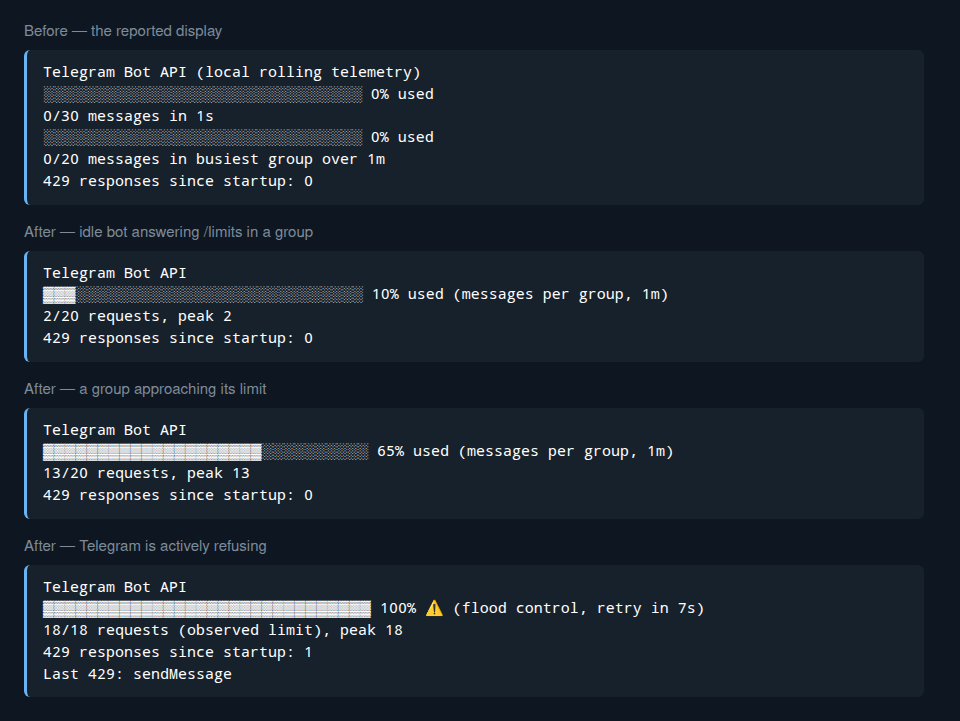

# Issue 2070: Telegram Bot API telemetry looked inactive

Issue: [link-assistant/hive-mind#2070](https://github.com/link-assistant/hive-mind/issues/2070)

Prepared PR: [link-assistant/hive-mind#2071](https://github.com/link-assistant/hive-mind/pull/2071)

Reported: 2026-07-16

## Executive summary

`/limits` showed two Telegram Bot API bars that were almost always at 0%. The counters were not broken: they measured two short rolling windows (one second globally, one minute for the busiest group) that a quiet bot genuinely leaves empty. The section was reporting a true fact that answered nobody's question.

The question an operator actually asks is "how close am I to Telegram refusing my next request?". Answering it needs three things the original display lacked:

1. **Coverage of every request, not just message sends.** All Bot API traffic now flows through one counted choke point, `getUpdates` long polling included.
2. **Limits that are measured, not assumed.** Telegram publishes hedged advisories and explicitly tells bot authors not to "depend on hardcoded limit values". The documented numbers are now only a starting estimate: a success proves a window's capacity and raises its limit, a 429 proves a ceiling and lowers it.
3. **A single bar on the window closest to refusing, ranked by remaining requests.** Telegram enforces several limits at once and only the tightest one can stop the bot.

While Telegram's `retry_after` is still counting down, the bar shows 100% and names the flood control instead of reporting a local estimate that has already been overruled.

## Preserved evidence

| Artifact                                                               | Description                                                                       |
| ---------------------------------------------------------------------- | --------------------------------------------------------------------------------- |
| [`raw-data/issue.json`](raw-data/issue.json)                           | Full GitHub issue API export, including the complete report and its pasted output |
| [`raw-data/issue-comments.json`](raw-data/issue-comments.json)         | Complete paginated issue comment export; empty at investigation time              |
| [`raw-data/issue-screenshot.png`](raw-data/issue-screenshot.png)       | Original GitHub attachment, validated by successful PNG decoding, 832×276         |
| [`raw-data/pr-comments.json`](raw-data/pr-comments.json)               | PR conversation comments, including the review feedback that drove the redesign   |
| [`raw-data/pr-review-comments.json`](raw-data/pr-review-comments.json) | PR inline review comments; empty at investigation time                            |
| [`raw-data/pr-reviews.json`](raw-data/pr-reviews.json)                 | PR review submissions; empty at investigation time                                |
| [`after-output.png`](after-output.png)                                 | Deterministic browser render of the new Telegram block for visual review          |

No separate runtime log file was attached to issue #2070. The reported output is preserved verbatim inside `issue.json`.

`experiments/telegram-limits-preview.mjs` in the repository root renders the section for an idle bot, a busy group, an active flood control, a long flood control, and every locale, without needing a live bot token. `experiments/render-telegram-limits-screenshot.mjs` emits the same output as an HTML page styled like a Telegram code block; `after-output.png` is a browser screenshot of it.

## Requirements inventory

Requirements R1-R10 come from the issue body; R11-R16 come from the review feedback on PR #2071 (2026-07-16T10:30:48Z), preserved in `raw-data/pr-comments.json`.

| ID  | Requirement                                                                       | Resolution                                                                                                                                                                      |
| --- | --------------------------------------------------------------------------------- | ------------------------------------------------------------------------------------------------------------------------------------------------------------------------------- |
| R1  | Make it possible to see whether Telegram is rate limiting the bot.                | The bar reports the window nearest refusal, goes to 100% while `retry_after` is counting down, and reports every 429 with its method.                                           |
| R2  | Remove `(local rolling telemetry)` from the title.                                | The heading is `Telegram Bot API` in every locale.                                                                                                                              |
| R3  | Use one GitHub-like progress bar and request count.                               | One bar, then `used/limit requests, peak N`.                                                                                                                                    |
| R4  | When multiple limits exist, show the most constraining one.                       | Every render ranks the modelled windows and displays one.                                                                                                                       |
| R5  | Identify the displayed limit in parentheses.                                      | `(messages per group, 1m)`, `(messages to all chats, 1s)`, `(messages per chat, 1m)`, `(other API requests, 1s)` or `(flood control, retry in 8s)`, localized in en/ru/zh/hi.   |
| R6  | Keep `429 responses since startup`.                                               | Kept, with the last 429's method on its own line.                                                                                                                               |
| R7  | Double-check that 429 observation works.                                          | Tests drive Telegraf's real `TelegramError` response shape and assert the count, `retry_after`, method, chat, countdown, and unchanged rethrow. See "Is the 429 capture real?". |
| R8  | Preserve issue data and conduct a deep case study with online research.           | This document, with sources ranked by evidence tier.                                                                                                                            |
| R9  | Apply the requirement across the codebase.                                        | There is one Telegram telemetry renderer and one interception point; all four locale catalogs are updated.                                                                      |
| R10 | Add a reproducing automated test.                                                 | `tests/telegram-rate-limit.test.mjs` reproduces the all-zero display and asserts the new behaviour (15 cases).                                                                  |
| R11 | Cover message updates and all other API requests.                                 | Interception sits at Telegraf's `callApi`, which carries `getUpdates` too. Requests are classified by `chat_id` presence, so edits count against the sending limits.            |
| R12 | Ground the estimate in real data from the internet.                               | Every modelled window cites a primary source; see "What Telegram's limits actually are".                                                                                        |
| R13 | Calculate limits dynamically from 429 frequency and the request counter.          | Each window's limit is corrected from observed successes and refusals; the display says `(observed limit)` when the number was measured rather than documented.                 |
| R14 | Integrate the 429 state into the bar: 100% until reset, accurate maximum after.   | A live `retry_after` renders 100% with `(flood control, retry in …)`; afterwards the bar returns to the measured window, keeping the ceiling the 429 proved.                    |
| R15 | Rank by request count, not percentage; "busiest group does not tell me anything". | Selection is by remaining requests. The label now names the limit rather than the chat.                                                                                         |
| R16 | Keep it visually simple while the logic is accurate and dynamic.                  | The section is four short lines; all of the learning happens behind them.                                                                                                       |

## Timeline

| Time                 | Event                                                                                                                                                                                     |
| -------------------- | ----------------------------------------------------------------------------------------------------------------------------------------------------------------------------------------- |
| 2026-07-14           | Issue [#2060](https://github.com/link-assistant/hive-mind/issues/2060) requested Telegram limit visibility because operators suspected long message queues could encounter flood control. |
| 2026-07-14           | PR [#2063](https://github.com/link-assistant/hive-mind/pull/2063) added process-local one-second global and one-minute busiest-group counters plus central 429 capture.                   |
| 2026-07-16 06:14 UTC | Issue #2070 reported that both counters usually displayed zero and that the two-bar section looked nonfunctional. The attached screenshot shows both bars at 0%.                          |
| 2026-07-16           | A first pass kept both counters and displayed the higher percentage of the two.                                                                                                           |
| 2026-07-16 10:30 UTC | Review feedback on PR #2071 rejected that direction: cover all routes, learn the limits dynamically, fold the 429 into the bar, rank by request count, and "deeply rethink everything".   |
| 2026-07-16           | Primary-source research established that Telegram's own server does not implement the published limits, which settled the design in favour of measurement over hardcoded values.          |
| 2026-07-16           | The tracker was rewritten around four cited windows with learned limits; 15 default-suite tests now cover the display and the learning rules.                                             |

## What Telegram's limits actually are

Sources are ranked by evidence tier. Tier 1 is Telegram's own documentation and source code; tier 2 is statements by levlam, the TDLib and Bot API server maintainer; tier 3 is the behaviour of widely used bot frameworks; tier 4 is community observation.

### Tier 1: there is no quota endpoint, and the open-source server does not enforce the sending limits

The official Bot API server is open source, and its entire treatment of sending limits is to parse the error text that Telegram's closed backend sends back ([`telegram-bot-api/Client.cpp`](https://github.com/tdlib/telegram-bot-api/blob/master/telegram-bot-api/Client.cpp), lines 60-66):

```cpp
int Client::get_retry_after_time(td::Slice error_message) {
  td::Slice prefix = "Too Many Requests: retry after ";
```

No 30-per-second or 20-per-minute counter exists anywhere in that codebase. The only limits it implements are infrastructural: 20 client creations per minute per IP, one HTTP connection per second per IP, one `setWebhook` per second. Everything else is enforced by servers nobody outside Telegram can inspect. **Any client-side model is therefore an approximation by construction**, which is the single most important fact behind this design.

Telegram states this in its own words, in [Bot Features](https://core.telegram.org/bots/features#dedicated-test-environment):

> Flood limits are not raised in the test environment, and may at times be stricter. […] you should make sure that it handles errors with retry policies and **does not depend on hardcoded limit values**.

and in [Local Bot API](https://core.telegram.org/bots/features#local-bot-api): "All limits may be subject to change in the future".

The four published numbers all come from a single FAQ answer, [My bot is hitting limits, how do I avoid this?](https://core.telegram.org/bots/faq#my-bot-is-hitting-limits-how-do-i-avoid-this), and every one of them is hedged:

| Documented advisory                        | Exact hedge in the source                                   |
| ------------------------------------------ | ----------------------------------------------------------- |
| 1 message per second per chat              | "We may allow short bursts that go over this limit"         |
| 20 messages per minute per group           | stated firmly, no hedge                                     |
| ~30 messages per second globally           | "**about** 30 messages per second", bulk notifications only |
| ~30 users per second for bulk notification | "~30"                                                       |

Two things the Bot API reference does **not** contain: the phrase "Too Many Requests" (zero occurrences across `/bots/api`), and any documented limit for `getUpdates`, `getMe`, `editMessageText` or `answerCallbackQuery`. Its single mention of 429 is in [`close`](https://core.telegram.org/bots/api#close) ("error 429 in the first 10 minutes after the bot is launched"), which is a launch guard, not a rate limit. The only machine-readable limit signal in the whole API is [`ResponseParameters.retry_after`](https://core.telegram.org/bots/api#responseparameters).

Two documents that look authoritative but do not apply here: [`/api/errors`](https://core.telegram.org/api/errors) with its 420 `FLOOD_WAIT` describes MTProto, not the Bot API; and the "~300 requests per minute" in [`#status-alerts`](https://core.telegram.org/bots/features#status-alerts) is a @BotFather popularity threshold, not a rate limit.

### Tier 2: the maintainer's clarifications

- [tdlib/td#3034](https://github.com/tdlib/td/issues/3034) — "Limits for message editing and sending are shared, but well-behaving bots […] can hardly exceed them. **There is no global limit on the number of sent messages for bots.**"
- [t.me/tdlibchat/146123](https://t.me/tdlibchat/146123) — "**Currently**, bots can do up to 20 message edits in a minute per group chat." Note the "currently".
- [telegram-bot-api#516](https://github.com/tdlib/telegram-bot-api/issues/516) — a bot hitting 429s at roughly 10 messages per second was told: "Likely, you are trying to send messages to the same chat at the speed noone can read." Ten messages to ten _different_ users "definitely would be different". **Per-chat concentration, not raw throughput, is what triggers flood control in practice.**
- [telegram-bot-api#184](https://github.com/tdlib/telegram-bot-api/issues/184) — "Forwarding and sending messages is a different thing", and a `retry_after` of **2282 seconds** observed in the wild.

### Tier 3: what the major frameworks actually do

| Framework                            | Global      | Per group    | Per chat                                                       | Route classification                                      |
| ------------------------------------ | ----------- | ------------ | -------------------------------------------------------------- | --------------------------------------------------------- |
| grammY `transformer-throttler`       | 30 / 1000ms | 20 / 60000ms | `minTime: 1000` (a sustained rate)                             | presence of `chat_id`                                     |
| python-telegram-bot `AIORateLimiter` | 30 / 1s     | 20 / 60s     | `MESSAGES_PER_SECOND_PER_CHAT = 1`, **defined but never used** | presence of `chat_id`                                     |
| telegraf-throttler                   | 30 / 1000ms | 20 / 60000ms | —                                                              | presence of `chat_id`, minus a read/typing exemption list |

Three independent implementations converge on the same two conclusions. First, **classify by the presence of `chat_id` rather than by a method allow-list**, which is what makes edits count against the sending limits as levlam describes. Second, treat the per-chat "1 per second" advisory as a sustained rate that tolerates bursts, not a hard per-second gate — python-telegram-bot goes as far as defining the constant and never applying it.

grammY's documentation ([grammy.dev/advanced/flood](https://grammy.dev/advanced/flood)) is blunt about the whole question:

> ## What the Exact Limits Are
>
> They are unspecified. Deal with it.

and, decisively for the design:

> The limits are not simply hard thresholds […] they are **flexible constraints that change based on your bot's exact request payloads, the number of users, and other factors**.

It also lists as **false** the assumptions that "getMe cannot receive flood wait errors" and "getUpdates cannot receive flood wait errors", and clarifies that the 30/second figure "only applies to bulk notifications. […] If you are just responding to messages from users, then it is no problem to send 1,000 or more messages per second."

### Tier 4: community observation

`retry_after` escalates on repeated violations, with values reported up to 12-14 hours, and decays back to ~10s with good behaviour ([telegram-bot-api#535](https://github.com/tdlib/telegram-bot-api/issues/535) and community reports). No library predicts it; all of them simply trust the server's value. Together with the 2282s figure above, this substantiates a `retry_after` range spanning three orders of magnitude — which is why the countdown formats hours, not just seconds.

Sources excluded as unreliable: grokipedia.com, botnamefinder.com, hfeu-telegram.com and tradingonramp.com all publish confident-sounding limit tables that contradict the primary sources and each other, with no attribution.

## The model this produces

Four windows, each with its evidence and its behaviour when unmeasured:

| Window      | Size | Starting limit | Source                                                                        |
| ----------- | ---- | -------------- | ----------------------------------------------------------------------------- |
| `chat`      | 60s  | 60 messages    | The FAQ's 1/second advisory restated as a sustained rate, as grammY treats it |
| `group`     | 60s  | 20 messages    | The FAQ's one unhedged number, echoed by levlam for edits                     |
| `broadcast` | 1s   | 30 messages    | The FAQ's "about 30 messages per second"                                      |
| `other`     | 1s   | unknown        | No documented value exists; hidden until a 429 measures one                   |

The starting limits are estimates, and the tracker corrects them:

- **A success raises a known limit.** If Telegram accepts the 22nd message in a group within a minute, the limit was not 20; it becomes 22, marked `(observed limit)`.
- **A 429 lowers the blamed limit** to below the refused count, and the refused request is dropped from the window: it never landed, so `used` can never exceed the ceiling the refusal just proved.
- **A success never creates a limit from nothing.** A success proves capacity, never a ceiling, so `other` stays unknown and unrendered until a 429 measures it. This is what keeps an unmeasurable window from becoming a fake bar.
- **A 429 nobody can explain teaches nothing.** If every window was under half full, the refusal came from state we cannot see — flood control carries penalties across windows and escalates on repeat offences. Blaming a window would collapse its limit for no reason, so the tracker only reports the throttle.

Selection ranks throttled windows first, then by **remaining requests** (R15), then by used count, then by percentage. Per-chat and per-group windows with no traffic are skipped entirely, so an idle bot cannot show a phantom bar for a conversation it is not having.

## Root-cause analysis

### The zeroes were a snapshot of short rolling windows

The global value counted message calls newer than `now - 1000ms`. `/limits` sends a "fetching" placeholder and then gathers Claude, Codex, GitHub, CPU, memory, disk and queue data before formatting. That work takes longer than a second, so the placeholder had already left the one-second window by the time the section rendered. With no other traffic, `0/30` was correct and useless.

The section now counts all Bot API requests, and the shortest window it will display for an idle bot answering `/limits` in a group is the one-minute group window, which contains the placeholder and its edit. The screenshot's scenario now renders `2/20 requests, peak 2` instead of two zeroes.

### The display asked the operator to do the analysis

Two equally prominent bars, labelled by chat rather than by limit, left the operator to work out which number mattered. "Busiest group" named the wrong subject: the operator wants the _limit_ that is nearly exhausted, not the chat that happens to be noisiest. The section now performs the ranking and names the limit.

### The limits were hardcoded against documentation that disclaims itself

The original counters treated 30/second and 20/minute as quotas. Telegram's own documentation asks clients not to depend on hardcoded values, its server does not implement those numbers, and its maintainer describes the per-chat rate as the thing that actually triggers refusals. Anything hardcoded is wrong the moment Telegram changes it — and it changes silently. Learning from observed traffic is the only approach that can stay correct.

## Is the 429 capture real?

R1 and R7 both come down to this, so it is worth stating the evidence rather than asserting it works.

Telegraf constructs `TelegramError` with a `response` object carrying `error_code`, `description` and optional `parameters`, and throws it from `callApi` whenever a Bot API JSON response has `ok: false` ([`error.ts`](https://github.com/telegraf/telegraf/blob/v4/src/core/network/error.ts), [`client.ts`](https://github.com/telegraf/telegraf/blob/v4/src/core/network/client.ts)). The tracker reads `error.response.error_code` and `error.response.parameters.retry_after`, matching that contract, and also accepts `status`/`code` and a description match so a 429 relayed by a proxy or a local Bot API server is still counted.

That `callApi` is the only outbound path is verifiable upstream: [`polling.ts`](https://github.com/telegraf/telegraf/blob/v4/src/core/network/polling.ts) line 28 calls `await this.telegram.callApi('getUpdates', …)`, so long polling is instrumented by the same wrapper as everything else (R11).

The test supplies exactly Telegraf's structure and asserts the count increments once, the method and chat survive, `retry_after: 12` counts down to 7 after five seconds and clears after thirteen, and the wrapper rejects with the identical error object — proving monitoring does not swallow, replace or delay the failure.

## Result

Before, as reported:

```text
Telegram Bot API (local rolling telemetry)
░░░░░░░░░░░░░░░░░░░░░░░░░░░░░░ 0% used
0/30 messages in 1s
░░░░░░░░░░░░░░░░░░░░░░░░░░░░░░ 0% used
0/20 messages in busiest group over 1m
429 responses since startup: 0
```

After, the same idle bot answering `/limits` in a group:

```text
Telegram Bot API
▓▓▓░░░░░░░░░░░░░░░░░░░░░░░░░░░ 10% used (messages per group, 1m)
2/20 requests, peak 2
429 responses since startup: 0
```

While Telegram is actively refusing:

```text
Telegram Bot API
▓▓▓▓▓▓▓▓▓▓▓▓▓▓▓▓▓▓▓▓▓▓▓▓▓▓▓▓▓▓ 100% ⚠️ (flood control, retry in 7s)
18/18 requests (observed limit), peak 18
429 responses since startup: 1
Last 429: sendMessage
```

After that throttle expires, the learned ceiling stays and the bar returns to measuring:

```text
Telegram Bot API
▓▓▓▓▓▓▓▓▓▓▓▓▓▓▓▓▓▓▓▓▓▓▓▓▓▓▓▓▓▓ 100% ⚠️ (messages per group, 1m)
18/18 requests (observed limit), peak 18
429 responses since startup: 1
Last 429: sendMessage
```

Rendered side by side, in the style of the reported screenshot:



## Alternatives considered

### Show only the 429 counter

Authoritative but purely reactive: it says nothing until Telegram has already refused a request. The rolling estimate is what lets an operator watch a burst develop. Both are kept, with the 429 overriding the estimate while it is live.

### Keep hardcoded documented limits

Rejected on Telegram's own instruction not to depend on hardcoded values, and on the evidence that its server implements none of them. Documented values survive only as the initial estimate.

### Trust a 429 to define the limit unconditionally

Rejected because flood control carries invisible cross-window penalty state and escalates on repeat offences, so a 429 arriving on a nearly empty window would collapse a limit to a nonsense value. Attribution requires a plausible window; otherwise the tracker reports the throttle and learns nothing.

### Rank the windows by percentage

This is what the first pass did, and R15 rejects it: 25/30 (83%, five requests left) is more urgent than 55/60 (92%, five requests left) only if the percentages mean the same thing, and they do not. Remaining requests is the quantity that answers "how close am I to being refused".

### Aggregate all requests since startup into a bar

There is no denominator for lifetime requests. The bar would grow forever, implying a permanent quota that does not exist.

### Query Telegram for remaining quota

No such method exists; see tier 1 above. This is the constraint the whole design works around.

### Add a queueing/rate-limiter library

Bottleneck, grammY's throttler and telegraf-throttler all _schedule_ requests. Issue #2070 asks to fix monitoring, not delivery semantics; a scheduler would add latency and reordering outside the issue's scope. Their _classification_ logic is worth borrowing, and it was: keying on `chat_id` and treating the per-chat advisory as a sustained rate both come directly from reading them. Telegraf's `callApi` remains the correct observability point.

## Verification plan

`tests/telegram-rate-limit.test.mjs` (default suite, 15 cases) covers:

- classification by `chat_id`, including edits counting as messages and reads/typing not counting;
- independent expiry of the one-second and one-minute windows;
- selection by remaining requests, and the roomier windows staying hidden;
- a limit rising when Telegram accepts more than the documented value;
- a limit falling below the refused count on a 429, with the refused request dropped from the window;
- a 429 that no window explains changing nothing;
- an unknown limit staying unrendered until a 429 measures it;
- Telegraf-shaped 429 capture, countdown, expiry and unchanged rethrow;
- the throttled bar, the `retry_after` formatting across three orders of magnitude, and the return to a measured bar;
- the reproduction of the reported all-zero scenario now showing real usage;
- one bar, simplified title, and localized Russian, Chinese and Hindi output.

Repository lint, formatting, default tests, documentation validation, changeset validation, file limits and diff checks run before PR finalization. Fresh GitHub Actions results are then matched to the exact pushed commit SHA.

## External issue assessment

No upstream issue is warranted, and the research strengthens rather than weakens that conclusion.

- **Telegram**: the absence of a quota endpoint and the hedged limits are deliberate, documented platform behaviour. Telegram explicitly instructs clients to adapt rather than hardcode, which is what this change now does. There is nothing to report as a defect.
- **Telegraf**: exposes `error_code`, `description` and `parameters.retry_after` correctly, and routes every request including `getUpdates` through one interceptable method. No defect.
- **grammY / python-telegram-bot**: python-telegram-bot's unused `MESSAGES_PER_SECOND_PER_CHAT` constant is dead code rather than a bug, and its authors are plainly aware the advisory is burst-tolerant. Not worth an issue.

The defect was entirely in Hive Mind: it measured the wrong things, hardcoded numbers its own sources disclaim, and asked the operator to do the analysis.
