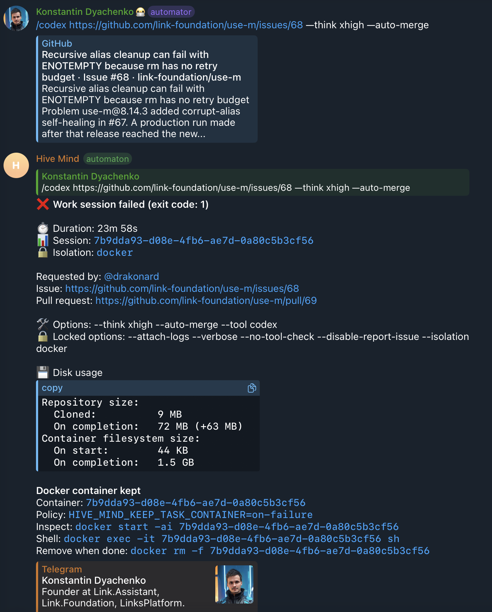
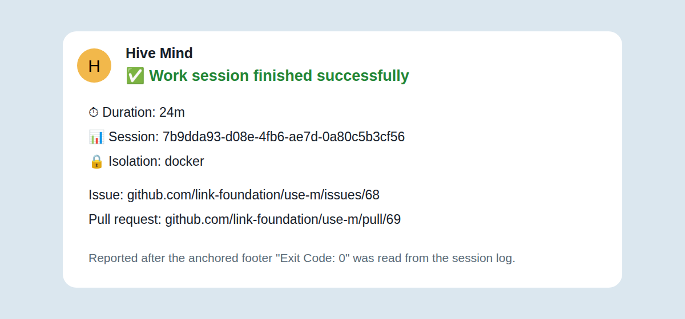

# Issue 2117 case study: a successful work session reported as "failed (exit code: 1)"

## Executive summary

The `/codex` run on `link-foundation/use-m#68` did everything right: it opened
`use-m#69`, merged it at `06:38:12Z`, and the containerized `solve` process
exited **0** at `06:38:16Z`. Telegram nevertheless announced
**"❌ Work session failed (exit code: 1)"**.

Nothing in Hive Mind's own exit path produced that `1`, and nothing in the
container did either. The exit code was **fabricated by start-command** and
handed to the Telegram monitor by `$ --status`:

- start-command derives the exit code of a detached docker session from an
  **unanchored** `/Exit Code:\s*(-?\d+)/g` scan over the **whole** execution log
  and takes the **last** match
  (`src/lib/status-formatter.js#readExitCodeFromLog`, v0.30.3).
- At `06:17:26Z` the agent printed the tail of an **older, unrelated**
  start-command log (from a `2026-07-28` `/fix` run) while investigating the
  issue. That quoted text ends with `Exit Code: 1`.
- The real footer is appended by a **host-side watcher** only _after_ the
  container is removed: `docker logs -f … ; docker inspect … ; docker rm -f … ;
printf '…\nFinished: %s\nExit Code: %s\n'`
  (`src/lib/docker-cleanup.js#buildDetachedDockerCompletionScript`).
- The bot polled `$ --status` inside that window. The container was already
  gone, so liveness was unknown, and `enrichDetachedStatus()` honoured the
  "footer" it found — which at that instant was still the agent's quoted
  `Exit Code: 1`, roughly two seconds before the genuine `Exit Code: 0` was
  written.

The evidence is unambiguous: the same `$ --status` command run later — after
the footer existed — reports `status executed` / `exitCode 0` for the very same
session (`data/start-command-status-output.txt`).

The fix therefore has two parts:

1. **Upstream** (the actual defect): reported to
   [link-foundation/start#150](https://github.com/link-foundation/start/issues/150)
   with a reproducible example, a workaround and a concrete code fix (anchor the
   footer regex, scan only the log tail, prefer `docker inspect .State.ExitCode`,
   and write the footer before removing the container).
2. **Downstream** (defense in depth, this pull request): the session monitor no
   longer trusts an uncorroborated docker terminal failure. It reads Hive Mind's
   own **anchored** footer parser first and lets it win, and defers an
   unverified docker failure for up to 60 s so the real footer can appear.

## Visual comparison

| Before: fabricated failure                              | After: the real outcome                                       |
| ------------------------------------------------------- | ------------------------------------------------------------- |
|  |  |

## Evidence and timeline

All times are UTC on 2026-07-30. Sources: `data/outer-session.log.txt` (the
host-side start-command execution log, obtained via `$ --upload-log`),
`data/session.log.txt` (the inner solve log attached to PR 69),
`data/start-command-status-output.txt`, and the GitHub API snapshots in `data/`.

| Time         | Event                                                                                   | Source                                                          |
| ------------ | --------------------------------------------------------------------------------------- | --------------------------------------------------------------- |
| 06:14:21.348 | start-command records the detached docker session `e2bf4bf1…`                           | `outer-session.log.txt:1-12`; `startTime` in the status record  |
| 06:14:58     | `solve` starts inside the container                                                     | Inner log header                                                |
| 06:17:26     | The agent prints the tail of a **2026-07-28** log that ends with `Exit Code: 1`         | `outer-session.log.txt:2051` (a Codex `item.completed` payload) |
| 06:35:34     | Hive Mind posts its working summary to PR 69                                            | Comment `5127479150`                                            |
| 06:38:12     | PR 69 is merged (`15cb6854…`)                                                           | GitHub `mergedAt`                                               |
| 06:38:13     | Hive Mind posts its merge-complete comment                                              | Comment `5127503934`                                            |
| 06:38:16.232 | `solve` finishes: `📈 Resource usage (solve exit 0)`, `✅ Process completed`            | `outer-session.log.txt:10400-10409`                             |
| ~06:38:19    | The bot polls `$ --status`; container removed, footer not yet written → **exit code 1** | Telegram duration 23m 58s counted from `06:14:21.348`           |
| 06:38:21.188 | The watcher appends the genuine footer `Exit Code: 0`                                   | `outer-session.log.txt:10411-10413`                             |
| 20:27:36.145 | `$ --status` for the same session now reports `status executed`, `exitCode 0`           | `start-command-status-output.txt`                               |

Two details confirm the mechanism rather than merely fitting it:

- The whole 10 413-line log contains exactly **two** `Exit Code:` occurrences:
  the quoted foreign one at line 2051 and the genuine footer at line 10413.
- `enrichDetachedStatus()` never persists its correction (it clones the record),
  which is why the store still said `executing` fourteen hours later and why the
  `endTime` in konard's output is `20:27:36.145Z` — the moment `--status` was
  run, not the moment the session ended. The record the bot saw at 06:38 was
  computed the same way, from the log content available at that instant.

## Root-cause analysis

### Upstream root cause (start-command v0.30.3)

```js
// src/lib/status-formatter.js
const matches = [...content.matchAll(/Exit Code:\s*(-?\d+)/g)];
return parseInt(matches[matches.length - 1][1], 10);
```

The pattern is unanchored, applied to the entire log, and the last match wins.
Any wrapped command that prints `Exit Code: N` — an agent quoting a log, a test
fixture, a CI transcript — can therefore dictate the session's reported exit
code. The exposure window is created by the completion watcher, which removes
the container **before** it writes the footer, so between container exit and
footer write `$ --status` sees "backend gone + a footer-looking line".

Reproduced twice, without mocks:

- `experiments/issue-2117/upstream-repro-cli.sh` — pure CLI, `alpine:3`, a
  command that prints `Exit Code: 1` and then exits/gets killed. Reported
  result: `status executed`, `exitCode 1` (expected `137` or the `-1`
  sentinel). Captured output: `data/upstream-repro-output.txt`.
- `experiments/issue-2117/reproduce-false-exit-code.mjs` — the same fabrication
  driven through a real execution store.

Filed as [link-foundation/start#150](https://github.com/link-foundation/start/issues/150).

### Downstream root cause (Hive Mind)

`getIsolationSessionState()` accepted a terminal status from `$ --status`
verbatim. Hive Mind already has a stricter parser — `parseSessionExitFooter()`
matches only an **anchored** `={10,}` / `Finished:` / `Exit Code: N` block in
the last 16 KB of the log, so quoted text cannot forge it — but that parser was
only consulted on other code paths. The monitor therefore inherited an upstream
fabrication it had the means to detect.

### Why the earlier "post-merge exit guard" was reverted

The first pass at this issue (commit `adb16e33`) assumed the container really
had exited 1 after the merge and suppressed exit-1 after a confirmed merge. The
archived log disproves the premise — `solve` exited 0 — and the guard was
actively harmful: it would have converted _genuine_ post-merge failures into
silent successes. It was removed together with `src/solve-terminal-outcome.lib.mjs`.
Its two genuinely useful side effects were kept: every step of the exit path is
now independently best-effort (diagnostics can never change the requested exit
code), and `solve` no longer installs a second, racing pair of process-error
handlers. `tests/test-issue-2117-exit-path-resilience.mjs` locks both in,
including an assertion that no exit-code override may return.

## The fix in this pull request

`src/session-monitor.lib.mjs` + `src/session-monitor.docker-terminal.lib.mjs`:

1. **The anchored footer wins.** When a session reports terminal and the log
   contains Hive Mind's anchored footer, the footer's exit code and derived
   status replace whatever `$ --status` claimed.
2. **Uncorroborated docker failures are provisional.** A docker session that
   reports a non-zero exit with no anchored footer is treated as still running
   for up to `DOCKER_TERMINAL_FOOTER_GRACE_MS` (60 s). The first sighting is
   persisted as `dockerTerminalUnverifiedFirstSeenAt`, so the deferral survives a
   bot restart and cannot be reset forever by polling.
3. **Real failures still surface.** Once the grace period expires without a
   footer (e.g. the watcher itself was killed), the reported exit code is
   accepted — a genuine failure is reported, just up to a minute later. The
   `-1` sentinel path (issue #1939), non-docker backends, OOM kills (#2015) and
   the stale-`executing` reconciliation (#1927) are explicitly unaffected.

Because the run in this incident was a success, the split-outcome message
("Pull request merged, but the work session exited with code: 1") is no longer
what a user would see here — a plain success is. That message is retained for
what it was designed for: a merge followed by a _corroborated_ runner failure.

## Reproduction and verification

```sh
# upstream defect (needs docker and `$` on PATH)
bash experiments/issue-2117/upstream-repro-cli.sh

# regression tests
node tests/test-issue-2117-false-terminal-exit-code.mjs   # 21 assertions
node tests/test-issue-2117-merged-pr-exit.mjs             # 10 assertions
node tests/test-issue-2117-exit-path-resilience.mjs       #  7 assertions
node tests/test-issue-1927-killed-detection.mjs
node tests/test-issue-2015-oom-killed-status.mjs

npm test && npm run lint && npm run format:check
```

`tests/test-issue-2117-false-terminal-exit-code.mjs` replays this incident end
to end: the status provider reports `executed`/`exitCode 1` while the log holds
no anchored footer, the monitor keeps the session running, the footer
`Exit Code: 0` then appears, and the user receives
`✅ Work session finished successfully`.

## Follow-up investigation protocol

When a session outcome looks contradictory:

1. keep the **host-side** start-command log (`$ --upload-log <session>`), not
   only the inner log attached to the PR;
2. run `$ --status <session>` again once the run is over — enrichment is
   recomputed on every call, so a later reading is often the correct one;
3. `grep -n "Exit Code:" <log>` — more than one match means the run is exposed
   to the upstream fabrication;
4. compare the footer's `Finished:` timestamp with the moment the notification
   was sent; a notification that precedes the footer is the signature of this bug.

## Sources

- start-command `readExitCodeFromLog` / `enrichDetachedStatus`:
  `src/lib/status-formatter.js` (v0.30.3, npm `start-command`)
- start-command detached-docker completion watcher:
  `src/lib/docker-cleanup.js#buildDetachedDockerCompletionScript` (v0.30.3)
- Upstream report filed for this defect:
  <https://github.com/link-foundation/start/issues/150>
- Related upstream sentinel report (exit `-1`):
  <https://github.com/link-foundation/start/issues/136>
- Related Hive Mind fixes for the same class of status misreading:
  <https://github.com/link-assistant/hive-mind/issues/1927>,
  <https://github.com/link-assistant/hive-mind/issues/1939>,
  <https://github.com/link-assistant/hive-mind/issues/2015>
- Docker run exit status:
  <https://docs.docker.com/engine/containers/run/#exit-status>
- Docker inspect:
  <https://docs.docker.com/reference/cli/docker/inspect/>

## Archived artifacts

`data/` contains:

- `outer-session.log.txt` — the host-side start-command execution log
  (the decisive artifact: both `Exit Code:` occurrences and the real footer);
- `start-command-status-output.txt` — `$ --status` for the same session,
  showing `status executed` / `exitCode 0`;
- `upstream-repro-output.txt` — output of the pure-CLI upstream reproduction;
- `session.log.txt` — the inner solve log attached to PR 69;
- `issue-screenshot.png` — the false "Work session failed" notification;
- GitHub API snapshots for issue 2117, PR 2118 (conversation/review/reviews),
  use-m issue 68 and PR 69, and the successful use-m CI run.

`SHA256SUMS` protects the archived data files from accidental modification.
