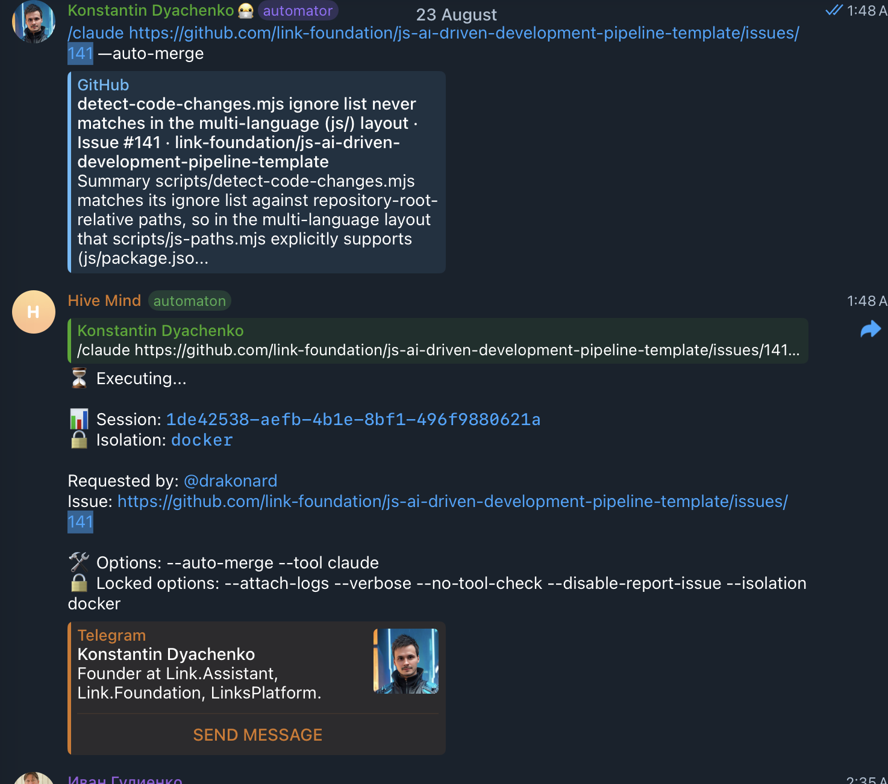
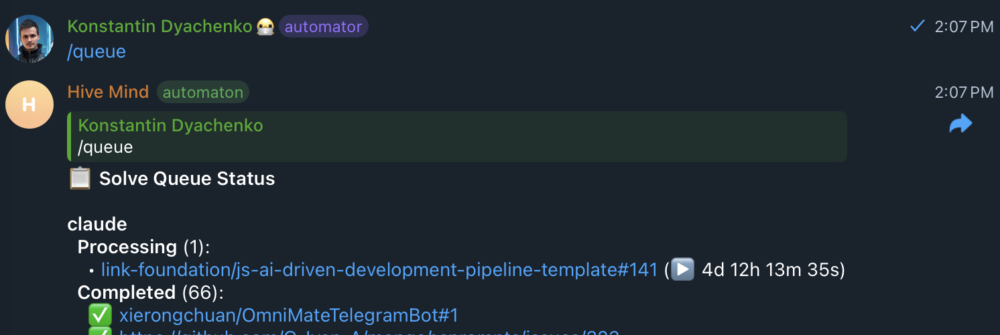

# Issue #2182: hive-mind drafted a pull request and never marked it ready again

## Summary

A `/claude <issue> --auto-merge` task reported "Processing" for 4d 12h 13m 35s. The work had been finished within nine minutes: the AI fixed the CodeQL failure, pushed `401020c`, and all 31 checks went green. What ran for the remaining four and a half days was the monitoring loop, trying to merge a pull request it was not allowed to merge — 2692 times, every 120 seconds, with the same three lines each time:

```
✅ PR IS MERGEABLE!
🔀 Auto-merging PR...
  ⚠️ Auto-merge failed:      GraphQL: Pull Request is still a draft (mergePullRequest)
   Will continue monitoring...
```

The pull request was a draft because **hive-mind had put it there and never took it back out**. Over 102 244 log lines hive-mind performed exactly one draft/ready state change — `Converting PR: To draft mode` — and zero conversions back. The only draft → ready transition in the whole run was typed by the AI model itself, in the first session, as a `Bash` tool call it decided to make.

That asymmetry is the root cause. Everything else in this case study — a draft reporting itself as mergeable, an unclassified merge failure, an unbounded loop — is why the asymmetry cost four and a half days instead of two minutes.

## Problem statement

From the issue (`--status` of the container, taken while it was still running):

```
  status executing
  startTime   "2026-08-22T18:53:30.799Z"
  currentTime "2026-08-27T07:25:02.131Z"
```




The `/queue` view shows `Processing (1): …#141 (▶ 4d 12h 13m 35s)` against `Completed (66)` — one task pinning a queue slot for four days while the rest of the queue drained around it.

## The invariant that was violated

> When a task or any working session is finished, hive-mind must put the pull request from draft to ready, and only when a working session starts does it go from ready to draft.

That is the contract introduced by issue [#2123](https://github.com/link-assistant/hive-mind/issues/2123) and it is the contract this run broke. Stated as an invariant:

**A pull request is in draft state if and only if an AI working session of this process is currently running on it.**

Before this fix, only the "if" direction was implemented in code. The "only if" direction — the return to ready — was partly missing, partly gated behind a flag that was false, partly sequenced behind a loop that never returned, and otherwise delegated to the AI model through a sentence in the prompt.

## The data

The full run log (65 MB, 102 244 lines) was retrieved from the private log store referenced in the issue. Excerpts that carry the argument are committed under [`log-excerpts/`](log-excerpts/); the full file is deliberately not, because it is 65 MB and contains third-party API payloads.

| Excerpt                                                                                                   | What it shows                                                                             |
| --------------------------------------------------------------------------------------------------------- | ----------------------------------------------------------------------------------------- |
| [`01-start-command-header.log`](log-excerpts/01-start-command-header.log)                                 | the exact command, image `konard/hive-mind-dind:2.12.5`, start time                       |
| [`02-watch-loop-header.log`](log-excerpts/02-watch-loop-header.log)                                       | the monitoring loop's own banner — note the missing timeout line                          |
| [`03-restart-and-draft-conversion.log`](log-excerpts/03-restart-and-draft-conversion.log)                 | the single draft conversion in the entire run                                             |
| [`04-check-2-mergeable-then-draft-failure.log`](log-excerpts/04-check-2-mergeable-then-draft-failure.log) | check #2: CI consensus, "PR IS MERGEABLE!", draft merge failure                           |
| [`05-check-2693-identical.log`](log-excerpts/05-check-2693-identical.log)                                 | check #2693, 4½ days later, byte-for-byte the same                                        |
| [`06-ai-marks-pr-ready-session-1.log`](log-excerpts/06-ai-marks-pr-ready-session-1.log)                   | the only draft → ready transition in the run — issued by the **AI**, not by hive-mind     |
| [`07-is-continue-mode-false.log`](log-excerpts/07-is-continue-mode-false.log)                             | `isContinueMode: false` — the gate that disabled `startWorkSession`/`endWorkSession`      |
| [`08-iteration-ends-without-ready.log`](log-excerpts/08-iteration-ends-without-ready.log)                 | the restart iteration ends normally and goes straight back to `Check #2`, still a draft   |
| [`09-marker-counts.log`](log-excerpts/09-marker-counts.log)                                               | `grep -c` over the whole log: 1 draft conversion, 0 ready conversions, 2692 merge retries |

Counts over the full log, all reproducible with `grep -c`:

| Pattern                         | Count | Meaning                                                    |
| ------------------------------- | ----- | ---------------------------------------------------------- |
| `Converting PR`                 | 1     | hive-mind changed the PR state exactly once in 4½ days     |
| `Now in draft mode`             | 1     | …and that one change was **to** draft                      |
| `Now in ready for review`       | 0     | hive-mind never converted the PR back                      |
| `Starting work session`         | 0     | `startWorkSession()` never ran                             |
| `Ending work session`           | 0     | `endWorkSession()` never ran                               |
| `RESTART TRIGGERED`             | 1     | one restart iteration, out of a budget of 5                |
| `🔍 Check #`                    | 2693  | monitoring checks                                          |
| `✅ PR IS MERGEABLE!`           | 2692  | the loop believed a draft was mergeable, every single time |
| `Pull Request is still a draft` | 5384  | 2692 × 2 — the verbose line and the user-facing line       |
| `Will continue monitoring`      | 2692  | the only reaction the loop had to a merge failure          |

One subtlety when reproducing these greps: `grep -c 'is marked as "ready for review"'` answers 0, but the escaped form `is marked as \"ready for review\"` answers 2. Those two hits are inside the AI's own JSON tool payloads — the `tool_use` echo and the `tool_result` of the `gh pr ready 142` the model ran in session 1 (line 6968). They are not hive-mind output. `Now in ready for review`, which only hive-mind's state machine ever prints, is 0 in both forms.

## Timeline

All times are from the log; the run's clock is UTC, the `Check #N` lines print local time. Line numbers refer to the full 102 244-line log.

| Time (UTC)          | Line      | Event                                                                                                                                                                                                                       |
| ------------------- | --------- | --------------------------------------------------------------------------------------------------------------------------------------------------------------------------------------------------------------------------- |
| 2026-08-22 18:53:30 | 1         | `solve … --auto-merge --tool claude` starts in a detached docker container                                                                                                                                                  |
| 18:53:xx            | 451/599   | The prompt tells the AI: `When you finish implementation, use gh pr ready 142.`                                                                                                                                             |
| 18:55–18:58         | —         | First AI session solves issue #141, opens PR #142 as a draft                                                                                                                                                                |
| 18:58:xx            | 6898      | The **AI** runs `gh pr edit 142 … && gh pr ready 142` itself. This is the only draft → ready transition in the entire run ([excerpt 06](log-excerpts/06-ai-marks-pr-ready-session-1.log))                                   |
| 18:59:29            | —         | CodeQL posts a review comment: "Incomplete string escaping or encoding"                                                                                                                                                     |
| 19:00:28            | —         | Session ends, logs attached. PR is **ready for review**, CI has 1 failure of 31                                                                                                                                             |
| ~19:00:30           | 8110      | `isContinueMode: false` ([excerpt 07](log-excerpts/07-is-continue-mode-false.log)) — `startWorkSession()`/`endWorkSession()` are no-ops for the whole process                                                               |
| ~19:00:30           | —         | `--auto-merge` enters `watchUntilMergeable`, initial cooldown 120 s                                                                                                                                                         |
| 19:02:29            | 8135      | **Check #1** — CI `failure`, `mergeable: true, state: UNSTABLE` → `🔄 RESTART TRIGGERED: CI failures detected (1/5)`                                                                                                        |
| 19:02:43            | 8161–63   | `executeToolIteration` converts PR #142 **to draft**. This is the last state change hive-mind performs in the run                                                                                                           |
| 19:02:xx            | 8292/8455 | The restart prompt repeats: `When you finish implementation, use gh pr ready 142.`                                                                                                                                          |
| 19:02–19:07         | —         | The restart session fixes the CodeQL finding and pushes `401020c`; all 31 checks pass. **The AI does not run `gh pr ready` this time** — there is no occurrence of it anywhere after line 8455                              |
| 19:07:1x            | 13404     | `✅ CLAUDE execution completed` — the iteration ends **normally**, and the process goes straight back into the monitoring loop with no ready conversion ([excerpt 08](log-excerpts/08-iteration-ends-without-ready.log))    |
| 19:07:17            | 13408     | **Check #2** — new commit detected, CI `success`, all four CI mechanisms agree, `mergeable: true, state: CLEAN` → `PR IS MERGEABLE!` → `gh pr merge` fails: _Pull Request is still a draft_ → `Will continue monitoring...` |
| 19:09:40 → 07:23:31 | —         | **Checks #3 … #2693** — identical. 2691 more merge attempts over 4 d 12 h                                                                                                                                                   |
| 2026-08-27 07:09    | —         | Issue #2182 filed; the container is still `executing`                                                                                                                                                                       |

The restart budget was never the safeguard anyone thought it was: `Max restart iterations: 5` bounds AI sessions, and only one was ever used. Nothing bounded the monitoring itself.

## Root cause

### RC-A — the draft/ready state machine was asymmetric

`src/pr-draft-state.lib.mjs` is the single source of truth for both transitions, and both are one function call. The draft call is unconditional and driven by code. The ready call, at the time of the incident, had four possible triggers — and after the restart iteration **not one of them fired**:

#### A1 — `executeToolIteration()` drafted the PR and had no counterpart

`src/solve.restart-shared.lib.mjs` opens every restart iteration with `ensurePullRequestIsDraft(...)` (issue #2123, so reviewers can see an AI is working). It had no matching `ensurePullRequestIsReady(...)` at the end. Line 8163 of the log is that draft conversion; line 13404 is the same iteration finishing normally with nothing in between.

Restart iterations deliberately do not go through `startWorkSession`/`endWorkSession` — that is exactly why #2123 had to touch `executeToolIteration` in the first place — so the pairing had to exist here and did not.

#### A2 — `endWorkSession()` was gated behind `isContinueMode`

`src/solve.session.lib.mjs` wrapped its ready conversion in `if (isContinueMode && prNumber)`. Line 8110 of the log shows `isContinueMode: false`, and `Starting work session` / `Ending work session` appear **0 times** in the whole file. The one place whose job is "a session ended, mark the PR ready" was switched off for the entire run.

The gate made sense for the _comments_ the function posts (they are `--watch`/`--auto-continue` reporting). It made no sense for a state transition: whether a session must clean up after itself does not depend on how the session was started.

#### A3 — the ready conversion was sequenced _after_ a loop that never returns

In `src/solve.mjs` the call order was:

```
… AI working session finishes …
startAutoRestartUntilMergeable()   ← can run for days
endWorkSession()                   ← the ready conversion lives here
```

Even with A2 fixed, `endWorkSession()` would not have run: the watch loop it sits behind ran for 4d 12h and was still running when the container was killed. The AI working session had ended at 19:00:28; everything after that is monitoring, not working. The state change belonged _before_ the loop, not after it.

#### A4 — the actual mechanism was a sentence in the prompt

Every tool prompt (`claude`, `codex`, `agent`, `qwen`, `gemini`, `opencode`) contains:

```
- When you finish implementation, use gh pr ready ${prNumber}.
```

In this run that instruction was delivered twice and obeyed once:

| Prompt at line                | AI ran `gh pr ready`?                                |
| ----------------------------- | ---------------------------------------------------- |
| 451 / 599 (session 1)         | yes — line 6898                                      |
| 8292 / 8455 (restart session) | **no** — the string does not occur again in the file |

The same instruction, the same model, the same run: 50 % compliance. A prompt line is a request. It cannot be the mechanism that enforces a state-machine invariant, and treating it as one is what let the PR stay a draft. (The line is still useful and stays in the prompts — the AI marking the PR ready promptly is a nice-to-have; hive-mind no longer _depends_ on it.)

### Why it cost 4½ days instead of 2 minutes

Three further defects turned a stuck state into an unbounded loop. They are contributing causes, not the root cause — but each one is on its own enough to keep a task alive forever, so each is fixed too.

#### RC-B — a draft pull request reports itself as mergeable

`checkPRMergeable` asked for `mergeable,mergeStateStatus` and returned `mergeable = (pr.mergeable === 'MERGEABLE')`. For PR #142 that answered `MERGEABLE` / `CLEAN` on all 2692 checks — while the PR was a draft.

This contradicts the documented meaning of `mergeStateStatus: DRAFT` ("the merge is blocked due to the pull request being a draft"). It reproduces on demand: PR #2183 of this repository, while a draft, answers

```
$ gh api graphql -f query='{repository(owner:"link-assistant",name:"hive-mind"){pullRequest(number:2183){isDraft mergeable mergeStateStatus}}}'
{"data":{"repository":{"pullRequest":{"isDraft":true,"mergeable":"MERGEABLE","mergeStateStatus":"UNSTABLE"}}}}
```

`UNSTABLE` there because CI was still running; with CI green the same query answers `CLEAN`. In neither case does `DRAFT` appear. The draft flag is only ever visible in `isDraft`, which the query did not ask for.

`mergeStateStatus` is also documented as computed on a background job, and GitHub's own note is that `DRAFT` is being deprecated in favour of `isDraft` — which is the field that is actually reliable here.

#### RC-C — every merge failure was treated as retryable

`mergePullRequest` returned `{ success: false, error }` and `watchUntilMergeable` printed:

```js
await log(formatAligned('⚠️', 'Auto-merge failed:', mergeResult.error, 2), { level: 'warning' });
await log(formatAligned('', 'Will continue monitoring...', '', 2));
```

There was no third option. "Pull request is closed", "Resource not accessible by integration" and "still a draft" all produced the same sentence and the same 120-second wait. Nothing counted failures, so no number of them ever meant anything.

#### RC-D — the monitoring loop had no wall-clock bound

`watchUntilMergeable` bounded restart iterations (`--auto-restart-max-iterations`, default 5) and limit resumes, but not time. A loop that never restarts and never merges is unbounded, which is precisely the state PR #142 reached at check #2. The container had `keepAlive: false` and would have exited the moment the loop returned; it simply never did.

## Requirements

Taken verbatim from the issue and tracked individually.

| #   | Requirement                                                               | Where it is addressed                                          |
| --- | ------------------------------------------------------------------------- | -------------------------------------------------------------- |
| R1  | Download all logs and data into `./docs/case-studies/issue-2182`          | this folder: `log-excerpts/`, `assets/`                        |
| R2  | Deep case-study analysis, including searching online for additional facts | this document, [External findings](#external-findings)         |
| R3  | Reconstruct the timeline/sequence of events                               | [Timeline](#timeline)                                          |
| R4  | List each and all requirements from the issue                             | this table                                                     |
| R5  | Find root causes of each problem                                          | [Root cause](#root-cause)                                      |
| R6  | Propose possible solutions and solution plans for each requirement        | [Solutions](#solutions)                                        |
| R7  | Check known existing components/libraries that solve a similar problem    | [Existing components](#existing-components)                    |
| R8  | If data is insufficient, add debug output and verbose mode                | [Diagnostics](#diagnostics)                                    |
| R9  | Report the issue upstream if another repository is involved               | [Upstream](#upstream)                                          |
| R10 | Apply the fix to the entire codebase — every place the problem exists     | [Every call site](#every-call-site)                            |
| R11 | Plan and execute everything in one pull request                           | [#2183](https://github.com/link-assistant/hive-mind/pull/2183) |

## Solutions

### The invariant, enforced

`src/pr-draft-state.lib.mjs` now keeps a **registry of every draft it hands out**: `trackWorkingSessionDraft()` on a successful (or already-in-state) draft conversion, `untrackWorkingSessionDraft()` on the way back, and on a PR that turns out to be merged or closed. `restorePullRequestsLeftInDraft()` drains that registry.

Because the registry is a module-level singleton it is reachable from exit paths that have no idea which call site drafted the PR — which is what makes the guarantee hold when the normal path is skipped.

| Sub-cause | Fix                                                                                                                                                                                        |
| --------- | ------------------------------------------------------------------------------------------------------------------------------------------------------------------------------------------ |
| A1        | `executeToolIteration()` converts back to ready in a **`finally` block**, so a crash, an API error or an aborted tool process still ends the iteration with a ready PR                     |
| A2        | `endWorkSession()` performs the ready conversion unconditionally. Only the session _comments_ stay gated behind `isContinueMode && (watch \|\| autoContinue)` — they are reporting         |
| A3        | `src/solve.mjs` converts the PR to ready **before** `startAutoRestartUntilMergeable()`, with reason `AI working session finished`. The working session is over at that point by definition |
| A4        | The prompt line stays, but nothing depends on it: `src/solve.results.lib.mjs` no longer shells out to `gh pr ready` inline either, it goes through the state machine like everyone else    |

Two safety nets drain the registry when the normal path is skipped entirely:

- **CTRL+C** — `src/solve.interrupt.lib.mjs` restores the drafts _before_ attaching the log. Attaching a multi-MB log can be cut off by the isolation backend's SIGKILL (issue #2052); two `gh` calls are not, and a PR left in draft is the more expensive loss.
- **Fatal error** — the top-level `catch` in `src/solve.mjs` drains it after finalizing the development log.

### Defence in depth

| Root cause | Fix                                                                                                                                                                                                                                                       |
| ---------- | --------------------------------------------------------------------------------------------------------------------------------------------------------------------------------------------------------------------------------------------------------- |
| RC-B       | `checkPRMergeable` requests `isDraft` and delegates the verdict to `evaluatePullRequestMergeability()`, which never reports a draft as mergeable and returns `isDraft` to the caller                                                                      |
| RC-C       | `classifyMergeError()` maps a failure to a category with `terminal`/`recoverable` flags and a resolution hint. Recoverable draft failures self-heal (bounded); terminal ones stop the run; anything else stops after `MAX_CONSECUTIVE_MERGE_FAILURES = 3` |
| RC-D       | `--auto-restart-until-mergeable-timeout-hours` (default 24, `0` = unlimited) ends the loop with a `watch_timeout` report                                                                                                                                  |

Both decisions live in one pure module, `src/merge-error-classification.lib.mjs`, so the three merge call sites cannot drift apart. It has no I/O, which is what makes the regression test able to assert on the exact API payload observed in production. The watch loop's use of them lives in `src/solve.auto-merge-guards.lib.mjs`.

These do not replace the root-cause fix; they bound the damage of _any_ draft PR, including ones a human drafted and ones left behind by a `SIGKILL` that no `finally` block survives.

Any one of these fixes alone would have ended this run. RC-A stops it happening, RC-B notices it, RC-C recovers from it, RC-D bounds it regardless of cause.

### Every call site

R10 asked for the whole codebase, not the one file that produced the log.

Every place that ends a working session:

| Call site                                                   | Behaviour after the fix                                                                     |
| ----------------------------------------------------------- | ------------------------------------------------------------------------------------------- |
| `src/solve.restart-shared.lib.mjs` — `executeToolIteration` | `finally` → `ensurePullRequestIsReady(reason: 'restart iteration finished')`                |
| `src/solve.session.lib.mjs` — `endWorkSession`              | ungated `ensurePullRequestIsReady(reason: 'session end')`                                   |
| `src/solve.mjs` — before the auto-merge loop                | `ensurePullRequestIsReady(reason: 'AI working session finished')`                           |
| `src/solve.mjs` — fatal-error handler                       | `restorePullRequestsLeftInDraft(reason: 'working session failed')`                          |
| `src/solve.interrupt.lib.mjs` — CTRL+C                      | `restorePullRequestsLeftInDraft(reason: 'session interrupted (CTRL+C)')`, before log upload |
| `src/solve.results.lib.mjs` — solution draft verified       | routed through `ensurePullRequestIsReady` instead of an inline `gh pr ready`                |

Every place that can merge or wait for mergeability:

| Call site                                                              | Behaviour after the fix                                                                               |
| ---------------------------------------------------------------------- | ----------------------------------------------------------------------------------------------------- |
| `src/solve.auto-merge.lib.mjs` — `watchUntilMergeable`                 | draft blocker → mark ready (max 3 attempts) → re-check; classified merge failures; wall-clock timeout |
| `src/solve.auto-merge-attempt.lib.mjs` — `attemptAutoMerge`            | one draft self-heal and a single retry before reporting, with the category in the report              |
| `src/solve.auto-merge-helpers.lib.mjs` — `getMergeBlockers`            | dedicated `draft` blocker, emitted in the `no_checks` branch too — it owns several early returns      |
| `src/telegram-merge-queue.lib.mjs` / `src/telegram-merge-wait.lib.mjs` | a draft is skipped immediately instead of waiting out the full mergeability timeout                   |
| `src/bidirectional-interactive.lib.mjs`                                | consumes `blockers` generically, so it reports the draft blocker without changes                      |

### Diagnostics

Two things made this log hard to read, and both are fixed.

The verbose line that ran 2692 times said everything except the one thing that mattered:

```
[VERBOSE] /merge: PR #142 mergeable: true, state: CLEAN
```

It now reads `mergeable: false, state: CLEAN, isDraft: true`, and merge failures add a category line (`terminal=…, recoverable=…`). The watch banner prints the timeout it is running under.

The state machine was also silent about the transition it _did not_ make. Every conversion now logs its `reason` (`restart iteration`, `session end`, `AI working session finished`, `session interrupted (CTRL+C)`, …), so the log answers "who drafted this and who was supposed to undo it" directly, and `restorePullRequestsLeftInDraft()` announces how many pull requests it is repairing.

## Existing components

| Project                                        | How it handles this                                                                                                                      | What we took                                                                                                                                                                    |
| ---------------------------------------------- | ---------------------------------------------------------------------------------------------------------------------------------------- | ------------------------------------------------------------------------------------------------------------------------------------------------------------------------------- |
| Kodiak                                         | "Draft pull requests will also prevent a pull request from merging" — a draft is a first-class blocking condition, never a merge attempt | the `draft` blocker type; a blocker is cheaper than a failed merge                                                                                                              |
| Mergify                                        | Draft state is part of queue rules; failures are classified and retried a bounded number of times (`max_checks_retries`)                 | bounded retries with an explicit budget rather than an open loop                                                                                                                |
| GitHub's own auto-merge (`gh pr merge --auto`) | GitHub queues the merge and performs it when conditions clear; a draft simply never satisfies them                                       | considered and not adopted: it needs the repo to enable auto-merge and gives no reason string back to the task                                                                  |
| `p-retry`, `cockatiel`                         | Retry libraries with `AbortError` / circuit-breaker semantics                                                                            | the shape (classify → terminal vs retryable → bounded budget), not the dependency: the classification here is over `gh` stderr strings, which no generic library can categorise |
| `AsyncLocalStorage`, `async-exit-hook`         | Scope-bound resources and process-exit cleanup hooks                                                                                     | the pattern behind the draft registry — acquire/release pairing with a drain on every exit path — implemented directly, because the "resource" is remote state, not a handle    |

The retry libraries were the closest fit for RC-C and still the wrong one. What was missing was never the retry mechanism — it was a predicate saying which failures are worth retrying, and that predicate is domain-specific.

For RC-A the useful framing is the one every resource-cleanup library uses: a draft conversion is an _acquire_, the ready conversion is its _release_, and a release that only runs on the happy path is not a release. That is why the fix is a registry plus a `finally`, not another call site.

## External findings

- GitHub's `MergeStateStatus` enum documents `DRAFT` as "the merge is blocked due to the pull request being a draft", and `CLEAN` as "mergeable and passing commit status". Observed behaviour on both PR #142 and PR #2183 is that a draft PR with no other blockers reports `CLEAN`/`UNSTABLE`, never `DRAFT`. Any tool that reads `mergeStateStatus` without `isDraft` inherits this bug.
- `mergeable`/`mergeStateStatus` are computed asynchronously and can be `UNKNOWN` on first read — hive-mind already retries that (issue #1339), which is why the `UNKNOWN` path was left untouched here.
- GitHub's REST and GraphQL merge endpoints reject a draft with `Pull Request is still a draft`; there is no force flag. Marking ready is the only path, which is why the fix has to be a state transition rather than a merge option.

## Upstream

No upstream issue was filed. The root cause and all three contributing causes are in this repository. The one externally-owned behaviour — `mergeStateStatus` answering `CLEAN` for a draft — is a documentation/API mismatch on GitHub's side rather than in a repository that accepts issues, and it is already worked around by reading `isDraft`, which is the field GitHub itself is steering clients toward. If it is ever filed, the reproduction is the two-line GraphQL query in [RC-B](#rc-b--a-draft-pull-request-reports-itself-as-mergeable).

## Verification

- `tests/pr-ready-on-session-end-2182.test.mjs` — the draft registry, the two safety nets, `endWorkSession()` converting with `isContinueMode: false`, and the wiring of each call site (the `finally` block, the ordering against the watch loop, the ordering against the log upload, and the absence of inline `gh pr ready` calls).
- `tests/draft-pr-auto-merge-loop-2182.test.mjs` — the merge classifier against the exact payload observed in production, the mergeability evaluator, the watch timeout, and the draft handling of every merge call site.
- `tests/pr-draft-on-session-start-2123.test.mjs` — the pre-existing #2123 contract still holds: sessions still draft the PR on start.
- `experiments/issue-2182-draft-merge-loop.mjs` — replays the observed sequence against the old and new logic.

## What this does not do

- **It does not make the draft state survivable across a `SIGKILL`.** The registry lives in the process; a killed container leaves the PR as it was. That is why the watch-loop self-heal (RC-B/RC-C) still exists — a later process, or the same one on `--resume`, repairs the state within one check instead of never.
- **It does not shorten anything but the failure case.** A healthy `--auto-merge` run waiting on a slow CI suite is unaffected; the 24-hour default is far above any real CI.
- **It was not reproduced end-to-end against a live GitHub repository.** The regression tests assert on the exact API payload observed in production and on the wiring at each call site; recreating a 4½-day run to watch it stop would take 4½ days.
