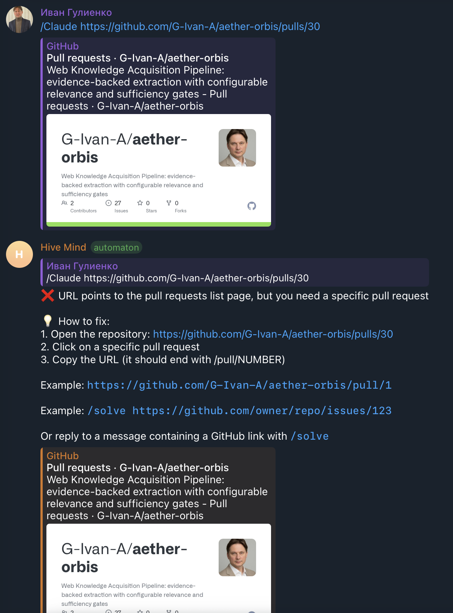

# Issue #2194 — the broken URL that looked perfect

On 2026-09-03 a user sent `/Claude https://github.com/G-Ivan-A/aether-orbis/pulls/30`
to the Hive Mind Telegram bot. Telegram drew a healthy GitHub preview card under
the message. The bot answered:

> ❌ URL points to the pull requests list page, but you need a specific pull request
>
> 💡 How to fix:
> **1. Open the repository: https://github.com/G-Ivan-A/aether-orbis/pulls/30**

The URL was one letter wrong — `pulls` where `pull` was meant — and the number the
user wanted was sitting right there in the URL the whole time. The bot had every
piece of data it needed to do the work, and instead told the user to go and find it
again, pointing them at the same broken link.



## Contents

| Section                                                  | What is in it                                                      |
| -------------------------------------------------------- | ------------------------------------------------------------------ |
| [1. Timeline](#1-timeline)                               | What happened, minute by minute, with the evidence for each step   |
| [2. Requirements](#2-requirements)                       | Every requirement in the issue, quoted, with where it is addressed |
| [3. Root causes](#3-root-causes)                         | Six of them, each with the code that caused it                     |
| [4. What was built](#4-what-was-built)                   | The recovery layer and where it is wired in                        |
| [5. Existing libraries](#5-existing-libraries)           | Measured — not assumed — against this issue's own inputs           |
| [6. Upstream](#6-upstream)                               | What belongs to GitHub, and why nothing was filed                  |
| [7. Reproducing all of this](#7-reproducing-all-of-this) | Every command used here                                            |

Raw material: [`data/issue-2194.md`](data/issue-2194.md) (the issue),
[`data/telegram-error-screenshot.png`](data/telegram-error-screenshot.png),
[`data/telegram-bot-claude-command.excerpt.log`](data/telegram-bot-claude-command.excerpt.log)
(the 70 lines around the failure) and
[`data/hive-telegram-bot.log.txt.gz`](data/hive-telegram-bot.log.txt.gz) — the
complete 26 979-line bot log from the
[gist linked in the issue](https://gist.githubusercontent.com/konard/1f5607fdec5a52f2d550143e314c2e8d/raw/debc323f337c44e20f997629f36ebdb648ff6531/hive-telegram-bot.log.txt),
committed here so this analysis stays reproducible if the gist ever goes away.

## 1. Timeline

The bot log covers `2026-09-02T20:45:24Z` → `2026-09-03T08:45:15Z`. Within those
12 hours the failure happened exactly once.

| When (UTC)   | What                                                                            | Evidence                                                                                                                                                                 |
| ------------ | ------------------------------------------------------------------------------- | ------------------------------------------------------------------------------------------------------------------------------------------------------------------------ |
| 07:38:33.877 | Bot heartbeat — two sessions running, everything healthy                        | `EVENT heartbeat {"pid":995,"activeSessions":2,…}` in the excerpt                                                                                                        |
| ~07:38:34    | `/Claude https://github.com/G-Ivan-A/aether-orbis/pulls/30` arrives             | `[VERBOSE] /claude command received` … `passed all checks, executing...`                                                                                                 |
| ~07:38:34    | Telegram renders a GitHub preview card that looks entirely healthy              | The screenshot; and github.com really does answer that path with HTTP 200 — [`evidence/github-serves-200-for-pulls-30.log`](evidence/github-serves-200-for-pulls-30.log) |
| ~07:38:35    | `parseGitHubUrl` returns `type: 'pulls_list'`, `subpath: '30'`                  | [`evidence/before-and-after.log`](evidence/before-and-after.log) reproduces it exactly with `{ recover: false }`                                                         |
| ~07:38:35    | Bot rejects the command and tells the user to "Open the repository: …/pulls/30" | `[telegram-send] s74 safeReply` line in the excerpt — the broken URL, verbatim, in the fix instructions                                                                  |
| 07:38:38.298 | Next unrelated session write; nothing was ever started for this request         | `DEBUG Persisted session fc14d5ce-…`                                                                                                                                     |
| 08:49:32     | Issue #2194 filed, 71 minutes later                                             | [`data/issue-2194.md`](data/issue-2194.md)                                                                                                                               |

Note what the log does **not** contain: the text the user actually typed. Everything
we know about the input comes from the screenshot and from the URL the bot happened
to echo back inside its error message. That gap is [RC6](#rc6-nothing-recorded-what-the-user-actually-typed).

## 2. Requirements

Quoting the issue, in order, with where each one is answered.

| #   | Requirement (quoted)                                                                                                                                                                                                                    | Where                                                                                                                                                                                                                   |
| --- | --------------------------------------------------------------------------------------------------------------------------------------------------------------------------------------------------------------------------------------- | ----------------------------------------------------------------------------------------------------------------------------------------------------------------------------------------------------------------------- |
| R1  | "we must be able to recover broken format even if it split with unprintable unicode symbols or something"                                                                                                                               | `src/github-url-recovery.lib.mjs` strips `\p{Cf}`/`\p{Cc}`/`\p{Zl}`/`\p{Zp}`, U+034F and the variation selectors before parsing. Tested in `tests/test-issue-2194-broken-url-recovery.mjs` (suite R2).                  |
| R2  | "find root cause, why it looks valid, yet not working"                                                                                                                                                                                  | [§3](#3-root-causes) — six causes, [RC2](#rc2-github-answers-the-broken-path-with-http-200) is the "looks valid" one.                                                                                                   |
| R3  | "make sure we safe time for users by actually implementing recovery mechanism, that will restore original url as displayed, if there is the data to restore from"                                                                       | `repairGitHubUrlText` / `repairGitHubPathParts`, wired into every entry point ([§4](#4-what-was-built)). The reported URL now runs instead of being rejected.                                                           |
| R4  | "download all logs and data related about the issue to this repository … compile that data to `./docs/case-studies/issue-{id}`"                                                                                                         | [`data/`](data) — issue text, screenshot, the full gist log and the excerpt.                                                                                                                                            |
| R5  | "deep case study analysis (also make sure to search online for additional facts and data), in which we will reconstruct timeline/sequence of events, list of each and all requirements … find root causes … propose possible solutions" | This document. Timeline [§1](#1-timeline), requirements [§2](#2-requirements), root causes [§3](#3-root-causes), solutions [§4](#4-what-was-built).                                                                     |
| R6  | "we should also check known existing components/libraries, that solve similar problem or can help in solutions"                                                                                                                         | [§5](#5-existing-libraries), measured against this issue's own inputs rather than assumed.                                                                                                                              |
| R7  | "If there is not enough data to find actual root cause, add debug output and verbose mode if not present"                                                                                                                               | `traceUrlRecovery()` under `--verbose`, `revealHiddenCharacters()` in the bot's raw-text trace, and `hidden`/`revealed`/`repairs` on every parse result. See [RC6](#rc6-nothing-recorded-what-the-user-actually-typed). |
| R8  | "If issue related to any other repository/project, where we can report issues on GitHub, please do so."                                                                                                                                 | [§6](#6-upstream) — the one external behaviour involved is GitHub's own routing, which is deliberate and not a bug to file.                                                                                             |
| R9  | "double check to fully apply requirements to entire codebase, so if we have issue in multiple places, it should be fixed in all them"                                                                                                   | Recovery is on by default **inside `parseGitHubUrl`**, so all 48 call sites across 14 files get it at once; the three user-facing entry points additionally report the repair ([§4](#4-what-was-built)).                |

## 3. Root causes

### RC1: the parser threw away the number it had just found

The pre-fix parser (`src/github-url-parser.lib.mjs` at `148b9a1c`) matched `pulls`
and stored everything after it in a field nobody reads:

```js
case 'pulls':
  // /owner/repo/pulls - PR list
  result.type = 'pulls_list';
  if (pathParts.length > 3) {
    result.subpath = pathParts.slice(3).join('/');
  }
  break;
```

`subpath` was the string `'30'`. The issue's phrase "if there is the data to restore
from" is exact: the data was already in the result object. Nothing looked at it.

### RC2: GitHub answers the broken path with HTTP 200

This is the "why does it look valid" question, and it has a measurable answer —
[`evidence/github-serves-200-for-pulls-30.log`](evidence/github-serves-200-for-pulls-30.log):

```
== https://github.com/G-Ivan-A/aether-orbis/pulls/30
   HTTP 200
   og:image:alt "… - Pull requests · G-Ivan-A/aether-orbis"
== https://github.com/G-Ivan-A/aether-orbis/pullz/30
   HTTP 404
```

`/pulls/<anything>` is served as the pull-request list page with a complete set of
Open Graph tags, which is exactly what Telegram builds its preview card from. A
genuinely wrong path (`/pullz/30`) 404s and gets no card at all. So the user's
screen showed a repository card with a green bar under a link that could not work —
there was no signal anywhere in the interface that anything was wrong.

### RC3: the error message pointed at the broken URL

From the log ([excerpt](data/telegram-bot-claude-command.excerpt.log)):

```
text="❌ URL points to the pull requests list page, but you need a specific pull request\n\n💡 How to fix:\n1. Open the repository: https://github.com/G-Ivan-A/aether-orbis/pulls/30\n…"
```

The locale string asks for the repository:

```
1. Open the repository: {{url}}
```

and `src/telegram-bot.mjs` passed `escapedUrl` — the user's broken URL — into it.
So the one instruction that was supposed to unblock the user sent them straight back
to the link that had just failed.

### RC4: no Unicode hygiene inside the parser

Only the Telegram path called `cleanNonPrintableChars`; `parseGitHubUrl` itself did
nothing. A zero-width space pasted into a repository name therefore produced a
_confidently wrong_ answer rather than an error — from
[`evidence/before-and-after.log`](evidence/before-and-after.log):

```
"https://github.com/G-Ivan-A/aether-orbis<U+200B>/pull/30"
  before: pull #30 https://github.com/G-Ivan-A/aether-orbis%E2%80%8B/pull/30
  after:  pull #30 https://github.com/G-Ivan-A/aether-orbis/pull/30
```

The "before" line is a URL for a repository that does not exist, produced silently,
with `valid: true`. This is the failure mode the issue's opening sentence was
worried about — it is real, it just was not what happened on 2026-09-03.

### RC5: case-sensitive scheme and host handling

Same evidence file:

```
"HTTPS://GITHUB.COM/G-Ivan-A/aether-orbis/PULL/30"
  before: other https://github.com/HTTPS://GITHUB.COM/G-Ivan-A/aether-orbis/PULL/30
```

The parser treated a shouted URL as a _relative path_, making `HTTPS:` the owner.
The Telegram bot's own gate had the same flaw — `if (!url.includes('github.com'))`
rejected `GITHUB.COM/...` before the parser ever saw it.

### RC6: nothing recorded what the user actually typed

`[VERBOSE] /claude command received` is followed by twelve lines about message
forwarding and then straight to the error. The message text is never logged. If the
cause really had been an invisible character, this log could not have proved it —
the character would have been just as invisible in the log. That is why the issue
had to say "if there is not enough data to find actual root cause, add debug output".

## 4. What was built

`src/github-url-recovery.lib.mjs` — a pure module, no I/O, no dependencies. Its
pipeline, in order:

1. **Strip the invisible.** `\p{Cf}` (zero-width space/joiner/non-joiner, BOM, soft
   hyphen, bidi marks), `\p{Cc}`, `\p{Zl}`, `\p{Zp}`, U+034F and U+FE00–U+FE0F.
   Every removal is named in the diagnostics.
2. **Undo the decoration.** `[title](url)`, `<url>`, `(url)`, `"url"`, a trailing
   `.` or `,` from prose, an unbalanced closer.
3. **Fold the look-alikes.** Full-width and fraction slashes and colons, full-width
   `.` `@` `-`, and full-width digits in the entity number.
4. **Normalize the address.** Lower-case scheme and host, `www.`/`m.` prefixes,
   `git@github.com:owner/repo.git`, `api.github.com/repos/owner/repo/...`,
   duplicated slashes.
5. **Read the path for what it means.** `/pulls/30` → `/pull/30`, `/issue/123` →
   `/issues/123`, `/pull-requests/30`, `/pull/30/files` → the pull request itself.

Two rules constrain all of it:

- **It never invents a GitHub URL.** `gitlab.com`, `bitbucket.org`,
  `gist.github.com`, `raw.githubusercontent.com`, `github.com.evil.example` and
  `evil.example/github.com/...` are all still rejected. So are the two ways the
  repairs could have over-reached in the opposite direction: `support@github.com`
  is an email address, not a repository (while `git@github.com:owner/repo.git`
  still works), and unwrapping `[the PR](aether-orbis)` is only worth doing when
  what comes out already names github.com — a wrapped bare word never becomes a
  GitHub profile. All asserted in suite R3 of
  `tests/test-issue-2194-broken-url-recovery.mjs`.
- **It never repairs silently.** Every parse result carries `original`, `repairs[]`
  and `recovered`, plus `hidden`/`revealed` when something invisible was removed.

Because `recover` defaults to `true` inside `parseGitHubUrl`, all 48 call sites
across 14 files get the behaviour without changing any of them; `{ recover: false }`
reproduces the old path exactly, which is what makes the before/after evidence above
possible. On top of that, the three entry points a human actually talks to say what
they did:

| Entry point                    | What the user sees                                                                                                                                            |
| ------------------------------ | ------------------------------------------------------------------------------------------------------------------------------------------------------------- |
| `src/telegram-bot.mjs`         | `telegram.url_recovered` — "I repaired the link before starting" with sent/used/repaired, in `en`/`ru`/`hi`/`zh`. Also fixes RC3 and the case-sensitive gate. |
| `src/solve.validation.lib.mjs` | "ℹ️ Repaired the GitHub URL before solving:" with the same three lines                                                                                        |
| `src/hive.mjs`                 | "ℹ️ Repaired the GitHub URL before monitoring:"                                                                                                               |

And for the next investigation: `traceUrlRecovery()` logs each repair stage under
`--verbose`, and `/solve` (with all its aliases, including the `/Claude` that started
this) logs its raw message text through `revealHiddenCharacters()`, so an invisible
character shows up as `[U+200B]` in the log instead of as nothing at all.

## 5. Existing libraries

The two candidates that could plausibly have replaced this work were installed and run against this issue's own inputs —
[`experiments/issue-2194/evaluate-existing-libraries.mjs`](../../../experiments/issue-2194/evaluate-existing-libraries.mjs),
output in [`evidence/existing-libraries.log`](evidence/existing-libraries.log).

| Library                                                                                            | On these inputs                                                                                                                                                        | Verdict                                                                                 |
| -------------------------------------------------------------------------------------------------- | ---------------------------------------------------------------------------------------------------------------------------------------------------------------------- | --------------------------------------------------------------------------------------- |
| [`normalize-url@9`](https://www.npmjs.com/package/normalize-url)                                   | Leaves `/pulls/30` untouched; **percent-encodes** the zero-width space instead of removing it; **throws `Invalid URL`** on the full-width colon and on a markdown link | Solves none of the six root causes. It normalizes URLs that already parse.              |
| [`confusables@1`](https://www.npmjs.com/package/confusables)                                       | Removes the zero-width space correctly; does **not** fix the full-width colon; and turns `github.com/Ćwikła/...` into `github.com/Cwikla/...`                          | Actively unsafe here — it would silently retarget a real, correctly-spelled owner name. |
| [`@ensdomains/unicode-confusables`](https://www.npmjs.com/package/@ensdomains/unicode-confusables) | **Not measured — read only.** Its documented job is to _detect_ confusing and zero-width codepoints (UTS #39), not to repair them, and it has no notion of a URL       | Would be a source for a warning, never the fix.                                         |

The measured result matters more than the summary: the one library that fixes the
Unicode half of this problem also breaks a legitimate non-ASCII GitHub login, and it
cannot be configured out of doing that. Hence a small local module that folds only
punctuation and digits and never touches letters — plus the half neither library
could ever cover, which is knowing that `/pulls/30` means pull request 30.

Also considered and rejected: doing the repair by asking GitHub. A network probe
would be authoritative but adds a round-trip and an auth dependency to every URL
parse, and — per [RC2](#rc2-github-answers-the-broken-path-with-http-200) — GitHub
answers `200` for the broken path anyway, so the probe would have confirmed the
wrong answer.

## 6. Upstream

The issue asks us to report problems to "any other repository/project, where we can
report issues on GitHub". The only third-party behaviour in this incident is
github.com serving `/owner/repo/pulls/<anything>` as the pull-request list page —
and there are two reasons nothing was filed.

**There is no tracker to file it in.** Feedback about github.com itself goes to
[`community/community`](https://github.com/community/community), which is a
Discussions-only repository — `gh api repos/github/feedback` redirects there and
reports `"has_issues": false`. The condition in the requirement is simply not met.

**It is not a defect anyway.** `/pulls` legitimately takes trailing segments
(`/pulls/comments`), and the list page tolerating an unknown one is ordinary lenient
routing rather than a bug; searching turned up no report of it being treated as one.
What it is, is a usability trap: it makes a one-letter typo indistinguishable from a
working link, right down to the preview card. That is documented here and handled on
our side, which is the only place it can be fixed without GitHub changing a
long-standing routing behaviour that other things surely depend on.

No dependency of this repository is implicated: the recovery layer has no
dependencies, and the two libraries in [§5](#5-existing-libraries) were evaluated and
not adopted, so their behaviour is not a bug we are subject to.

## 7. Reproducing all of this

```bash
# Why the broken URL looked healthy (needs network)
bash experiments/issue-2194/why-the-broken-url-looks-healthy.sh

# The old behaviour vs the new one, same process, same inputs
node experiments/issue-2194/before-and-after.mjs

# The full set of shapes that now recover, and the ones that must not
node examples/github-url-recovery-demo.mjs

# The prior-art measurement (installs two packages outside this repo)
mkdir -p /tmp/prior-art && cd /tmp/prior-art && npm init -y && npm install normalize-url@9 confusables@1
node /path/to/hive-mind/experiments/issue-2194/evaluate-existing-libraries.mjs

# The regression suite
node tests/test-issue-2194-broken-url-recovery.mjs
```
