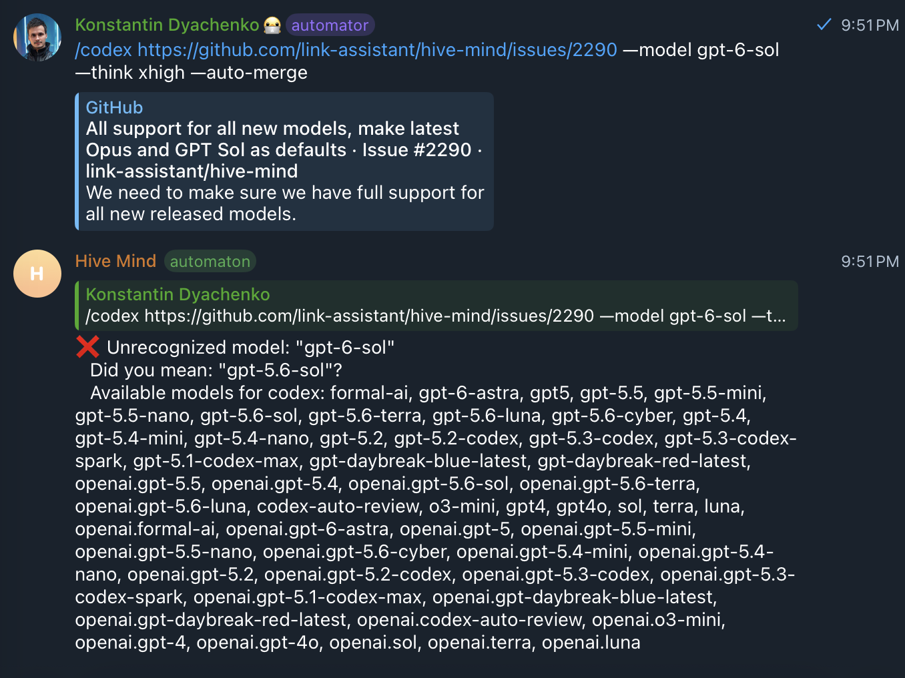

# Issue #2290 — model releases outran model validation

## Executive summary

On 2026-09-24, Hive Mind rejected `gpt-6-sol` before Codex could start even
though the locally installed Codex CLI advertised that exact model. The same
release also described Claude's `opus` default with a bundled mapping to an
older concrete model instead of letting Claude Code advance its rolling alias.

The immediate missing catalogue entries were small. The actual defect was an
architecture boundary introduced by the otherwise useful live model catalogue
in [PR #2203](https://github.com/link-assistant/hive-mind/pull/2203): `/models`
could discover models that command validation still refused. The live
catalogue was informational, while every work-producing command continued to
use a release-time allowlist.

This change closes that boundary:

1. bundled aliases remain the first validation layer and keep typo suggestions;
2. an exact ID reported by the installed Codex CLI or the configured router is
   accepted even when it post-dates this Hive Mind release;
3. direct provider-shaped IDs remain available for CLIs whose documented
   contract supports pass-through model names;
4. Codex defaults to the numerically newest `gpt-*-sol` in its installed
   catalogue, with `gpt-6-sol` as the bundled default;
5. Claude defaults to `opus`, preserved as a vendor-managed rolling alias for
   direct runs and resolved to the newest concrete Opus in a router catalogue
   for routed runs; and
6. the same runtime-aware validation is used by `solve`, `hive`, `task`,
   Telegram solve/hive/fix/task entry points, and the organizer.

The result is future-safe for releases such as `gpt-6.1-sol`: if the installed
CLI advertises it, Hive Mind selects and accepts it without a source change.

## Evidence bundle

The evidence directory contains the original visual report and the complete
token-free local catalogue output used in this investigation.

| Artifact                                                               | SHA-256                                                            | Purpose                                                                                                                                 |
| ---------------------------------------------------------------------- | ------------------------------------------------------------------ | --------------------------------------------------------------------------------------------------------------------------------------- |
| [`evidence/issue-screenshot.png`](evidence/issue-screenshot.png)       | `4108c91dbe23a2c9563172f19f3f42af4c5e2a7cbd7be7d36702cec7b33b69c5` | Original Telegram failure: `gpt-6-sol` is rejected and `gpt-5.6-sol` is suggested.                                                      |
| [`evidence/codex-debug-models.json`](evidence/codex-debug-models.json) | `f45b193f6164a2226d69c1d0811afcf3f96c277215c6725684ecbe03c2e507a4` | Complete output from `codex debug models` under Codex CLI `0.156.1`. It includes all model records, not only the names extracted below. |



The issue and PR had no discussion comments or reviews when the investigation
was performed, so the issue body, title, image, repository behavior, and vendor
contracts are the complete requirements record.

### Local runtime measurement

Environment measured on 2026-09-24:

| Component             | Observed version/result                                                                       |
| --------------------- | --------------------------------------------------------------------------------------------- |
| Codex CLI             | `0.156.1`                                                                                     |
| Claude Code           | `2.1.280`                                                                                     |
| `codex debug models`  | 9 model records                                                                               |
| Visible GPT-6 entries | `gpt-6-astra`, `gpt-6-sol`, `gpt-6-luna`                                                      |
| Other current entries | `gpt-reserve`, `gpt-5.6-sol`, `gpt-5.6-terra`, `gpt-5.6-luna`, `gpt-5.5`, `codex-auto-review` |

`codex debug models` is local metadata discovery. It does not submit a prompt
or consume model tokens. The model-list providers already added in #2202 use
the same principle: catalogue endpoints and local CLI metadata, never an
inference request.

## Online research

Primary documentation was used for changing product contracts; repository
history was used for Hive Mind's own behavior.

| Source                                                                                                                                                | Finding used here                                                                                                                                                                                                              |
| ----------------------------------------------------------------------------------------------------------------------------------------------------- | ------------------------------------------------------------------------------------------------------------------------------------------------------------------------------------------------------------------------------ |
| [OpenAI GPT-6 Sol model page](https://developers.openai.com/api/docs/models/gpt-6-sol)                                                                | `gpt-6-sol` is a real current model ID, not a user typo.                                                                                                                                                                       |
| [OpenAI latest-model guide](https://developers.openai.com/api/docs/guides/latest-model)                                                               | Current OpenAI model selection changes independently of Hive Mind releases.                                                                                                                                                    |
| [Claude Code model configuration](https://code.claude.com/docs/en/model-config)                                                                       | `opus`, `sonnet`, and `haiku` are rolling aliases; `opus` currently selects Opus 5.5, while a full model name pins a release. The page also documents pass-through model names and the Claude Code version floor for Opus 5.5. |
| [Anthropic model deprecations](https://platform.claude.com/docs/en/about-claude/model-deprecations)                                                   | Concrete Claude model lifecycle is vendor-controlled, so pinning a rolling default in Hive Mind creates avoidable drift.                                                                                                       |
| [Claude Code CLI reference](https://code.claude.com/docs/en/cli-usage)                                                                                | `--model` accepts an alias or full model name.                                                                                                                                                                                 |
| [Issue #2202](https://github.com/link-assistant/hive-mind/issues/2202) and [PR #2203](https://github.com/link-assistant/hive-mind/pull/2203)          | Hive Mind already had live provider/router/CLI catalogue readers, a one-hour cache, CLI freshness checks, and `/models`; the missing piece was operational validation.                                                         |
| [PR #2044](https://github.com/link-assistant/hive-mind/pull/2044)                                                                                     | The previous future-proofing attempt expanded static Codex aliases, but still required code changes for an unanticipated exact ID.                                                                                             |
| [Router issue #192](https://github.com/link-assistant/router/issues/192) and [router issue #595](https://github.com/link-assistant/router/issues/595) | The router already has dynamic provider catalogue work; no missing router capability caused this failure.                                                                                                                      |
| [Router issue #415](https://github.com/link-assistant/router/issues/415)                                                                              | Hive Mind intentionally remains on the compatible `0.x` router line; upgrading router was not necessary for this fix.                                                                                                          |

No external issue was opened. The router and both vendor CLIs already exposed
the required discovery or alias behavior; Hive Mind discarded that information
at its own static validation boundary. Reporting the local integration defect
to another project would therefore have been misleading.

## Timeline reconstructed

| Date                     | Event                                                                                                             | Consequence                                                                                                                    |
| ------------------------ | ----------------------------------------------------------------------------------------------------------------- | ------------------------------------------------------------------------------------------------------------------------------ |
| 2026-07-11               | PR #2044 merged additional Codex aliases and OpenAI-prefixed variants.                                            | More known models worked, but validation remained a compiled allowlist.                                                        |
| 2026-09-04               | PR #2203 merged hot catalogue loading, `/models`, CLI freshness checks, provider and router readers, and caching. | New models became visible immediately, but `liveOnly` entries were explicitly display-only.                                    |
| 2026-09 (vendor rollout) | Claude documentation advanced the rolling `opus` alias to Opus 5.5 and OpenAI exposed GPT-6 Sol.                  | Hive Mind's concrete model snapshots became stale again, as expected for release-time data.                                    |
| 2026-09-24 14:51 UTC     | Issue #2290 was opened with a Telegram reproduction.                                                              | `--model gpt-6-sol` failed before task execution and suggested the older default.                                              |
| 2026-09-24               | Local Codex `0.156.1` returned `gpt-6-sol` from `codex debug models`.                                             | This proved discovery worked and isolated the failure to Hive Mind validation.                                                 |
| 2026-09-24               | A failing regression test called the proposed runtime validator before it existed.                                | The test initially failed on the missing export, then passed after runtime validation and default resolution were implemented. |

## Requirements reconstructed

The issue deliberately asks for more than adding two strings. The requirements
below preserve that distinction.

| ID  | Requirement                                                           | Implementation/status                                                                                                                                                                                    |
| --- | --------------------------------------------------------------------- | -------------------------------------------------------------------------------------------------------------------------------------------------------------------------------------------------------- |
| R1  | Fully support all newly released models.                              | Added current GPT-6 Sol/Luna/Reserve and Opus 5.5 entries; exact live IDs are now operational, not display-only.                                                                                         |
| R2  | Make the latest Opus the Claude default.                              | Kept the default as `opus` and stopped eagerly pinning that rolling alias in every execution path. Router runs select the newest concrete live Opus because routers operate on IDs.                      |
| R3  | Make the latest GPT Sol the Codex default.                            | Bundled default is `gpt-6-sol`; runtime scans the installed catalogue and numerically selects the newest Sol generation.                                                                                 |
| R4  | Support later models without code changes.                            | Runtime validation accepts exact IDs from CLI/router catalogues. A regression fixture proves a hypothetical `gpt-6.1-sol` becomes valid and default automatically.                                       |
| R5  | Apply dynamic support with and without the router.                    | Direct Codex uses `codex debug models`; direct Claude uses documented pass-through/rolling aliases; `--use-router` adds the merged router catalogue and resolves rolling Claude aliases to concrete IDs. |
| R6  | Apply the behavior everywhere, not only `/models`.                    | Audited all model validation/default call sites and updated CLI, Telegram, task, organize, agent-commander, connection-check, and Claude execution paths.                                                |
| R7  | Download evidence and perform a deep case study with online research. | This document and the two hashed raw artifacts satisfy the durable evidence requirement.                                                                                                                 |
| R8  | Report related-project defects when one exists.                       | No upstream defect exists: the required router/CLI interfaces work. The root cause and fix are local.                                                                                                    |

## Reproduction and causal trace

The minimal failing input was:

```text
/codex <issue> --model gpt-6-sol --think xhigh --auto-merge
```

Before this change the path was:

```text
Telegram argument validation
  -> validateModelName("gpt-6-sol", "codex")
  -> CODEX_MODELS compiled into the installed Hive Mind package
  -> no key named gpt-6-sol
  -> reject before Codex or the live catalogue is consulted
```

At the same time, `/models --tool codex` followed a different path:

```text
codex debug models + router/provider sources + bundled catalogue
  -> mergeModelCatalogue()
  -> gpt-6-sol appears under liveOnly
  -> render it for the user
```

The contradiction was therefore deterministic: Hive Mind could truthfully
display a model and then reject that model on the next command.

The corrected path is:

```text
validateRuntimeModelName(model, tool)
  -> accept a bundled alias (preserves mappings and typo suggestions)
  -> otherwise discover exact CLI IDs
  -> with --use-router, include the merged live catalogue
  -> accept an exact case-insensitive ID match
  -> for documented pass-through CLIs, accept a constrained provider-ID shape
  -> otherwise return the original useful validation error
```

## Root causes

### 1. Live discovery stopped at presentation

PR #2203 correctly kept unknown live entries separate from fully bundled ones,
but encoded the assumption that only bundled models “will work.” That avoided
blind trust in external strings, yet left no promotion step from discovery to
execution. `validateModelName()` could only see static maps.

### 2. Defaults were data snapshots, not resolution policies

`defaultModels.codex` named one release. Updating it solved one rollout and
guaranteed another code change on the next Sol rollout. The durable policy is
“newest numeric Sol exposed by this installed Codex,” with a bundled value only
for offline/error fallback.

Claude has the inverse vendor contract: `opus` itself is the policy. Mapping it
to a concrete ID before launching Claude Code defeated the documented rolling
alias. A router cannot necessarily understand that alias, so router execution
requires a live family selection instead of unconditional pass-through.

### 3. Validation was duplicated at product boundaries

CLI parsing, Telegram queueing, task decomposition, connection checks,
organization classification, agent-commander, and the final tool executor each
handled the model independently. Fixing only `solve.mjs` would still leave the
reported Telegram command broken and could let a connection check probe a
different model from the actual run.

### 4. Safety and freshness had been treated as opposing goals

Removing validation accepts typos but makes failures late and costly. Keeping
an allowlist makes valid releases late. The missing design was layered trust:
strict aliases plus exact authoritative discovery, rather than either extreme.

## Alternatives considered

| Option                                                      | Advantage                                                | Failure mode                                                                               | Decision                                                                                              |
| ----------------------------------------------------------- | -------------------------------------------------------- | ------------------------------------------------------------------------------------------ | ----------------------------------------------------------------------------------------------------- |
| Add only `gpt-6-sol` and `claude-opus-5-5` to static maps.  | Smallest patch.                                          | Repeats the same incident on the next release and violates R4.                             | Rejected as the complete solution; retained only as an offline baseline.                              |
| Accept every arbitrary `--model` string.                    | Never blocks a new model.                                | Typos, injection-like values, and tool-incompatible IDs fail later; suggestions disappear. | Rejected.                                                                                             |
| Accept any string matching `gpt-*` or `claude-*`.           | Simple “future-proof” regex.                             | `gpt-6-slo` would be accepted despite an authoritative Codex catalogue proving it invalid. | Rejected for Codex; constrained provider-shaped pass-through is used only where the CLI documents it. |
| Make the router mandatory.                                  | One catalogue source.                                    | Breaks direct CLI use and contradicts the explicit “without router” requirement.           | Rejected.                                                                                             |
| Exact live-catalogue matching layered over bundled aliases. | Fresh, typo-safe, works direct and routed, reuses #2203. | Discovery can be unavailable, so an offline fallback remains necessary.                    | Selected.                                                                                             |
| Pin Claude to `claude-opus-5-5`.                            | Deterministic today.                                     | Becomes stale and bypasses Claude Code's rolling `opus` contract.                          | Offered as explicit `opus-5-5`, but not used for the default.                                         |

## Implementation design

### Bundled baseline

The bundled catalogue now includes `gpt-6-sol`, `gpt-6-luna`, `gpt-reserve`,
`claude-opus-5-5`, and the `opus-5-5` convenience alias. This makes current
models work even if discovery is temporarily unavailable and supplies current
help text, 1M-context metadata, and fallback relationships.

### Runtime validation

`validateRuntimeModelName()` first calls the existing static validator. On a
miss it queries the relevant authoritative runtime sources. It only promotes
an exact ID. Codex deliberately has no broad `gpt-*` fallback: its local
catalogue is authoritative enough to reject the reported typo class. Claude,
Gemini, Qwen, Agent, and OpenCode retain narrowly shaped pass-through behavior
consistent with their existing CLI/provider naming contracts.

Catalogue failures are best-effort. They do not replace a clear “unrecognized
model” message with an unrelated Docker or network error, and the bundled
catalogue remains usable offline.

### Runtime defaults

Codex version comparison parses the numeric portion of
`gpt-<version>-sol`, so `6.10` sorts after `6.9` and a future `6.1` sorts after
`6`. When no Sol is exposed, the existing capability-ordered fallback list is
used.

Direct Claude execution passes `opus` unchanged. Routed Claude execution reads
live concrete IDs and selects the highest numeric Opus family member. If no
live source answers, it falls back to the bundled mapping instead of failing
command preparation.

### Entry-point coverage

| Surface                      | Dynamic behavior                                                                         |
| ---------------------------- | ---------------------------------------------------------------------------------------- |
| `solve` / `hive`             | Runtime default selection and runtime validation for primary, plan, and fallback models. |
| `task`                       | Runtime default and exact live validation before starting agent-commander.               |
| Telegram solve/hive/fix/task | Async runtime validation before queueing; fixes the screenshot's path.                   |
| Claude native executor       | Preserves rolling aliases direct; resolves concrete live IDs for router use.             |
| Claude connection check      | Probes the same rolling/routed model contract as execution.                              |
| Agent Commander              | Preserves Claude rolling aliases instead of applying the compatibility snapshot.         |
| Organizer                    | Uses the runtime Codex default/validator and preserves the direct Claude rolling alias.  |
| `/models` and `hive-models`  | Explain that `liveOnly` exact IDs are accepted by runtime validation.                    |

## Existing components reused

| Component                            | Why it is sufficient                                                                      |
| ------------------------------------ | ----------------------------------------------------------------------------------------- |
| `codex debug models`                 | Installed-account catalogue, no inference call, already normalized by #2203.              |
| Anthropic/OpenAI model APIs          | First-party catalogue sources already integrated by #2203; no new HTTP library is needed. |
| Link.Assistant router catalogue      | Supplies routed/provider-visible exact IDs and already participates in the merged cache.  |
| models.dev metadata                  | Enriches labels/capabilities but is not trusted as the sole execution authority.          |
| Existing disk cache and one-hour TTL | Avoids provider/router discovery on every command; no second cache was added.             |
| Existing Levenshtein suggestions     | Preserves fast feedback for aliases and misspellings.                                     |

No dependency was added and no prompt is sent to discover models.

## Security and operational constraints

- Runtime IDs are length-limited and character-limited before provider-shaped
  pass-through is considered.
- Codex accepts an unknown ID only when an authoritative live source returns an
  exact match; `gpt-6-slo` remains rejected with a suggestion for
  `gpt-6-sol`.
- Static aliases still map exactly as before, limiting backward-compatibility
  risk for configuration, reporting, and old tests.
- Network, Docker, or provider catalogue failure degrades to the bundled
  catalogue and original validation error.
- Discovery endpoints and CLI metadata are non-inference operations, so the fix
  does not introduce token expense.
- The router version is unchanged. Its existing catalogue is enough, while a
  major router migration would be unrelated risk.

## Verification matrix

The regression test at
[`tests/issue-2290-dynamic-model-support.test.mjs`](../../../tests/issue-2290-dynamic-model-support.test.mjs)
covers the core incident and the next rollout, not only current strings.

| Scenario                                              | Expected result                                          |
| ----------------------------------------------------- | -------------------------------------------------------- |
| Bundled `gpt-6-sol`                                   | Accepted and mapped to itself.                           |
| Bundled `claude-opus-5-5`                             | Accepted and mapped to itself.                           |
| Direct default `opus`                                 | Passed unchanged to Claude Code.                         |
| Routed default `opus` with Opus 5 and 5.5 live        | Resolved to `claude-opus-5-5`.                           |
| Installed `gpt-6-sol`, `gpt-5.6-sol`                  | Runtime default is `gpt-6-sol`.                          |
| Hypothetical installed `gpt-6.1-sol`                  | Runtime default advances to `gpt-6.1-sol`.               |
| Hypothetical live-only exact Codex ID                 | Accepted without a bundled-map edit.                     |
| Model returned by an injected merged router catalogue | Accepted through the real catalogue-loader branch.       |
| Misspelled `gpt-6-slo`                                | Rejected with `gpt-6-sol` suggestion.                    |
| Organizer with default Claude model                   | Launch arguments contain `--model opus`, not an old pin. |

Existing Codex, Opus, catalogue, models-command, task, Telegram, and
agent-commander suites are also run to detect compatibility regressions.

## Limits and future work

Dynamic support cannot make an account eligible for a gated model; it can only
honor what that account's CLI, provider, or router advertises. A provider can
also publish incomplete metadata. For those reasons the bundled catalogue
still owns rich capability annotations and fallback policy, while live-only
models receive exact-ID execution support.

The compatibility map still records concrete targets for historical reporting
and synchronous APIs. The execution boundary is the source of truth for
rolling aliases. If every supported router later gains a standard rolling
alias contract, routed Claude execution can pass `opus` through as well and
remove the family-selection adapter.

The key regression invariant is now explicit: a model shown as live by Hive
Mind must be accepted by work-producing commands under the same tool/router
context.
