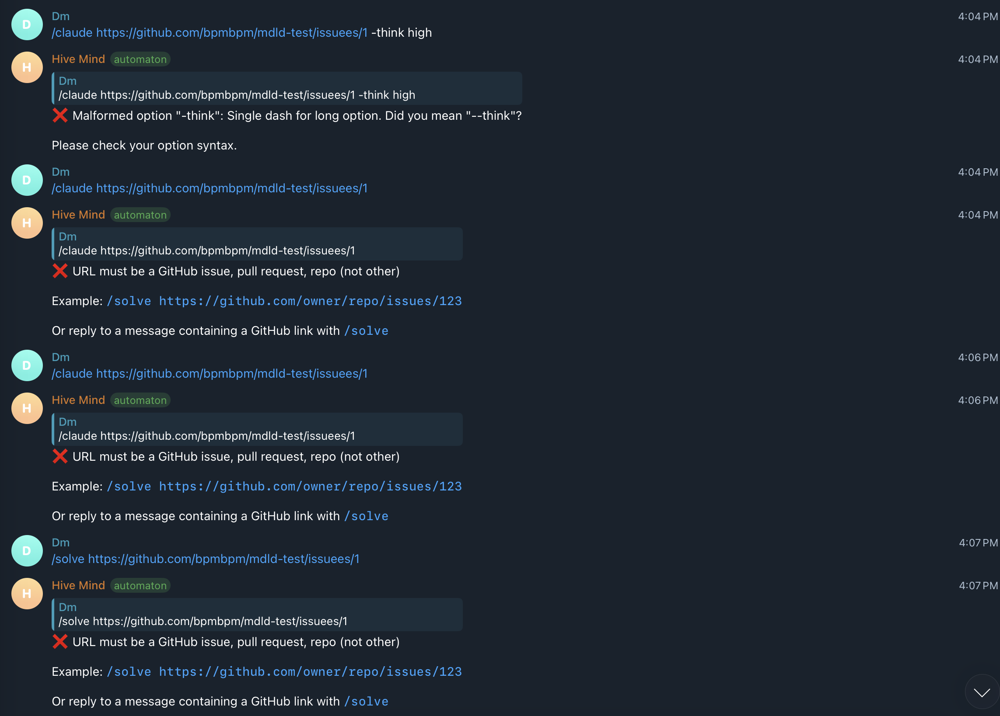
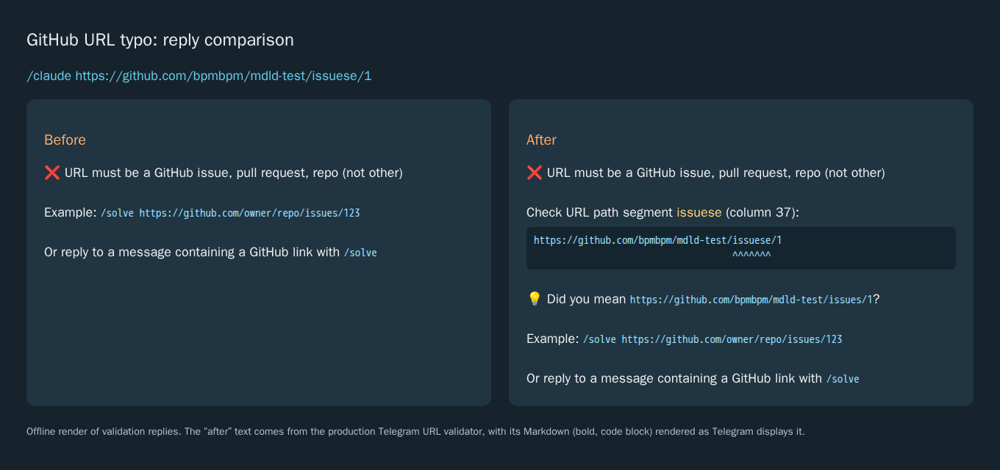

# Input error locations

Issue [#2326](https://github.com/link-assistant/hive-mind/issues/2326) shows
`/claude https://github.com/bpmbpm/mdld-test/issuese/1` repeatedly failing with
“URL must be a GitHub issue, pull request, repo (not other)”. The malformed
`-think` option in the same screenshot already had a correction, but neither
error identified a position in the input.

The URL parser classified an unknown repository path as `other`. Telegram
reported that category and discarded the path that caused it. Syntax diagnostics
now retain the offending segment and its column, echo the URL, and suggest a
unique nearby known path or host spelling. Suggestions leave the parsed target
unchanged. Existing URL recovery, valid targets, owner/repository names, and
query strings/fragments retain their behavior.

Shared CLI and Telegram option parsing adds the argument position and original
flag to validation errors. Invalid values include the flag and its value;
unrelated argument values are omitted. Malformed flags also include their
positions. `solve` previously swallowed some validation failures and continued
with `error.argv` or `{}`; those failures now reach its existing error handler.

## Reproduction and verification

```sh
node tests/issue-2326-input-diagnostics.test.mjs
node experiments/issue-2326/reproduce.mjs
npm test
```

The regression file reproduced the missing URL correction/location, missing
option positions, and swallowed validation error before the implementation.
It covers 20 cases, including the production Telegram validator, CLI and
Telegram parsers, malformed flags, invalid values, multiple errors, duplicate
path words, unsafe guesses, preserved recovery, and error metadata/idempotence.

Logs are saved locally in `experiments/issue-2326/*.log`; GitHub workflow logs
are saved in `ci-logs/`. The initial workflow
[37480900675](https://github.com/link-assistant/hive-mind/actions/runs/37480900675)
ran against prepared commit `32e1f339`, before the fix. Its log at lines
2524–2529 reports four stale declarations: `start-command` 0.35.3 → 0.35.4 in
three Dockerfiles and `command-stream` 1.5.0 → 1.6.2 in the runtime package map.
The mandatory freshness check reproduced these failures locally. The pins and
matching fixtures were refreshed without changing the check.

The first security scan of the implementation flagged the regression test's
URL substring assertion as incomplete URL validation ([annotation](https://github.com/link-assistant/hive-mind/pull/2562#discussion_r4196927353)).
That assertion checks displayed error text, not host authorization. It now
compares the complete `Input:` field against the quoted original URL, which
tests the intended behavior more precisely without disabling the scanner.

## Visual evidence

Original screenshot from the issue:



Offline browser render comparing the original reply with the production
validator's reply. This is a reply preview, not a live Telegram conversation.
Recreate its HTML with the experiment script above.


