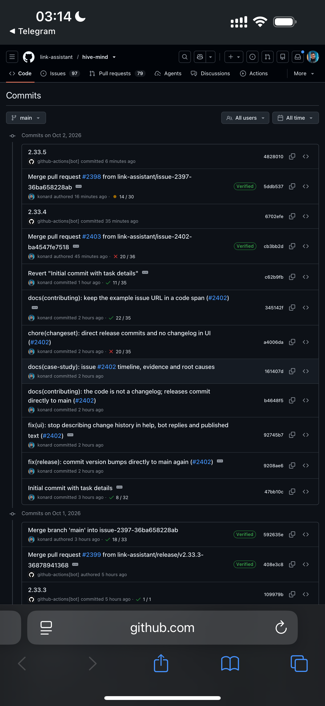

# Case study: `/merge` kept merging while `main` CI was red (issue #2404)

- Issue: https://github.com/link-assistant/hive-mind/issues/2404
- Fix PR: https://github.com/link-assistant/hive-mind/pull/2405
- Raw evidence: [`home-box-hive-telegram-bot.log.txt`](home-box-hive-telegram-bot.log.txt) (full bot log) and [`data/`](data)

## Summary

On 2026-10-01 the Telegram bot's `/merge` queue for `link-assistant/hive-mind` started while the
`Checks and release` run of `main` (run [36914477944](https://github.com/link-assistant/hive-mind/actions/runs/36914477944)
on `cb3bb2d`, the merge of PR #2403) was still in progress. The queue waited for that run to
**finish**, but never looked at **how** it finished. The run failed (`Docker Publish (linux/arm64)`
→ `Pipeline Status: Pipeline failed. Failing jobs: docker-publish`), and the queue merged PR #2398
and later PR #2401 on top of the red `main` anyway.



## Timeline (UTC, 2026-10-01)

All times come from the GitHub API (`data/*.json`) and the bot log (`data/merge-session-excerpt.log`).

| Time     | Event                                                                                                                                                                                          |
| -------- | ---------------------------------------------------------------------------------------------------------------------------------------------------------------------------------------------- |
| 19:27:54 | PR #2403 merged → `cb3bb2d` on `main`.                                                                                                                                                         |
| 19:27:58 | `push` runs for `cb3bb2d` start (`Checks and release` 36914477944, `Workflows`, `Broken Link Checker`, `Security`).                                                                            |
| ~19:33   | `/merge` starts. Health check: `1 CI run(s) still in progress on main (latest commit cb3bb2d)` → treated as healthy and the queue decides to wait (excerpt lines 25–30).                       |
| 19:37:27 | Release job pushes the `2.33.4` version bump `6702efe` with `GITHUB_TOKEN`. **No workflow runs are created for it** (`data/runs-6702efe.json`: `total_count: 0`).                              |
| 19:42:45 | Release job finished; Docker jobs start.                                                                                                                                                       |
| 19:43:39 | `scripts/wait-for-npm.mjs` reports `@link-assistant/hive-mind@2.33.4` available (`npm view … version` succeeded).                                                                              |
| 19:46:37 | `Docker Publish (linux/arm64)`: `error: GET https://registry.npmjs.org/@link-assistant/hive-mind/-/hive-mind-2.33.4.tgz - 404` (`data/run-36914477944-failed-steps.log:1633`).                 |
| 19:56:15 | `Pipeline Status`: `##[error]Pipeline failed. Failing jobs: docker-publish` (same log, line 1879).                                                                                             |
| 19:56:18 | Run 36914477944 completes with `conclusion: failure`.                                                                                                                                          |
| 19:56:4x | Queue log: `No active CI runs on main branch. Ready to proceed.` → `Waited for 1 CI runs to complete on main branch` → `Processing PR #2398` (excerpt lines 145–148). **No conclusion check.** |
| 19:56:46 | PR #2398 merged → `5ddb537`.                                                                                                                                                                   |
| 19:56:50 | `Checks and release` 36917996687 for `5ddb537` starts; the queue waits for post-merge CI.                                                                                                      |
| 20:06:28 | Release bump `2.33.5` → `4828010`. Its only run is `Formal AI Draft` (event `issues`), not branch CI (`data/runs-4828010.json`).                                                               |
| 20:27:07 | Run 36917996687 for `5ddb537` succeeds.                                                                                                                                                        |
| 20:27:38 | PR #2401 merged by the queue → `3d33ef7`.                                                                                                                                                      |

## Requirements from the issue

1. `/merge` must recognise a failed CI/CD run on the target branch and **stop** instead of merging.
2. Collect logs and data under `docs/case-studies/issue-2404` (done: bot log, PR/run/commit JSON,
   failed-step logs, screenshot).
3. Deep case study: timeline, requirements, root causes, solutions, existing components, online research (this file).
4. Add debug output if the root cause cannot be found (root cause was found; the new gate logs every decision —
   see "Observability" below).
5. Report issues to other repositories if relevant (none needed — see "External reports").
6. Fix the same problem everywhere in the codebase (initial queue start, every merge iteration, auto-resolve mode).

## Root causes

### RC1 — "finished" was treated as "green"

`MergeQueueProcessor.run()` checked the branch CI health **once**, before the queue started. A
HEAD with runs in progress returned `{ healthy: true, pending: true }`, and the processor then
called `waitForBranchCI()`, which only polls until no run is `in_progress`/`queued`. When it
returned, the queue went straight to `Processing PR #2398`. The failed conclusion of run
36914477944 was never read.

### RC2 — HEAD-only health check is blind to commits without branch CI

Even a re-check after the wait would not have helped with the old implementation of
`checkBranchCIHealth()`: it only looked at the runs whose `head_sha` is the branch HEAD. By 19:56
the HEAD was `6702efe` (`2.33.4`), pushed by the release workflow with `GITHUB_TOKEN`. GitHub
documents that _"events triggered by the `GITHUB_TOKEN` … will not create a new workflow run"_
(see sources), so the HEAD had **0 runs** and the old check reported `main` as healthy. The same
happens when the HEAD only carries non-branch-CI runs, e.g. `4828010` (`2.33.5`) whose only run is
`Formal AI Draft` triggered by an `issues` event.

### RC3 — timeouts proceeded "anyway"

On `targetBranchCITimeoutMs` expiry the queue logged a warning and **merged anyway**
(`config.lib.mjs` comment: "proceed with merge anyway"), which would also merge on top of an unknown
or red branch.

### Trigger (secondary) — npm metadata visible before tarball

The red run itself was caused by the npm registry: `wait-for-npm.mjs` only checked
`npm view <pkg>@<version> version`. The version metadata was visible at 19:43:39, but the tarball
URL still returned 404 at 19:46:37 for the arm64 Docker build (`bun install -g …@2.33.4`).

## Solution

| Area                                           | Change                                                                                                                                                                                                                                                                                                                                                                                                                                                |
| ---------------------------------------------- | ----------------------------------------------------------------------------------------------------------------------------------------------------------------------------------------------------------------------------------------------------------------------------------------------------------------------------------------------------------------------------------------------------------------------------------------------------- |
| `src/telegram-merge-branch-gate.lib.mjs` (new) | `ensureTargetBranchReady()` — check health → wait for active runs → **re-check conclusions** → repeat (max 10 rounds). Returns `ready` / `failed` / `pending` / `cancelled`. On wait timeout the HEAD verdict is re-read and the queue only proceeds if it is green.                                                                                                                                                                                  |
| `src/telegram-merge-queue.lib.mjs`             | The gate runs **before every PR** (not only at start), and in auto-resolve mode. A `failed` or `pending` gate stops the queue (`failQueue()`): the remaining PRs are left unmerged and the error, with the failed run links, is reported to the user. `checkBranchCIHealthBeforeStart()` is kept as a thin wrapper around the gate for compatibility. `getDefaultBranch`, `checkBranchCIHealth`, `waitForBranchCI`, `waitForCommitCI` are injectable. |
| `src/github-branch-ci-health.lib.mjs` (new)    | `evaluateBranchCIHealth()` — walks the first-parent chain (up to 10 commits) to the newest commit that has `push` runs and judges that commit. A HEAD without runs younger than 2 minutes is reported as `pending` (runs may not be registered yet). If no commit in the window has push CI, the previous HEAD-only behaviour is kept (0 runs → healthy).                                                                                             |
| `src/github-merge-ci.lib.mjs`                  | `checkBranchCIHealth()` fetches the recent commits once and delegates to the evaluator; the result now also contains `headSha`, `checkedSha`, `skippedCommits`.                                                                                                                                                                                                                                                                                       |
| `src/config.lib.mjs`                           | Comments updated: the queue stops instead of "proceed anyway".                                                                                                                                                                                                                                                                                                                                                                                        |
| `scripts/wait-for-npm.mjs`                     | Also waits until `npm view <pkg>@<ver> dist.tarball` is downloadable (`HEAD` → 2xx), addressing the trigger.                                                                                                                                                                                                                                                                                                                                          |

Existing behaviour that is intentionally preserved:

- Issue #1425: when the HEAD has its own CI, older red commits are ignored.
- Issue #1952: `startup_failure` and `timed_out` count as failures, `cancelled` does not.
- API errors while checking health are not treated as merge blockers (as before).
- With `CHECK_BRANCH_CI_HEALTH_BEFORE_START` disabled, the legacy "wait, then proceed" flow is used.

### Observability

Every decision is logged in verbose mode, e.g.:

```
Branch gate (before merging PR #2398): checking CI health of main HEAD (round 2/10)...
Commit 6702efe on main has no push CI runs (e.g. a release bump pushed with GITHUB_TOKEN); checking its parent
Found 1 failed CI run(s) on main (commit cb3bb2d (HEAD 6702efe has no CI of its own)):
Branch gate (before merging PR #2398): main is red — 1 CI run(s) failed on main: Checks and release (commit cb3bb2d, below HEAD 6702efe)
```

`experiments/issue-2404-branch-ci-health-live.mjs [owner/repo] [branch]` runs the new health check against the live API.

## Verification

- `tests/test-merge-red-main-after-wait-2404.mjs` (9 tests) — reproduces the incident with the queue
  processor. The "exact production timeline" test replays the commits and runs from this incident
  through the real evaluator: with a HEAD-only check (`lookback: 1`) the queue merges `[2398, 2401]`
  exactly like production; with the fix it merges nothing and reports the `Checks and release`
  failure.
- `tests/test-branch-ci-health-walkback-2404.mjs` (11 tests) — evaluator unit tests with the real SHAs/run IDs.
- Regression suites still pass: `test-merge-queue.mjs` (86), `test-merge-auto-resolve-1805.mjs` (26),
  `test-merge-auto-resolve-sequential-1807.mjs` (10), `test-branch-ci-health-1425.mjs` (12),
  `test-merge-queue-cancel-1588.mjs`, `test-merge-cancel-latency-2072.mjs`, `test-merge-targets-2013.mjs`,
  `test-active-branch-runs-buffer-1722.mjs`, `test-merge-stuck-no-workflow-runs-1918.mjs`.

## Alternatives considered (online research)

| Option                                                         | Notes                                                                                                                                                                                                                                                         |
| -------------------------------------------------------------- | ------------------------------------------------------------------------------------------------------------------------------------------------------------------------------------------------------------------------------------------------------------- |
| GitHub native merge queue (`merge_group` event)                | Tests every PR on top of the queue head before merging; requires branch protection with required status checks and workflows that listen to `merge_group`. It would not, by itself, react to a red post-merge `Checks and release` run (release/Docker jobs). |
| Mergify / Bors-NG ("Not Rocket Science Rule")                  | Same principle — keep `main` always green by testing the merge result. External services/GitHub Apps; not a drop-in for the bot's Telegram-driven flow.                                                                                                       |
| Personal access token / GitHub App token for release bump push | Would make bump commits trigger CI, so HEAD-only checks would work, but it doubles CI cost and needs extra secrets. The walk-back solves it without workflow changes.                                                                                         |
| Commit status API (`/commits/{sha}/status`)                    | Also only covers the HEAD SHA, with the same blind spot for bump commits.                                                                                                                                                                                     |

Sources:

- GitHub Docs — Triggering a workflow (`GITHUB_TOKEN` events do not create new runs):
  https://docs.github.com/en/actions/how-tos/write-workflows/choose-when-workflows-run/trigger-a-workflow
- GitHub Docs — Automatic token authentication:
  https://docs.github.com/en/actions/security-for-github-actions/security-guides/automatic-token-authentication
- GitHub Docs — Managing a merge queue:
  https://docs.github.com/en/repositories/configuring-branches-and-merges-in-your-repository/configuring-pull-request-merges/managing-a-merge-queue
- Mergify — The origin story of merge queues: https://mergify.com/blog/the-origin-story-of-merge-queues

## Related issues

- #1307 — wait for target-branch CI before merging (introduced the wait that ignored conclusions).
- #1341 — branch CI health check before starting the queue.
- #1425 — only the latest commit's CI matters (preserved: walk-back only skips commits without branch CI).
- #1952 — `startup_failure` counts as failure.

## External reports

None filed. The behaviour that made the HEAD-only check blind (pushes with `GITHUB_TOKEN` not starting
workflows) is documented and intentional on GitHub's side, and the npm tarball delay is a known
propagation effect that is now handled in `scripts/wait-for-npm.mjs`.
