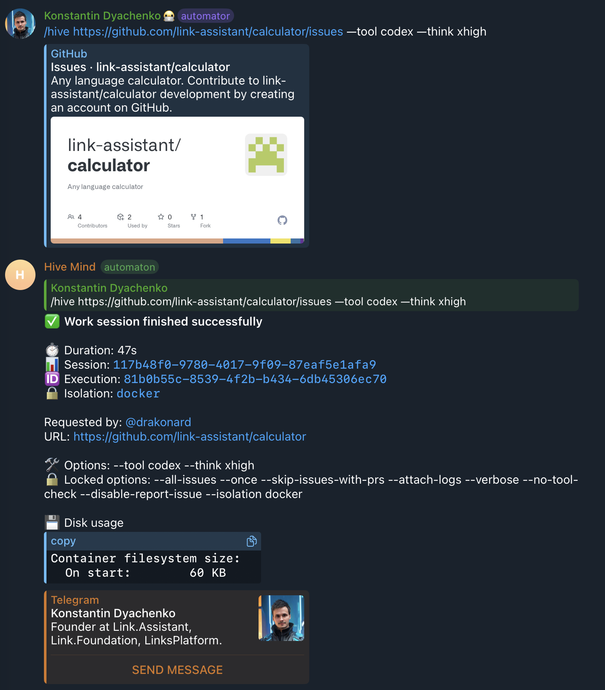
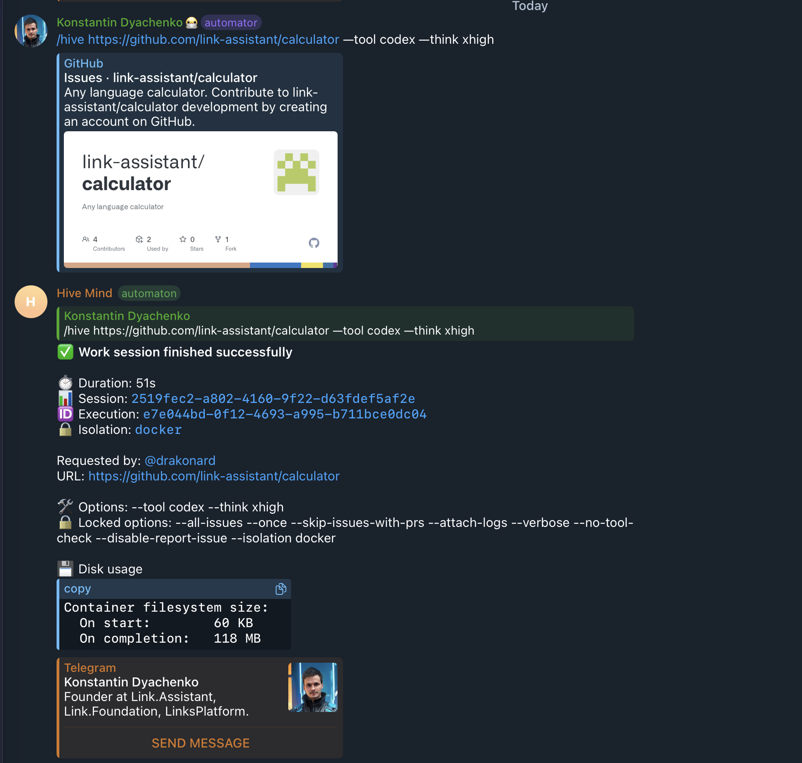
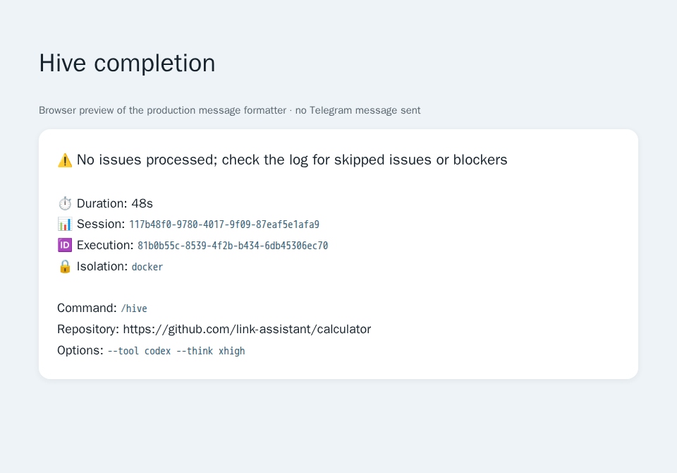

# Issue 2685: `/hive` reported success without processing an issue

Both reported runs discovered 19 open calculator issues, skipped all 19 because open PR #228 declared that it closed them, started no solver, and exited zero. The CLI printed “All issues processed!” with `Completed: 0`; Telegram displayed the successful process exit as a successful work session. This is a reproducible outcome-reporting defect, rather than a failed Codex invocation.

The investigation also identifies where the overly broad closing references originated: hive's native sub-issue link repair appended references for 18 future implementation issues to a planning PR. The agent removed those references, but the final repair appended them again. That repository's planning/implementation distinction is reported in [calculator issue #247](https://github.com/link-assistant/calculator/issues/247).

## Requirements and disposition

| Requirement from [issue #2685](https://github.com/link-assistant/hive-mind/issues/2685)      | Evidence and implemented response                                                                                                                                                                                                 |
| -------------------------------------------------------------------------------------------- | --------------------------------------------------------------------------------------------------------------------------------------------------------------------------------------------------------------------------------- |
| Explain why the original `/hive` command delivered no results                                | Replay the captured 19-issue/one-PR snapshot; all issues match explicit closing references, so the PR filter removes every candidate. See the timeline and root causes below.                                                     |
| Stop reporting no results as success                                                         | Separate skipped from completed issues; exit 3 when no issue was processed; show a Telegram warning in English, Russian, Chinese and Hindi.                                                                                       |
| Explain why restarting produced the same result                                              | Both runs read the same still-open issues and PR; no solver started, so retrying could not alter eligibility.                                                                                                                     |
| Download all relevant logs and data into this repository                                     | Preserve both supplied logs/screenshots, both complete calculator solver-session logs, issue/PR snapshots, comments, reviews, timeline, commits and initial CI metadata under this directory.                                     |
| Reconstruct the timeline and each problem's root cause                                       | Preserve line-numbered findings and SHA-256 hashes in [evidence-analysis.json](data/evidence-analysis.json); trace filtering, workers, shutdown and Telegram propagation below.                                                   |
| Search online for additional facts and evaluate existing components                          | Consult GitHub closing-reference documentation, Node process-exit documentation, the existing queue and `p-queue`, and recent related PRs. Sources and decisions are below.                                                       |
| Propose solutions and plans for every requirement                                            | Implement truthful reporting throughout discovery/worker paths; retain PR skip policy; provide operator workarounds and a separate scope-correction plan for calculator.                                                          |
| Add debug output when evidence is insufficient                                               | Evidence establishes this root cause. Add opt-in `--verbose` discovery details with skipped URLs, reasons, waiting count and discovery errors for future cases.                                                                   |
| Report problems in related repositories with reproductions, workarounds and code suggestions | [Calculator #247](https://github.com/link-assistant/calculator/issues/247), with the exact submitted body and returned issue metadata archived in `data/`. No evidence supports a Codex, command-stream or GitHub product defect. |
| Apply the fix to all affected paths                                                          | Cover repository/label, organization/user fallback, project and YouTrack discovery; archived/PR filtering, worker rechecks, blocked work, once-mode shutdown, and the shared Telegram completion formatter.                       |
| Deliver one PR with reproducing tests and review evidence                                    | [PR #2686](https://github.com/link-assistant/hive-mind/pull/2686), one patch changeset, red-before test output, offline CLI regressions, original screenshots and a browser-rendered completion preview.                          |

## Evidence and provenance

The issue and PR were read after their edits. `issue.json` contains the description and comments; `issue-comments.json`, `pr-comments.json`, `pr-review-comments.json` and `pr-reviews.json` preserve the separate GitHub comment types. No issue clarification, inline PR comment or review changed the requested behavior at capture time.

| Local evidence                                                                                                                                | Original source / meaning                                                                                                                |
| --------------------------------------------------------------------------------------------------------------------------------------------- | ---------------------------------------------------------------------------------------------------------------------------------------- |
| [first-run.log](data/first-run.log), 542 lines                                                                                                | Authenticated `gh gist view 4a0e97e79d7972fff4064de04e7d2d73`; first supplied full execution log                                         |
| [restarted-run.log](data/restarted-run.log), 544 lines                                                                                        | Authenticated `gh gist view 14469604a0d8d69c973ddc5887c6c0b2`; second supplied full execution log                                        |
| [first-run.png](screenshots/first-run.png), [restarted-run.png](screenshots/restarted-run.png)                                                | Original authenticated GitHub attachment downloads; validated PNG signature and dimensions before viewing                                |
| [calculator-open-issues.json](data/calculator-open-issues.json), [calculator-open-prs.json](data/calculator-open-prs.json)                    | REST snapshots: 19 actual issues (#227, #229–#246), plus one PR (#228); the issue endpoint's PR entry is excluded when counting issues   |
| `calculator-pr-228-{comments,review-comments,reviews,timeline,commits}.json`                                                                  | Paginated GitHub API evidence for the PR that caused all 19 skips                                                                        |
| [calculator-pr-228-first-session.log.gz](data/calculator-pr-228-first-session.log.gz), 41,731 decoded lines                                   | Authenticated `gh gist view 1023602faae25056fda9ccf9e4a3f471`; complete sanitized solver log linked from the PR's first log comment      |
| [calculator-pr-228-restart.log.gz](data/calculator-pr-228-restart.log.gz), 47,104 decoded lines                                               | Authenticated `gh gist view 75dea7afa9c7e2ddca01a94a687d40b7`; complete restart log, which also includes the first session               |
| [previous-solution-attempt.log.gz](data/previous-solution-attempt.log.gz), [collector metadata](data/previous-solution-attempt-metadata.json) | Existing committed development-log snapshot of the previous automated attempt; retains its failed read and HTTP 403 gist upload          |
| [regression-before.log.gz](data/regression-before.log.gz)                                                                                     | Initial 10-test run against unchanged production code: 9 failures, 1 pass; no-work CLI exited 0 and worker recheck incremented completed |
| [regression-after.log](data/regression-after.log)                                                                                             | Focused test results after the fix                                                                                                       |
| `initial-{security,release}-run.json`, `initial-runs.json`                                                                                    | Initial CI status investigation on the pre-fix head; distinguish approval-required runs from successful dispatches on the same SHA       |
| [calculator-report.md](data/calculator-report.md), [calculator-issue-247.json](data/calculator-issue-247.json)                                | Exact upstream reproduction, workarounds, code suggestions and submitted issue response                                                  |

Log archives retain the original captured bytes, compressed without alteration. [analyze-evidence.py](../../../experiments/issue-2685/analyze-evidence.py) scans every production/session log in chunks of at most 1,500 lines and records bounded, line-numbered events. Its logical `splitlines()` numbering counts an unterminated final line and Unicode line separators, so totals can differ from `wc -l`. Run it with:

```sh
python3 experiments/issue-2685/analyze-evidence.py
gzip -dc docs/case-studies/issue-2685/data/calculator-pr-228-restart.log.gz | sed -n '47055,47085p'
```

## Sequence of events

All timestamps are UTC on 2026-10-07. Facts from the production logs are distinguished from later snapshot-based interpretation.

| Time                | Event and evidence                                                                                                                                                                                                                                                                                           |
| ------------------- | ------------------------------------------------------------------------------------------------------------------------------------------------------------------------------------------------------------------------------------------------------------------------------------------------------------ |
| 10:31:08.843        | First calculator solver session finishes its planning work; native link repair adds 18 required closing references to PR #228. First-session decoded line 41,708.                                                                                                                                            |
| 10:33:45.712        | Restart agent explicitly removes `Fixes #229` through `Fixes #246`, stating that these are the future work plan and only #227 should close. Restart decoded lines 45,315 and 45,325.                                                                                                                         |
| 10:44:48.967        | Final native link repair adds the same 18 references again. Restart decoded line 47,072.                                                                                                                                                                                                                     |
| 19:48:26            | Related PR #2616 merges, adding native sub-issue/dependency readiness gating. This is relevant to blocked-work reporting, but the reported runs are filtered out before that gate.                                                                                                                           |
| 19:58:20            | Hive release 2.34.0; both reported containers use `konard/hive-mind-dind:2.34.0`.                                                                                                                                                                                                                            |
| 21:27:53.861        | First execution starts, execution UUID `81b0b55c-8539-4f2b-b434-6db45306ec70`, Docker session `117b48f0-9780-4017-9f09-87eaf5e1afa9`. First-run lines 4–12.                                                                                                                                                  |
| Before 21:28:25.517 | Startup validates GitHub access, checks disk/memory and performs a Codex greeting connection check. That greeting is the only AI invocation; the legacy `--no-tool-check` switch was not applied after successful parsing.                                                                                   |
| 21:28:25.517        | Monitoring iteration 1 discovers 19 issues, finds one open PR, and skips all 19. First-run lines 478, 488, 514. Queue, processing, completed and failed counts are all zero.                                                                                                                                 |
| 21:28:42.126        | CLI prints success, workers stop, container is removed with exit 0 and `oomKilled=false`; Telegram shows success. First-run lines 526–542. Wall time is 48.265 seconds; the screenshot's duration is 47 seconds and the container lifetime is 45.442 seconds consistent with different start/end boundaries. |
| 21:43:36.030        | Second execution starts, execution UUID `e7e044bd-0f12-4693-a995-b711bce0dc04`, Docker session `2519fec2-a802-4160-9f22-d63fdef5af2e`. Restarted-run lines 4–12.                                                                                                                                             |
| 21:44:12.134        | Second monitoring iteration repeats the same 19-issue/one-PR filtering and starts no solver. Restarted-run lines 480, 490, 516.                                                                                                                                                                              |
| 21:44:28.574        | Same false success, zero completed/failed, exit 0 and no OOM. Restarted-run lines 528–544. Wall time is 52.544 seconds, screenshot duration 51 seconds, container lifetime 49.710 seconds.                                                                                                                   |

The translated Telegram command normalizes the `/issues` repository URL and Unicode dashes, then adds `--all-issues --once --skip-issues-with-prs`. Both full log command lines also contain `--no-tool-check`. There is no malformed-command or unsupported-model failure here: initialization completes and discovery executes normally.

## Root causes and related failure classes

### No work: every issue was excluded by an existing PR

`batchCheckPullRequestsForIssues` delegates matching to the shared closing-reference parser. PR #228 explicitly declares `Closes #227` and `Fixes #229` through `Fixes #246`. The parser regression uses the captured body and confirms all 19 matches. The logged one-PR/all-issues skip is therefore consistent with the configured policy.

The PR describes a case study, corpora, gap checker and future implementation issues; it explicitly says “No Rust code changes” and that the 18 children should stay open. `fetchRequiredIssueScope` traverses the native issue hierarchy, and `repairRequiredIssueLinks` requires closing references for that entire hierarchy. The [native sub-issue API snapshot](data/calculator-native-sub-issues.json) independently confirms all 18 children. The parent task's analysis/plan scope does not imply that its newly filed implementation children were solved. The repair/removal/repair sequence is directly observed, rather than inferred solely from the current PR body.

Automatic link repair was deliberately introduced by [PR #2336](https://github.com/link-assistant/hive-mind/pull/2336) for tasks whose implementations cover the full native hierarchy. Removing that requirement globally would regress an existing feature. This PR retains it and the PR skip policy, makes the resulting no-work outcome visible, and reports the specific planning-scope mismatch upstream with an explicit scope-correction proposal.

### False success: an empty queue was treated as completed work

In once mode, `hive.mjs` waited until `queued === 0 && processing === 0`, then unconditionally printed success. Its final exit logic only checked task failures, subscription limits and disk halts. Since no task started, those counts were zero and the normal process exit was zero. An empty queue establishes that scheduling is drained, without establishing that any work ran.

`HiveRunReport` derives the result after all workers finish, records discovery errors and filtering decisions, and logs found/completed/failed/skipped/waiting counts, grouped reasons and deduplicated PR URLs. Discovery counts describe the most recent monitoring round; completed/failed counts describe the run. A solver completion means that the solver process succeeded; it does not assert that a PR merged or that every open repository issue was fixed.

### Worker rechecks counted exclusions as completions

A queued issue can become closed, archived or PR-covered before a worker starts it. Previously that recheck called `markCompleted` despite never starting a solver. It now calls `markSkipped`, releases the processing slot and preserves the reason. A later monitoring round may reconsider that skipped issue.

### Discovery failures could be converted into an empty success

Several nested discovery catches returned `[]`. This affected repository/label queries, organization/user fallbacks, and their partial per-repository failures. Project and YouTrack errors reached the outer catch, which also returned an empty list without a terminal failure flag. These errors are now recorded and produce exit 1; the repository fallback still preserves useful results from other repositories. A successful later monitoring round clears transient discovery errors.

### Blocked work and disk shutdown needed accurate final state

Sub-issue/dependency gating can leave issues waiting while another issue completes. The report unions discovery waiting URLs, worker deferrals, queued URLs and active URLs to avoid double-counting the same issue. A run with completed work and remaining waiting work exits 4. Disk deferral keeps its established exit 75; a stopped queue no longer waits forever for its unstarted entries to disappear. Cleanup executes once in the shared shutdown path after workers finish, with the same `argv` safeguards.

### Telegram faithfully rendered the wrong exit contract

The shared completion formatter interpreted a normal zero exit as success. The CLI's exit contract is fixed, and the formatter now renders hive exit 3/4 as warnings with localized explanations. Other commands' exit codes, actual failures, kills, deliberate stops, recovery state, verified merges, execution/session IDs and isolation details retain their existing handling. Failed-container log retention remains in place, so a no-work nonzero exit also preserves the diagnostic path.

### Legacy tool-check normalization was placed in an error handler

The legacy switches were normalized only when parsing threw and supplied `error.argv`. Successful parsing bypassed that normalization, so the reported command still ran a Codex greeting despite `--no-tool-check`. Applying the existing aliases after both parse paths fixes this for `--no-tool-check`, `--skip-tool-check` and `--skip-claude-check`. This unnecessary greeting explains part of startup time, but it did not cause the 19 issues to be filtered out.

## Outcome contract and operator options

| Exit | Meaning                                                                                                     |
| ---- | ----------------------------------------------------------------------------------------------------------- |
| 0    | At least one solver completed and no selected work remains waiting; or an explicitly reported dry run       |
| 1    | Solver failure or discovery error; existing initialization/subscription failures also retain their handling |
| 3    | No issues processed, including empty discovery, all skipped, all blocked, and recheck-only runs             |
| 4    | Some issues processed, with selected work still queued/waiting                                              |
| 75   | Existing insufficient-disk-space deferral                                                                   |

Review the named PR's actual delivered scope before changing its closing references. For this calculator plan, the upstream report proposes retaining only `Closes #227` and ordinary references for #229–#246. Editing those references alone can be undone by native link repair until the scope mismatch is addressed.

An operator who intends to continue an existing draft can explicitly use `--no-skip-issues-with-prs --auto-continue`. A direct `solve https://github.com/link-assistant/calculator/issues/229 --tool codex --think xhigh` invocation targets a specific ready implementation issue. These options start real work and can update existing PRs; the offline regression commands below avoid those side effects. This PR does not edit calculator PR #228 or force a solver to bypass the operator's skip policy.

## Research, component evaluation and solution decisions

| Primary source / existing component                                                                                                                  | Finding and decision                                                                                                                                                                                                                       |
| ---------------------------------------------------------------------------------------------------------------------------------------------------- | ------------------------------------------------------------------------------------------------------------------------------------------------------------------------------------------------------------------------------------------ |
| [GitHub: linking a PR to an issue](https://docs.github.com/en/issues/tracking-your-work-with-issues/using-issues/linking-a-pull-request-to-an-issue) | Closing keywords are explicit issue-closing declarations; automatic closure depends on the default target branch. Preserve declared-reference matching rather than silently assuming an analysis PR resolves future child implementations. |
| [Node: `process.exitCode`](https://nodejs.org/api/process.html#processexitcode)                                                                      | A normal process exit defaults to zero. Use the existing `safeExit` lifecycle with application-specific nonzero outcomes; retain its log flushing and cleanup semantics.                                                                   |
| Existing `IssueQueue`, relations gate and shared completion formatter                                                                                | Already own scheduling, waiting state and Telegram presentation. Extend those surfaces without duplicating the scheduler or changing relation ordering.                                                                                    |
| [`p-queue` documentation](https://github.com/sindresorhus/p-queue)                                                                                   | `onIdle()` means no queued or pending promises; it also cannot establish that work produced a result. A replacement queue would not fix the missing outcome contract. No new dependency is needed.                                         |
| [PR #2616](https://github.com/link-assistant/hive-mind/pull/2616), merged just before the incident                                                   | Dependency gating and progress-based once-mode rounds are intentional. Preserve those rounds and report waiting issues explicitly.                                                                                                         |
| [PR #2336](https://github.com/link-assistant/hive-mind/pull/2336)                                                                                    | Full native hierarchy closing-reference repair is an existing feature; an explicit planning-vs-implementation scope mechanism is the follow-up proposal, rather than globally deleting child linkage.                                      |
| [PR #2493](https://github.com/link-assistant/hive-mind/pull/2493), [PR #2614](https://github.com/link-assistant/hive-mind/pull/2614)                 | Follow current truthful reporting and failed-session log retention. Preserve failure/kill/recovery details while correcting zero-work presentation.                                                                                        |

The smallest solution is to retain eligibility rules, correct accounting and exit results, and expose the exact references causing exclusions. Automatically retrying unchanged inputs repeats the defect; treating any open PR as proof of completed implementation overclaims its result; checking every PR's diff with an AI introduces cost and uncertainty before every discovery pass. The scope follow-up should distinguish parent planning completion from implementation coverage and ensure final link repair respects that scope while preserving full-hierarchy implementation behavior.

## Reproduction and verification

The minimal red test was added before production code changed. [regression-before.log.gz](data/regression-before.log.gz) records 9 failures out of 10 tests, including the production replay exiting zero, a recheck incrementing completed, discovery failure claiming success, and Telegram presenting the proposed warning code as a generic failure.

[hive-outcomes-2685.test.mjs](../../../tests/hive-outcomes-2685.test.mjs) contains 23 regressions. Its finite fixture runs the actual hive entry point, parser, monitor, worker and outcome implementation with offline GitHub/environment collaborators and a tiny stub solver. Every child is limited to 256 MiB and aborted after 12 seconds; each CLI test has a 15-second timeout. It does not invoke a paid AI tool or mutate GitHub. Captured closing-reference matching uses the actual shared parser.

```sh
node --test tests/hive-outcomes-2685.test.mjs tests/hive-issue-relations-2615.test.mjs tests/temp-cleanup-2160.test.mjs
node tests/hive-extracted-modules-2175.test.mjs
npm test -- --continue-on-failure
npm run lint
npm run format:check
npm run check:duplication
npm run check:secrets
```

The regressions cover all-skipped, empty, blocked, archived, worker-recheck-only, partial, dry-run, successful and failed workers, disk deferral, repository/label/project/YouTrack failures, partial repository fallback, later recovery, all three tool-check aliases, waiting deduplication and all supported Telegram locales. Existing relations, extracted-module and temp-cleanup regressions also pass. The [final complete default-suite log](data/default-tests-final.log.gz) records all 576 selected files passing; [local-validation.json](data/local-validation.json) preserves the runtime, commands, check results and decoded log hash.

Fresh GitHub Actions runs on implementation commit `c21ccd1d97fd321ba539e1c3841cf7dab8595d50` passed the full default suite, GitHub integration, execution, memory, quality and dependency checks, Docker image builds and container verification, security analysis and link checking. [ci-code-validation.json](data/ci-code-validation.json) preserves all three run URLs, timestamps, exact head SHA, job conclusions and decoded log hashes. The complete [release](data/ci-release-37719356959.log.gz), [security](data/ci-security-37719356693.log.gz) and [link-checker](data/ci-links-37719356610.log.gz) logs are archived without byte changes by [record-ci-validation.py](../../../experiments/issue-2685/record-ci-validation.py). The PR records the final documentation-head checks separately.

Initial non-passing CI runs were `action_required` with zero jobs, so attempts to download their logs returned “log not found.” The same pre-fix SHA already had successful checks-only dispatches. The archived metadata prevents approval-required status from being misreported as a test failure. Local dependency freshness subsequently detected a newly published Node 26.11.1; the three image pins and their two regression-test expectations are updated to satisfy the existing freshness policy. The [initial complete 576-file log](data/default-tests-initial.log.gz) records the two stale expectations: `test-issue-2187-current-dependency-pins.mjs` failed at decoded line 11,253, and `test-issue-2187-runtime-versions.mjs` reported the three old-version checks at lines 11,560, 11,568 and 11,576. The package version remains release-managed through one patch changeset.

## Visual verification

Original Telegram result from the first reported run:



Restarted result:



The following is a Playwright browser render of the actual production completion formatter, generated by [preview-completion.mjs](../../../experiments/issue-2685/preview-completion.mjs). It is a preview, rather than a sent Telegram message. The warning preserves duration, session, execution and isolation details. The browser was closed after verification.



## Remaining limits

The [previous automated attempt's PR comment](https://github.com/link-assistant/hive-mind/pull/2686#issuecomment-6047485455) reports a missing `e.g` file and an unsuccessful gist upload. Its development-log collector nevertheless committed a snapshot under `dev/log`; [previous-solution-attempt.log.gz](data/previous-solution-attempt.log.gz) and [collector metadata](data/previous-solution-attempt-metadata.json) preserve that available evidence in the case study. The agent selected a nonexistent `.../e.g` path, returned a terminal error, and the wrapper correctly treated its zero process exit as a failed solution attempt. GitHub returned HTTP 403 when the integration token attempted to create a gist. The snapshot contains 434,259 captured bytes through development-log finalization; its metadata records the pre-sanitization source range, rather than a promised byte-identical source size. The logs establish the failed read and upload restriction, without explaining why the agent selected that path or proving a provider defect. Use a valid repository file path and a token permitted to create gists, or use the committed development-log capture for diagnostics. Both supplied incident logs and both accessible calculator solver-session logs are archived in full.

There was no solver attempt for any of the 19 issues in either reported run; the logs do not demonstrate a Codex reasoning or execution failure. The current PR snapshot is later evidence, but its references are independently corroborated by the production skip counts and the earlier repair logs. Automatic scope selection for planning PRs remains the explicitly reported upstream follow-up. This change makes such exclusions diagnosable and prevents them from being presented as successful work; it does not claim that the calculator's implementation backlog has been delivered.
