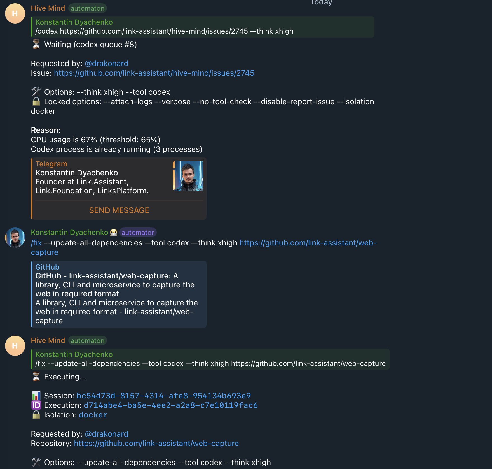
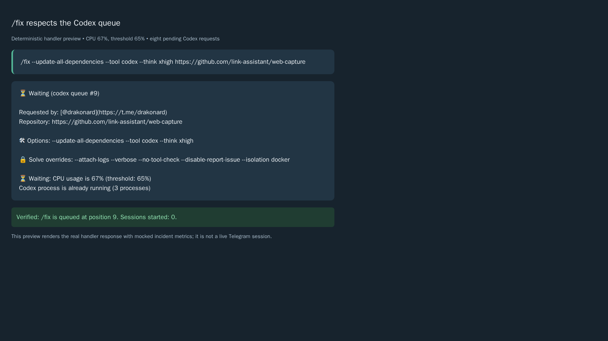

# Case study: Telegram commands bypassing the work queues

Issue: [hive-mind #2747](https://github.com/link-assistant/hive-mind/issues/2747). Fix: [PR #2750](https://github.com/link-assistant/hive-mind/pull/2750).

## Finding

`/fix` started a Codex session without consulting the work queue. The screenshot shows an earlier `/codex` request waiting at position 8 with CPU usage at 67%, above the configured 65% threshold, while `/fix --update-all-dependencies --tool codex --think xhigh https://github.com/link-assistant/web-capture` immediately reported execution in Docker.

The dispatcher, rather than the CPU measurement or Codex itself, caused the bypass. Both `/fix` modes called the command executor directly. The same audit found direct launches in `/task --split` (including `/split`), in-process AI classification in `/organize`, and conflict-resolution sessions created by `/merge --auto-resolve`. They now enter the same tool queues and resource admission checks as `/solve`.

## Requirements and execution plan

| Issue requirement                                                | Investigation and solution                                                                                       | Verification/evidence                                                                    |
| ---------------------------------------------------------------- | ---------------------------------------------------------------------------------------------------------------- | ---------------------------------------------------------------------------------------- |
| Make `/fix` respect queues                                       | Reproduce both modes under the reported CPU threshold; admit the effective tool before execution                 | Regression tests for `--ci-cd` and `--update-all-dependencies`                           |
| Check every other command, except `/hive`                        | Audit all bot registrations and AI execution entry points; integrate split, organize and merge auto-resolve      | Command audit below; tests exercise each additional producer                             |
| Download related logs and data into this case study              | Preserve issue, all available comments/reviews, screenshot, related target execution and earlier solver evidence | `data/` inventory below; full execution logs compressed without truncation               |
| Reconstruct events, requirements, root causes and solution plans | Correlate timestamped GitHub records and execution logs; distinguish observed facts from inferences              | Timeline, root-cause analysis and implementation sequence below                          |
| Search online and compare existing components                    | Read official p-queue and Bottleneck documentation; compare with existing SolveQueue                             | Component comparison and archived source READMEs                                         |
| Add diagnostics when needed                                      | Retain the existing queue diagnostics; add an admission decision under the existing verbose switch               | Command, tool, backlog, reservation, rejection and reason logged only when verbose       |
| Report defects in related repositories when applicable           | Check the affected web-capture run and known queue work                                                          | The reproducible defect belongs to hive-mind; no separate upstream defect is established |
| Complete the work in one PR without removing features            | Keep existing executors, CLI arguments, isolation, messages, session tracking and queue policies                 | Regression coverage, existing command tests, patch changeset and PR #2750                |

## Evidence inventory and limits

Files in `data/` preserve the available source material:

- `issue.json`, `issue-comments.json`: full issue description and all comments. There were no issue comments at collection time.
- `reported-queue-bypass.png`: original GitHub attachment, downloaded with authenticated `curl -L`; its PNG signature was verified before viewing. The container lacked the `file` utility, so Python checked the binary signature instead.
- `pr-session-start.json`, `pr-review-comments.json`, `pr-reviews.json`: initial PR metadata, conversation comments and both review endpoints. Inline comments and reviews were empty.
- `web-capture-174.json`, `web-capture-174-comments.json`, `web-capture-pulls.json`, `web-capture-pr-175*.json`: affected repository issue, related PR, complete available conversation/review data and timestamps.
- `web-capture-solve.log.gz`: full sanitized log from [the execution gist](https://gist.github.com/konard/218376470c4377f58f253a3fefacf582), fetched using authenticated `gh gist view --allow-escape-sequences`; 35,305 lines before compression.
- `queued-issue-2745.json`, `queued-issue-2745-solve.log.gz`: screenshot's earlier queued target and its referenced sanitized execution gist. Its separate Codex failure is not needed to reproduce queue bypass.
- `previous-session-solve.log.gz`: earlier solver session already present under `dev/log/issues/2747/pulls/2750/sessions/`; preserved here for completeness.
- `related-pr-2018.json`, `related-pr-2572.json`: related atomic-start reservation and Telegram queue-card work.
- `initial-ci-runs.json`, `initial-ci-log-unavailable.txt`: initial runs, including the historical `action_required` run whose logs were unavailable. These predate this fix.
- `p-queue-readme.md`, `bottleneck-readme.md`: official repository documentation captured during online research.
- `local-checks.log.gz`: completed default-suite, expanded regressions and local CI verification logs.
- `command-audit.txt`, `regression-before.log`, `regression-after.log`, `preview-verification.log`: audit, reproducing failure, fixed behavior and message-preview verification.

The screenshot does not include a precise capture timestamp. Its session and execution UUIDs identify the reported bot response, but the downloaded web-capture solve log does not contain those identifiers. Matching the repository, mode, tool and nearby GitHub events makes issue #174/PR #175 a related run; it does not prove an exact UUID join. No production Telegram bot log was attached or accessible in this workspace. The earlier solver's external full-log path was also unavailable; the committed development log records the failed attempt to upload it. These limits do not prevent a deterministic reproduction using the actual command handlers and SolveQueue.

## Timeline (UTC)

| Time on 2026-10-08  | Event and evidence                                                                                                                                                                                                                                           |
| ------------------- | ------------------------------------------------------------------------------------------------------------------------------------------------------------------------------------------------------------------------------------------------------------ |
| 06:06:26            | web-capture issue #174 created for the dependency update (`web-capture-174.json`)                                                                                                                                                                            |
| 06:06:28.520        | Related solve log begins; at line 10, 06:06:31.147, the CLI includes `--update-all-dependencies --tool codex --think xhigh` (`web-capture-solve.log.gz`)                                                                                                     |
| 06:07:05            | web-capture PR #175 created (`web-capture-pr-175-timeline.json`)                                                                                                                                                                                             |
| Before 06:29:02     | Reported screenshot shows `/codex .../issues/2745` waiting at #8, CPU 67%/65%, and three Codex processes; the subsequent `/fix` reports Docker execution. Session: `bc54d73d-8157-4314-afe8-954134b693e9`; execution: `d714abe4-ba5e-4ee2-a2a8-c7e10119fac6` |
| 06:29:02            | hive-mind issue #2747 created (`issue.json`)                                                                                                                                                                                                                 |
| 06:39:11.995        | Earlier solver log begins; its PR session ends with `File not found: /tmp/gh-issue-solver-1791441570322/e.g`. That is a previous investigation failure, not the bot queue defect                                                                             |
| Approximately 06:41 | Initial-head CI runs recorded. The historical `action_required` result has no available log; other recorded runs succeeded (`initial-ci-runs.json`)                                                                                                          |
| 08:26:21–08:26:55   | Related web-capture solver posts its final summary and full-log gist. Later cgroup OOM evidence at log line 35,296 is not evidence that the photographed queue decision used that measurement                                                                |
| 08:29:41            | web-capture PR #175 merged; merge SHA `9cc792` prefix (`web-capture-pr-175-timeline.json`)                                                                                                                                                                   |
| This investigation  | Reproduction tests fail before implementation and pass after shared admission is wired; latest default branch merged before final verification                                                                                                               |

## Root causes

1. **Admission lived inside `/solve`, not at all work producers.** `/fix` and split-task handlers performed validation and option merging, then called `executeAndUpdateMessage` without checking `canStartCommand`, reserving a global startup slot or enqueueing. `/organize` checked only its per-repository active set; that prevents duplicate classification in one repository but does not enforce host or tool limits. Merge conflict resolution used a separate `start-screen` spawner.
2. **The queue item assumed the CLI was `solve`.** Although the isolation-aware callback already accepted `item.command`, the item constructor discarded it and the fallback executor always launched `solve`. Merely enqueueing fix/task arguments would therefore launch the wrong CLI. The item now retains its command and both execution paths honor it.
3. **Detached sessions and in-process work have different completion needs.** Organize needs its final summary preserved. Merge needs to wait until its queued solve has actually launched before starting resolution polling. Per-item callbacks and completion promises support those needs; cancellation, rejection and exceptions settle the promise and release pending repository locks.
4. **Immediate starts need ordering protection.** Existing atomic reservations serialize concurrent direct starts across tools, as established in [PR #2018](https://github.com/link-assistant/hive-mind/pull/2018). New producers must use them too. A second backlog check after asynchronous resource admission prevents new work from overtaking an item queued during that check.

## Command audit

The audit searches every `telegram-*.mjs` producer for `executeAndUpdateMessage`, `executeStartScreen`, `executeWithIsolation`, `organizeRepository` and `spawnAutoResolveSolve`, and reviews bot command registrations. The retained search output is `data/command-audit.txt`.

| Command path                                                                                                                                                                                                                     | AI workload                               | Admission after this change                                                                          |
| -------------------------------------------------------------------------------------------------------------------------------------------------------------------------------------------------------------------------------- | ----------------------------------------- | ---------------------------------------------------------------------------------------------------- |
| `/solve`, `/do`, `/continue`, `/claude`, `/codex`, `/opencode`, `/agent`, `/gemini`, `/qwen`                                                                                                                                     | Solver session                            | Existing shared queues and atomic reservation; backlog race check strengthened                       |
| `/fix --ci-cd`, `/fix --update-all-dependencies`                                                                                                                                                                                 | Fix CLI starts solver work                | Shared admission helper; queued item retains `fix`                                                   |
| `/task --split`, `/split`                                                                                                                                                                                                        | Task CLI starts splitting work            | Shared admission helper; queued item retains `task` and alias                                        |
| `/organize`, including `--dry-run`                                                                                                                                                                                               | In-process AI classifier                  | Shared admission helper and per-item callback; existing repository lock preserved                    |
| `/merge --auto-resolve`                                                                                                                                                                                                          | Conflict-resolution solver                | Shared admission and standard executor, operator tool/isolation options, cancellable wait for launch |
| `/task` issue-creation modes                                                                                                                                                                                                     | GitHub issue creation, no AI launch       | Existing behavior; returned follow-up `/fix` command is admitted when invoked                        |
| `/merge` without auto-resolve                                                                                                                                                                                                    | GitHub merge/CI polling, no AI launch     | Existing behavior                                                                                    |
| `/help`, `/limits`, `/version`, `/models`, `/language`, `/auth`, `/queue`, `/top`, `/log`, `/watch`, `/terminal_watch`, `/tokens`, `/start`, `/stop`, `/subscribe`, `/unsubscribe`, `/accept_invites` (and its spelling aliases) | Status, administration or session control | No new AI work producer to gate; existing API governance preserved                                   |
| `/hive`                                                                                                                                                                                                                          | Hive execution                            | Explicitly excluded by #2747; deferred to separate work                                              |

## Solution alternatives and implementation sequence

| Option                                            | Benefit                                                                                                       | Decision                                                                                                  |
| ------------------------------------------------- | ------------------------------------------------------------------------------------------------------------- | --------------------------------------------------------------------------------------------------------- |
| Add queue checks independently in each handler    | Small local changes                                                                                           | Duplicates reservation, rejection and message logic; prone to the same omission in future producers       |
| Share admission while retaining the current queue | Reuses CPU/RAM/disk policies, tool usage limits, global pacing, process scanning, fairness and Telegram cards | Implemented; producers supply command metadata and an execution callback                                  |
| Replace scheduling with p-queue                   | Promise callbacks, cancellation and concurrency/interval controls                                             | Useful model for completion promises, but host metrics and existing tool policy would still need adapters |
| Replace scheduling with Bottleneck                | Startup pacing, concurrent-job caps, reservoir budgets and optional Redis coordination                        | Worth considering for multiple bot processes; a larger migration than this dispatch fix                   |

[p-queue's official documentation](https://github.com/sindresorhus/p-queue) distinguishes concurrency from starts per interval and returns a promise for task completion. [Bottleneck's official documentation](https://github.com/SGrondin/bottleneck) provides `minTime`, `maxConcurrent`, reservoirs and shared Redis scheduling. A detached launcher finishes before its AI process, so wrapping launch promises in a generic concurrency cap would not by itself track the running solver processes. The existing process scanner remains the source of running-session admission data.

The implementation sequence is:

1. Reproduce the photographed threshold condition with the real fix/split/organize handlers, controlled metrics and no external AI processes.
2. Add shared admission, command-preserving queue items and completion settlement; retain the existing resource and rejection policies.
3. Integrate every uncovered producer, passing the final tool and isolation options before admission; preserve locale, topic, requester, URL context and session tracking.
4. Cover FIFO, all five tool queues, concurrent reservations, delayed backlog arrival, cancellation, consumer rejection, refused launches, exceptions and isolation execution paths.
5. Run the existing command/queue tests, complete the default test suite and local CI checks; publish the evidence and patch changeset in PR #2750.

No new library dependency is required. The verbose admission line is off by default and uses the existing bot verbose option. Existing queue dequeue diagnostics continue to explain consumer decisions.

## Reproduction and verification

```bash
node --test tests/telegram-work-queue-2747.test.mjs
node tests/test-telegram-fix-command.mjs
node tests/test-telegram-task-command.mjs
node tests/test-telegram-organize-command.mjs
node tests/test-issue-2015-queue-stability.mjs
npm test
```

The initial four regressions failed before the implementation: both fix modes, split and organize executed while mocked CPU usage was 67% with a 65% threshold (`data/regression-before.log`). After the fix, they enqueue without launching; the tests first verify that the consumer still blocks, clear the metric, and verify that the original CLI and options execute. The expanded suite adds cross-tool reservations, operator overrides, FIFO, completion failures, cancellation and message preservation. All 580 default-suite test files and the expanded 20-test regression run passed locally. Each regression has a finite five-second test timeout and launches no real solver or stress process.

To reproduce the reviewable message preview:

```bash
node experiments/issue-2747/preview-queue.mjs
python -m http.server 8274 --directory experiments/issue-2747
```

The preview invokes the actual fix handler with eight pre-existing Codex items and the reported blocking metrics, asserts nine queued items and zero launched sessions, and writes `queue-preview.html`. Playwright captured the generated page. This is a deterministic preview of the actual response text, not a live Telegram deployment screenshot.

Reported state:



Fixed response under the same resource limits:



## Related repository reporting and operational limits

web-capture is the affected target repository. Its CLI log confirms related dependency-update work; the reproducible scheduling bug is in hive-mind's Telegram dispatcher. No independently reproducible scheduling defect in web-capture, Codex, start-command, p-queue or Bottleneck was established, so a duplicate upstream bug report would lack a valid reproduction. The linked hive-mind issue and PR contain the fix and reproduction.

Before deployment, a workaround is to wait until `/limits` and `/queue` show available capacity before issuing affected commands; splitting work can also be submitted through a queued `/solve` request. The code fix removes that manual coordination. Admission remains local to one bot process, as it was before this change; coordinating several bot instances would require shared scheduling state and is outside this single-process bypass defect.

## CI freshness follow-up

The first fresh CI run on commit `70e933bc` was created at 09:39:30 UTC. Its dependency gate failed before test jobs started: `link-foundation/box` released `v2.10.3` at 09:38:56 UTC, after the successful local freshness check. The downloaded detect-changes job log is preserved as `data/ci-detect-changes-37758170413.log.gz`; lines 2724–2727 identify the three stale `2.10.2` pins in `Dockerfile`, `Dockerfile.dind` and `coolify/Dockerfile`. Other checks on that head passed or remained pending; skipped test jobs are not counted as validation.

The three image pins and their existing regression expectations were updated together to `2.10.3`, without relaxing the freshness policy. The [upstream release](https://github.com/link-foundation/box/releases/tag/v2.10.3) and [comparison](https://github.com/link-foundation/box/compare/v2.10.2...v2.10.3) are archived in `data/box-release-2.10.3*.json`. This patch adds the `file` utility to the shared essentials runtime; runtime version pins are unchanged. The authenticated local freshness check again passed all 168 declarations, and the Docker pin, runtime, dependency-policy and 20 queue regression checks passed (26 Node test entries, including 52 runtime assertions). This image refresh is required by the repository's CI gate and is separate from the proven Telegram dispatch root cause.

On the next head, `5ecef123`, CI's default suite stopped at file 140: `tests/task-image-languages-2247.test.mjs` requires the Docker base to match the task-language catalog. The catalog still referenced `2.10.2`; the job log is archived in `data/ci-test-suites-37759307267.log.gz` (assertion at line 3350). Running that existing test locally reproduced the exact assertion (`data/image-catalog-before.log`). The catalog and the two current language-verification scripts were aligned with `2.10.3`; their supported language lists and probe commands were preserved. Historical experiments and changelog entries retain the versions they actually investigated.
