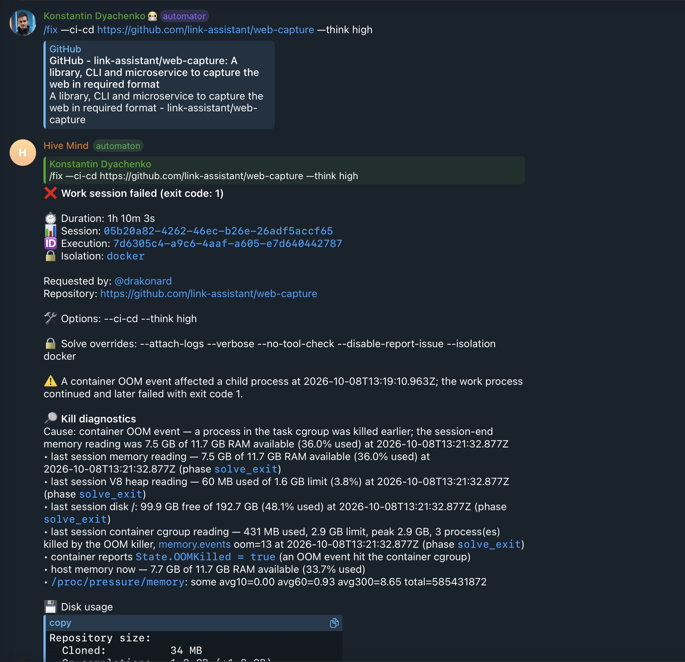

# Case study: issue #2803 — `CLAUDE execution failed with Claude command failed with exit code 137`

- Issue: https://github.com/link-assistant/hive-mind/issues/2803
- Pull request: https://github.com/link-assistant/hive-mind/pull/2804
- Failed run: https://github.com/link-assistant/web-capture/pull/178#issuecomment-6060806494
- Evidence: [`logs/`](logs), [`images/issue-screenshot.png`](images/issue-screenshot.png), [online research](online-research.md)



## Requirements

| #   | Requirement (from the issue)                                                                                                | Status in PR #2804                                                                                 |
| --- | --------------------------------------------------------------------------------------------------------------------------- | -------------------------------------------------------------------------------------------------- |
| R1  | "Looks like there was not auto-recovery from OOM."                                                                          | Fixed: root causes 1 and 2 below                                                                   |
| R2  | "And no OOM reported in GitHub comment at that time."                                                                       | Fixed: root cause 3                                                                                |
| R3  | "Double check we get full situation in logs"; report start-command gaps or fix them here                                    | Fixed here: root causes 3 and 4; filed upstream: start#192                                         |
| R4  | "If the only root cause of fail is OOM it should be recovered with auto-resume/auto-restart … Double check for regressions" | Fixed and tested: root causes 1 and 2, regression tests for #2134, #2301 and #2498 still pass      |
| R5  | "On OOM restart docker container with … random … 70% to 80%" of RAM                                                         | Implemented: `--container-memory-after-oom`, default `70%-80%`; upstream request start#191         |
| R6  | "Even on normal operation it starts with random limit for RAM between 90% to 100%"                                          | Implemented: `--container-memory`, default `90%-100%`; upstream request start#190                  |
| R7  | "All these values must be configurable."                                                                                    | Both are options and env vars (`TELEGRAM_CONTAINER_MEMORY`, `TELEGRAM_CONTAINER_MEMORY_AFTER_OOM`) |
| R8  | Report issues and feature requests to link-foundation/start                                                                 | start#190, start#191, start#192                                                                    |

## Timeline (2026-10-08, UTC)

| Time         | Event                                                                                                                                                                                                                                                                                                                                          |
| ------------ | ---------------------------------------------------------------------------------------------------------------------------------------------------------------------------------------------------------------------------------------------------------------------------------------------------------------------------------------------- |
| 12:11:53     | The Telegram bot starts `/fix https://github.com/link-assistant/web-capture --ci-cd --think high` as session `05b20a82-…` in `$ --isolated docker --detached` (start-command 0.35.4, image `konard/hive-mind-dind:2.34.0`). After the start gate, `docker update` caps the container at 25% of host RAM: 3135373312 bytes (2.9 GB of 11.7 GB). |
| 12:11:57     | The gate is released, and `fix` hands off to `solve` for PR web-capture#178 (Claude, `opus`).                                                                                                                                                                                                                                                  |
| ~13:19       | Claude runs `cargo test -j 2 --test integration transport::`. The container reaches its 2.9 GB cap.                                                                                                                                                                                                                                            |
| 13:19:10.963 | The bot's monitor sees `State.OOMKilled=true` while the container is alive and keeps the session tracked (`an OOM event hit the container, not the command`, issue #2134 rule).                                                                                                                                                                |
| 13:21:06.154 | The kernel cgroup OOM killer SIGKILLs Claude: `[STDERR] Killed`, `❌ Claude command failed with exit code 137`. `memory.events oom=13`, `oom_kill=3`, peak 2.9 GB. The host still has 7.4 GB available.                                                                                                                                        |
| 13:21:06.686 | `cargo test -j 2` (pid 107732) and its bash parent are still running after Claude died, holding memory.                                                                                                                                                                                                                                        |
| 13:21:32     | solve treats exit 137 as a critical error: it posts "Solution Draft Failed … exit code 137" on PR #178 with no OOM information, and exits 1.                                                                                                                                                                                                   |
| 13:21:56     | The container exits 1. The start-command post-mortem shows `OOMKilled: true` but no `Memory:` line.                                                                                                                                                                                                                                            |
| 13:22:14.283 | The bot decides `cause=out-of-memory policy=resume attemptRecovery=true`, then `no recovery session started (reason=not-resumable, attempt 0/3)`, because the session was known only as `fix <repo URL>`.                                                                                                                                      |
| 13:22:14.581 | Telegram says "A container OOM event affected a child process … the work process continued and later failed with exit code 1", but the process killed was Claude itself.                                                                                                                                                                       |

The same day at 06:53, task `bc54d73d-…` (`/fix … --tool codex`) had the same 2.9 GB cap and peak 2.9 GB, with one OOM kill. It survived only because the process killed was not the AI tool.

Excerpts: [`logs/hive-telegram-bot.session-05b20a82.excerpt.log`](logs/hive-telegram-bot.session-05b20a82.excerpt.log), [`logs/solve-log.kill-window.excerpt.log`](logs/solve-log.kill-window.excerpt.log), [`logs/start-command.post-mortem.excerpt.log`](logs/start-command.post-mortem.excerpt.log). Full logs are gzipped next to them.

## Root causes and fixes

### 1. The primary solve session had no in-process recovery after SIGKILL (R1, R4)

`resumeAfterToolKill` already resumed tools killed during the watch and auto-merge loops, but the primary dispatch in solve did not go through it. Exit 137 from the first Claude run was a critical error.

**Fix (a20353d6):** the primary dispatch now runs through `runPrimaryTool`/`resumeAfterToolKill`. Before each resume attempt, solve stops the processes the killed tool left in the working directory (the incident's `cargo test -j 2`), so the resumed run does not start next to the memory that caused the kill.
**Test:** `tests/issue-2803-oom-recovery.test.mjs`.

### 2. The bot refused to recover a `/fix` session (R1, R4)

The bot stored the session as `fix <repo URL>`. `planKillRecovery` needs a resumable solve command with an issue or PR URL, so it answered `not-resumable`, and the PR notice was skipped with `no-pull-request`. The same-container resume also ran the display string, which can be a Telegram alias such as `/codex`, instead of the real command.

**Fix (3284ac10):** `fix.mjs` prints a machine-readable handoff line. The bot reads it, or the existing `🚀 Starting /solve:` line in older logs, and resumes and reports the session as the solve it became. The same-container resume runs `command.shell`.
**Test:** `tests/issue-2803-oom-recovery.test.mjs`.

### 3. Reports hid the OOM kill (R2, R3)

- The PR comment ("Solution Draft Failed … exit code 137") had no memory evidence.
- The Telegram message said "a child process" was affected and "the work process continued", based on the #2134 rule that a still-running container means the command survived.

**Fix (a20353d6, 55999686):** the PR comment includes the cgroup `memory.events` OOM counters, limit and peak. The completion report scans the log tail for `❌ <Tool> command failed with exit code 137` and names the AI tool the OOM killer took, in both Telegram and the PR.
**Test:** `tests/issue-2803-oom-recovery.test.mjs`.

### 4. Logs did not show the resolved limits (R3)

Nothing logged which RAM limit a container actually got.

**Fix (79418c5b):** with `--verbose`, `[VERBOSE] Docker limits for <container>: requested … → cpuCores=… memoryBytes=…` and `[VERBOSE] Session <id>: recovery RAM limit …`. The `session_kill_recovery_launched` event records `memoryLimitBytes` and `memoryLimitLowered`. All of this is off by default.

### 5. A fixed 25% RAM cap, the same for every task (R5, R6, R7)

The cap that killed Claude was 25% of the host while 7.5 GB stayed free. Every task had the same cap, so tasks under the same load reached it at the same moment. A task restarted after an OOM kill would have come back with the same cap and the same memory pressure.

**Fix (79418c5b):**

- Resource limits accept a percentage range (`MIN%-MAX%`), resolved uniformly at random once per container launch. CPU accepts ranges too.
- `--container-memory` / `TELEGRAM_CONTAINER_MEMORY` defaults to `90%-100%` (R6).
- New `--container-memory-after-oom` / `TELEGRAM_CONTAINER_MEMORY_AFTER_OOM` defaults to `70%-80%` (R5). It applies when the bot restarts a task after an OOM kill:
  - in the same container (`docker update` after `docker start`, which otherwise keeps the old HostConfig limit);
  - in a fresh container.

  `off`/`none`/`false`/`0` disables it. When `--container-memory` is set explicitly, the post-OOM default is not applied, so an explicit `4GiB` is never raised by a percentage.

- Invalid ranges (`100%-90%`, `90%-101%`, `0%-10%`) are rejected at startup.

**Test:** `tests/issue-2803-container-memory-ranges.test.mjs` (10 tests; fails on the previous code).

### 6. start-command gaps (R3, R8)

| Gap                                                                                                                                                                                                               | Upstream                                                         | Workaround here                                                            |
| ----------------------------------------------------------------------------------------------------------------------------------------------------------------------------------------------------------------- | ---------------------------------------------------------------- | -------------------------------------------------------------------------- |
| No launch-time `--memory`/`--memory-swap`/`--cpus`, no percentage or random range                                                                                                                                 | [start#190](https://github.com/link-foundation/start/issues/190) | Start gate plus `docker update`, with ranges resolved by Hive Mind         |
| No way to give the recovery after an OOM kill a different (lower, random) memory limit; `docker start` and #176 keep the old one                                                                                  | [start#191](https://github.com/link-foundation/start/issues/191) | `docker update` right after the in-place `docker start`                    |
| The post-mortem `Memory:` line (#182) is missing with a dind or remote daemon: `/proc/<State.Pid>/cgroup` and `/sys/fs/cgroup/...` are not visible to `$`, the sampler exits quietly, and the log gives no reason | [start#192](https://github.com/link-foundation/start/issues/192) | Hive Mind samples the cgroup from inside the task container and reports it |

The issue asks to pause this pull request until link-foundation/start delivers these. The Hive Mind side works without them, so once start ships them the workarounds can switch to its flags.

## Existing components reused

- `src/container-resource-limits.lib.mjs` (#449): parsing, capacity resolution, `docker update`. Extended with ranges.
- `src/session-kill-resume.lib.mjs` and `src/session-kill-resume.in-place.lib.mjs` (#2498): bot-side recovery. Extended with the post-OOM limit.
- `resumeAfterToolKill` (solve): in-process resume. Now also used for the primary session.
- `src/session-kill-diagnostics.lib.mjs`: OOM cause classification, used to decide when the post-OOM limit applies.
- start-command `--on-kill-resume-delay` (start#181): random restart delay. The same idea, a random spread so tasks do not fail or restart together, is applied here to the RAM limit.

## Online research

See [online-research.md](online-research.md): exit 137 semantics, the cgroup v2 `memory.*` files, the sticky Docker `OOMKilled` flag (moby/moby#43564), `docker update` semantics, and tools that already use jitter for restarts, memory use of Rust builds, and resuming a SIGKILLed Claude Code session.

## How to reproduce and verify

```bash
node --test tests/issue-2803-oom-recovery.test.mjs tests/issue-2803-container-memory-ranges.test.mjs
```

Both files fail against the code before PR #2804. To see the random limit in practice, start the bot with `--verbose` (Docker isolation is the default) and look for `[VERBOSE] Docker limits for …` lines with a different `memoryBytes` for each task.
