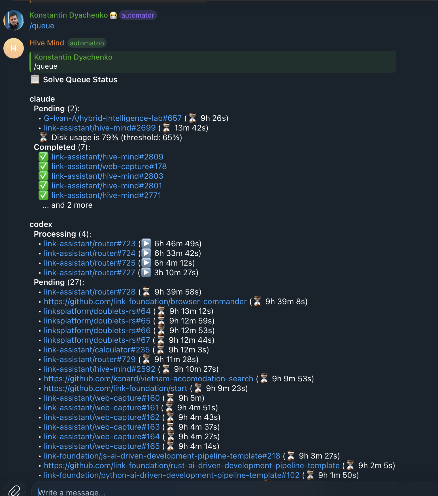
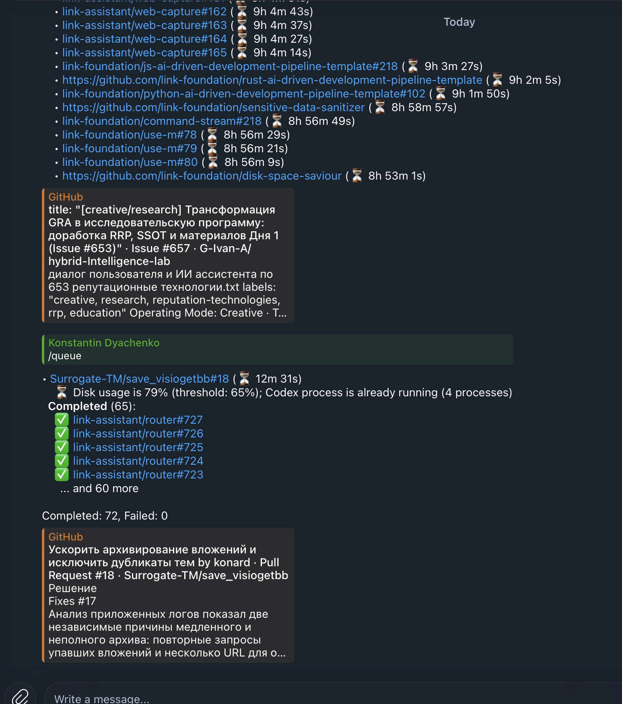

# Case study: `/queue` output is wrong (issue #2823)

- Issue: https://github.com/link-assistant/hive-mind/issues/2823
- Pull request: https://github.com/link-assistant/hive-mind/pull/2824
- Source log: `hive-telegram-bot.log.txt` (47 MB, 952,247 lines, bot pid 1233, 2026-10-07T21:10Z → 2026-10-09T06:30Z),
  published in a private log repository. Only short, redacted excerpts are kept here
  ([`data/log-excerpts.txt`](data/log-excerpts.txt)).

## The report

The reporter's `/queue` reply listed the same four tasks twice in the codex section (last reply in the log, 2026-10-09 06:28 UTC):

```
*Processing* (4):
  • link-assistant/router#723 (▶️ 6h 46m 49s)
  • link-assistant/router#724 (▶️ 6h 33m 42s)
  • link-assistant/router#725 (▶️ 6h 4m 12s)
  • link-assistant/router#727 (▶️ 3h 10m 27s)
...
*Completed* (65):
  ✅ link-assistant/router#727
  ✅ link-assistant/router#726
  ✅ link-assistant/router#725
  ✅ link-assistant/router#724
  ✅ link-assistant/router#723
    ... and 60 more

Completed: 72, Failed: 0
```

| Message 1 (title + Pending)                            | Message 2 (continuation)                                |
| ------------------------------------------------------ | ------------------------------------------------------- |
|  |  |

## Requirements

| #   | Requirement (from the issue)                                                            | Status                                             |
| --- | --------------------------------------------------------------------------------------- | -------------------------------------------------- |
| R1  | A task that is still running is not shown as completed (false positive)                 | Done                                               |
| R2  | Fix the other errors, false positives and false negatives visible in the log            | Done (RC2–RC4)                                     |
| R3  | Solve every `/queue` issue that is clearly visible in the screenshots and log           | Done (RC1–RC4)                                     |
| R4  | Collect logs and data in `docs/case-studies/issue-2823` with a deep case study analysis | This document                                      |
| R5  | Timeline, requirements, root causes, solutions, existing libraries and online research  | Below                                              |
| R6  | Add debug/verbose output where data is missing for the next investigation               | Done (`--verbose` lines in the queue)              |
| R7  | Report issues to other repositories if relevant                                         | Not needed: every root cause is in this repository |

## Timeline (UTC, from the log)

Reconstructed with [`experiments/issue-2823/extract-queue-timeline.mjs`](../../../experiments/issue-2823/extract-queue-timeline.mjs)
(output: [`data/queue-timeline.txt`](data/queue-timeline.txt)).

| Time                     | Event                                                                                                                                                                                       |
| ------------------------ | ------------------------------------------------------------------------------------------------------------------------------------------------------------------------------------------- |
| 2026-10-07 21:10:23      | Bot starts (pid 1233, docker isolation).                                                                                                                                                    |
| 2026-10-07 21:21:45      | `/solve hive-mind#2592` starts directly (not queued), session `33fb97ec…`.                                                                                                                  |
| 2026-10-07 21:23:55      | `33fb97ec…` ends with `exitCode: 1, status: failed`.                                                                                                                                        |
| 2026-10-07 21:27:16      | `/hive link-assistant/router` starts, session `6c330d49…` (not a queue item).                                                                                                               |
| 2026-10-07 21:22:24      | The first `/solve` items are enqueued in the codex queue (log line 1309 onward).                                                                                                            |
| 2026-10-08 02:30:01      | `6c330d49…` fails after 5h 2m (OOM event, not resumable).                                                                                                                                   |
| 2026-10-08 07:55:30      | First `/queue` reply in the log: `Completed: 28, Failed: 0`. **3** URLs are listed under both Processing (▶️) and Completed (✅).                                                           |
| 2026-10-08 08:13 → 15:46 | Eight more `/queue` replies; every one lists 2–4 running tasks under Completed as well.                                                                                                     |
| 2026-10-08 09:26:40      | Queued `/solve Godmy/stylist-svelte#3` launches as session `1e53e5b3…`.                                                                                                                     |
| 2026-10-08 10:38:11      | `1e53e5b3…` fails (`exitCode: 1`). The queue never learns about it: the 11:50, 13:53, 14:11 and 15:46 replies still say `Failed: 0` and count it in Completed.                              |
| 2026-10-08 13:22:14      | `/fix web-capture` (not a queue item) fails, session `05b20a82…`.                                                                                                                           |
| 2026-10-09 01:50:39      | Disk usage passes the 65% threshold; 506 "Cannot start: Disk usage is 7x%" lines follow, so pending items wait about 9h.                                                                    |
| 2026-10-09 05:26 → 06:28 | The status grows to about 4.8k characters. It is sent as two messages, and the second one starts with bare `• owner/repo#n (⏳ …)` rows and no tool or list header (the second screenshot). |
| 2026-10-09 06:28:00      | The reporter's reply: router#723/724/725/727 are both Processing and Completed. `Completed: 72, Failed: 0`.                                                                                 |

## Root causes

### RC1: "Completed" listed launched items, not finished ones (false positive, the reported bug)

`SolveQueue` keeps a separate queue per tool. When `executeItem` succeeds, the item gets the status `STARTED` and is pushed
to `this.completed`. `STARTED` only means the detached screen/docker session launched. The task itself runs for hours.
`formatToolSection` printed `this.completed` as **Completed** and the processing list (from the running-process
counters) as **Processing**, so every running queued task appeared in both lists. The summary line used
`this.completed.length`, so it also counted running tasks as completed.

### RC2: post-launch failures never reached the queue (false negative)

Session results are only known to `session-monitor.lib.mjs` (`completeSession` → `session_completed` event, and the
"❌ Work session failed" notification). Nothing reported them back to the queue, so a queued task that failed after
launch, such as `1e53e5b3…` above, stayed in Completed forever, and `Failed:` only counted launch failures.
Of the four failed sessions in the log, one was launched by the queue (`1e53e5b3…`). The other three came from a direct
`/solve`, `/hive` and `/fix`, which the queue does not track.

### RC3: long replies lost their context when split

`/queue` passed the whole status to `replyWithFallback`, which uses the generic `splitTelegramMessageText` (cut at a line
boundary under 4096 characters). The second message started in the middle of the codex Pending list. It had no
`*codex*` and no `*Pending*` header, so its rows could not be attributed to a tool or a list.

### RC4: bare repository URLs were not shortened

`formatQueueItemLink` only recognised issue and PR URLs, so queued repository-wide tasks (`/solve <repo>`) were printed as
raw `https://github.com/owner/repo` lines, unlike every other row.

### Context (not bugs in `/queue`)

- The ~9h stall came from the configured disk threshold (79–83% used vs the 65% limit), which `/queue` reported correctly.
- `/limits` logged an expired OAuth token and `rate_limit_error` responses. These are separate, account-side conditions.

## Solutions

| Root cause | Fix                                                                                                                                                                                                                                                                                                                                                                                                                                          | Code                                                                                                              |
| ---------- | -------------------------------------------------------------------------------------------------------------------------------------------------------------------------------------------------------------------------------------------------------------------------------------------------------------------------------------------------------------------------------------------------------------------------------------------- | ----------------------------------------------------------------------------------------------------------------- |
| RC1        | `partitionQueueHistory` hides launched items whose URL is still executing and has no recorded outcome. The summary is computed from the lists actually shown: `Pending: P, Processing: X, Completed: Y, Failed: Z`.                                                                                                                                                                                                                          | `src/telegram-solve-queue.helpers.lib.mjs`, `formatDetailedStatus`                                                |
| RC2        | `session-monitor` exposes `addSessionCompletionListener`. The bot registers `SolveQueue.recordSessionCompletion`, which matches the item by session name, then by the kill-recovery root session, then (for `solve` sessions only) by URL and tool. Failed or killed sessions move to **Failed** with `exit code N` or `SIGKILL (exit code 137)`. Completions superseded by a kill-recovery session are ignored until the recovery finishes. | `src/session-monitor.lib.mjs`, `src/telegram-solve-queue.lib.mjs`, `src/telegram-bot.mjs`                         |
| RC3        | `splitQueueStatusMessage` splits on lines, never leaves a dangling header at the end of a message, and starts each continuation with `*codex* (continued)` / `  *Pending* (17, continued):`. The "continued" marker is localized in en/ru/hi/zh.                                                                                                                                                                                             | `src/telegram-solve-queue-status-split.lib.mjs`, `src/telegram-solve-queue-command.lib.mjs`, `src/locales/*.lino` |
| RC4        | Repository URLs render as `[owner/repo](url)`.                                                                                                                                                                                                                                                                                                                                                                                               | `formatQueueItemLink`                                                                                             |
| R6         | With `--verbose`, the queue logs every recorded outcome, every unmatched or superseded completion, items hidden from or moved out of Completed per tool, and the number of chunks a reply was split into.                                                                                                                                                                                                                                    | same files                                                                                                        |

### Reproduction and verification

- `node experiments/issue-2823/queue-status-repro.mjs` builds the reporter's situation (four running router tasks, one
  failed after launch, a bare repository URL, a disk-blocked pending item) and prints the status.
  [`data/repro-before.txt`](data/repro-before.txt) shows the old output, with router#723–727 in both lists and `Failed: 0`.
  [`data/repro-after.txt`](data/repro-after.txt) shows the fixed output.
- `node tests/test-issue-2823-queue-status.mjs` has 49 assertions covering RC1–RC4, kill-recovery attribution, the
  `/hive` URL collision guard, the monitor → queue notification path and localized continuation headers.

## Existing libraries and online research

- **Telegram message splitting.** Several libraries split long messages:
  [`@gramio/split`](https://github.com/gramiojs/split) (also splits formatting entities),
  [`tgfancy`](https://github.com/GochoMugo/tgfancy) (adds `[01/10]` page prefixes) and
  [`Telegram.Bot.Messages`](https://www.nuget.org/packages/Telegram.Bot.Messages) for .NET.
  All of them work on generic text or entities. None knows that a row belongs to a tool or list header, which was the
  actual problem (RC3). The bot already has a tested generic splitter (`splitTelegramMessageText`), so the fix adds a
  small structure-aware layer on top of it and keeps the generic splitter as the fallback for oversized lines. Adding a
  dependency would not have helped.
- **Job state models.** Mature queues keep "running" and "finished" apart. For example, BullMQ separates `active`,
  `completed` and `failed` jobs, and `getJobCounts()` reports each state
  ([BullMQ getters](https://docs.bullmq.io/guide/jobs/getters),
  [QueueGetters API](https://api.docs.bullmq.io/classes/v5.Queue.html)). The queue here launches detached sessions and
  does not own their lifetime, so adopting BullMQ (and Redis) would be disproportionate. Instead, the fix applies the
  same model by feeding the session monitor's terminal state back into the queue items.

## Remaining limits

- Queue history lives in memory (as before). After a bot restart, the `Completed` and `Failed` lists start empty.
- `tests/test-telegram-solve-queue.mjs` (parked in the `needs-triage` suite) still fails with
  `status1.includes is not a function`, because it calls the async `formatStatus()` from a synchronous `runTest`. This
  predates the issue and fails the same way on `main`.
