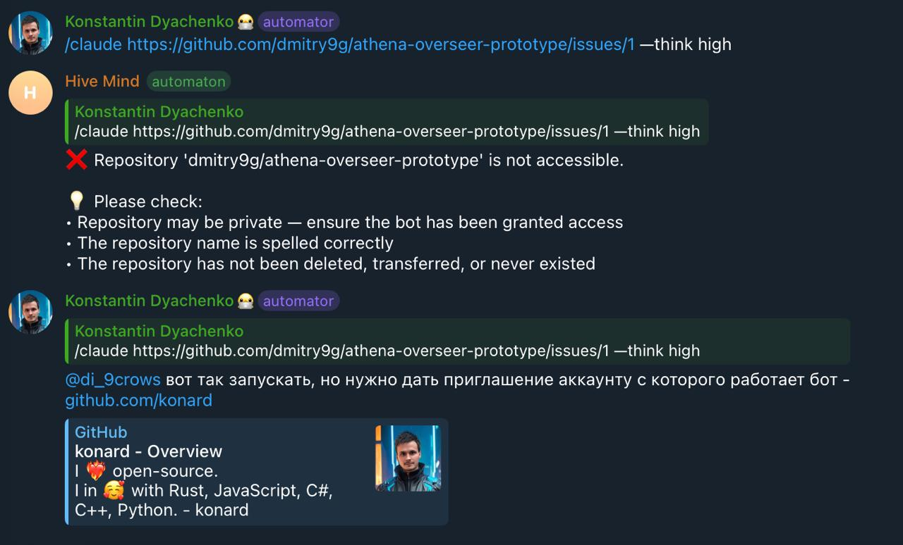

# Case study: issue #2998 — link GitHub Docs wherever GitHub settings are the fix

- Issue: https://github.com/link-assistant/hive-mind/issues/2998
- Pull request: https://github.com/link-assistant/hive-mind/pull/2999
- Evidence: [`experiments/issue-2998/`](../../../experiments/issue-2998/) (scripts and their saved output)

## 1. What happened



A user sent `/solve` for an issue in the private repository `dmitry9g/athena-overseer-prototype`. The bot replied:

```
❌ Repository 'dmitry9g/athena-overseer-prototype' is not accessible
Please check:
• Repository may be private — ensure the bot has been granted access
• The repository name is spelled correctly
• ...
```

A maintainer then had to explain in the chat, by hand and in Russian, that the GitHub account `konard` (the account Hive Mind runs as) must be invited to the repository. The bot's reply did not say:

1. which account to invite;
2. where in GitHub to do it, or what GitHub Docs says about it;
3. that the account needs write access, not just read access.

### Root cause

- `src/github-entity-validation.lib.mjs` (Telegram `/solve` pre-check) and `checkRepositoryWritePermission` in `src/github.lib.mjs` (CLI `solve`) both saw GitHub's `404 Not Found`. For a private repository GitHub returns 404 instead of 403 ([GitHub Docs: troubleshooting the REST API → 404 for an existing resource](https://docs.github.com/en/rest/using-the-rest-api/troubleshooting-the-rest-api#404-not-found-for-an-existing-resource)), so the code cannot distinguish "does not exist" from "you were not invited". It printed a generic checklist instead.
- Hive Mind never looked up its own login (`gh api user`), so it could not name the account to invite.
- No module mapped GitHub problems to GitHub Docs pages. Each message was handwritten, and the few that had links used hardcoded English URLs.
- The same gap existed for every other GitHub-side failure the bot reports: protected branches, rulesets, archived repositories, missing token scopes, rate limits, forking policy, maintainer edits, invitations, and so on.

`documentation_url` in GitHub's REST error JSON (visible in `experiments/issue-2998/check-write-permission-live.txt`: `{"message":"Not Found","documentation_url":"https://docs.github.com/rest/repos/repos#get-a-repository",...}`) does not solve this. It points to the **endpoint reference**, not to the page that explains how to fix access, and it is always English. We deliberately do not forward it.

## 2. Requirements

| #   | Requirement (from the issue)                                                                                   | Status | Where                                                       |
| --- | -------------------------------------------------------------------------------------------------------------- | ------ | ----------------------------------------------------------- |
| R1  | In the "not accessible" case, link `inviting-collaborators-to-a-personal-repository`                           | Done   | `github-access-guide.lib.mjs`, Telegram + CLI               |
| R2  | Use the user's language (`ru`, `en`, …)                                                                        | Done   | `github-docs-links.lib.mjs` locale resolution               |
| R3  | Link the related section of the page directly                                                                  | Done   | Every topic has a verified heading anchor                   |
| R4  | Ask for **write** permission                                                                                   | Done   | Guide names the Write role / collaborator push access       |
| R5  | Cover all relevant cases, not only invitations                                                                 | Done   | 24 topics + `github-error-docs.lib.mjs` error mapping       |
| R6  | In all places: CLI, GitHub comments, Telegram                                                                  | Done   | See §4 table                                                |
| R7  | GIF instructions made with link-foundation/browser-commander                                                   | Done   | `github-access-animation.lib.mjs`                           |
| R8  | GIFs committed to the docs for `github.com/konard`                                                             | Done   | `docs/assets/github-access/*.gif`, `docs/GITHUB-ACCESS*.md` |
| R9  | For other active accounts: generate once, reuse from the Hive Mind folder on the host                          | Done   | `~/.hive-mind/guides/github-access/` cache                  |
| R10 | Case study in `docs/case-studies/issue-2998` with online research, requirements, solutions, existing libraries | Done   | This file                                                   |
| R11 | Everything in one PR                                                                                           | Done   | PR #2999                                                    |

## 3. Online research

### 3.1 GitHub Docs: URLs, languages and anchors

- GitHub Docs is published in nine languages: `en, es, ja, pt, zh, ru, fr, ko, de` (language picker on docs.github.com). The path after the language segment is the same in every language. For example, `https://docs.github.com/ru/repositories/.../inviting-collaborators-to-a-personal-repository` is the Russian version of the English page linked in the issue.
- **Heading anchors are not translated.** The Russian page uses the English heading id `#inviting-a-collaborator-to-a-personal-repository` for the heading "Приглашение участника совместной работы в личный репозиторий". See [`anchors-ru.txt`](../../../experiments/issue-2998/anchors-ru.txt) and [`anchors-en.txt`](../../../experiments/issue-2998/anchors-en.txt), produced by [`list-docs-anchors.mjs`](../../../experiments/issue-2998/list-docs-anchors.mjs). So one anchor per topic works in every language.
- Telegram supplies `language_code` (IETF tags such as `ru`, `pt-br`, `zh-hans`). The CLI has `LANG`/`LC_ALL` (`ru_RU.UTF-8`). Hive Mind's own UI languages are `en/ru/zh/hi`. GitHub Docs has no Hindi, so `hi` falls back to English, while `de`, `es` and the other GitHub Docs languages are used even though Hive Mind's UI is not translated into them.
- Every topic in the catalogue was fetched in `en` and `ru` and checked to answer HTTP 200 and to contain its anchor: [`docs-links-online-check.txt`](../../../experiments/issue-2998/docs-links-online-check.txt) (56/56) and [`url-check.txt`](../../../experiments/issue-2998/url-check.txt). The online part of `tests/github-docs-links-2998.test.mjs` only runs with `HIVE_MIND_CHECK_DOCS_LINKS=1`, so CI does not depend on docs.github.com.

### 3.2 Which page fixes which situation

| Situation                                         | Who fixes it      | GitHub Docs page (anchor)                                                                                                |
| ------------------------------------------------- | ----------------- | ------------------------------------------------------------------------------------------------------------------------ |
| Private personal repo, bot not invited (404)      | Owner             | Inviting collaborators to a personal repository `#inviting-a-collaborator-to-a-personal-repository`                      |
| What a personal-repo collaborator can do          | Owner             | Permission levels for a personal account repository `#collaborator-access-for-a-repository-owned-by-a-personal-account`  |
| Private org repo, bot has no access               | Org admin         | Managing teams and people with access to your repository `#inviting-a-team-or-person`                                    |
| Org repo, bot has Read only                       | Repo admin        | Managing teams and people with access `#changing-permissions-for-a-team-or-person`, Repository roles for an organization |
| Pending org invitation                            | Bot account       | Inviting users to join your organization, Accessing an organization                                                      |
| Fork PR, maintainer cannot push                   | PR author         | Allowing changes to a pull request branch created from a fork                                                            |
| Forking disabled                                  | Owner / org admin | Managing the forking policy for your repository / organization                                                           |
| Token missing `repo`/`workflow` scope             | Bot operator      | Scopes for OAuth apps; Managing your personal access tokens                                                              |
| SAML SSO not authorized                           | Bot operator      | Authorizing a personal access token for use with single sign-on                                                          |
| `Resource not accessible by integration`          | Operator / owner  | Troubleshooting the REST API `#resource-not-accessible`                                                                  |
| Rate limit                                        | Wait / operator   | Rate limits for the REST API `#exceeding-the-rate-limit`                                                                 |
| Archived repository                               | Owner             | Archiving repositories                                                                                                   |
| `GH006` protected branch, required reviews/checks | Repo admin        | About protected branches                                                                                                 |
| `GH013` rulesets                                  | Repo admin        | About rulesets                                                                                                           |
| `GH013` + "GITHUB PUSH PROTECTION"                | Author            | About push protection                                                                                                    |
| `GH007` private email                             | Bot operator      | Blocking command line pushes that expose your personal email address                                                     |
| `GH001` large files                               | Author            | About large files on GitHub                                                                                              |
| Issues disabled                                   | Owner             | Disabling issues                                                                                                         |
| Actions disabled / CI did not run                 | Owner             | Managing GitHub Actions settings for a repository                                                                        |

### 3.3 GitHub's error messages (what we match on)

These texts were confirmed in GitHub Docs and in real-world reports:

- `remote: error: GH006: Protected branch update failed for refs/heads/main.` is the classic branch protection rejection ([LLVM Discourse report](https://discourse.llvm.org/t/unable-to-push-changes/57158)).
- `remote: error: GH013: Repository rule violations found for refs/heads/…` covers rulesets. **Secret scanning push protection uses GH013 too**, followed by `GITHUB PUSH PROTECTION` / `Push cannot contain secrets` ([GitHub Docs: push protection](https://docs.github.com/code-security/secret-scanning/push-protection-for-repositories-and-organizations), [dev.to write-up](https://dev.to/kkibet/github-push-protection-how-i-fixed-the-repository-rule-violations-error-50b8)). The ruleset rule therefore stays quiet when the push-protection phrases are present, so the user is not sent to the wrong settings page.
- `remote: error: GH007: Your push would publish a private email address.` is email privacy.
- `remote: error: GH001: Large files detected.` / `exceeds GitHub's file size limit of 100.00 MB` is the large-file limit.
- `refusing to allow an OAuth App to create or update workflow … without 'workflow' scope` means the token is missing the `workflow` scope ([dev.to: jessehouwing](https://dev.to/jessehouwing/can-t-push-to-github-refusing-to-allow-an-oauth-app-to-create-or-update-workflow-without-workflow-scope-1imc), [GitHub Docs: OAuth scopes](https://docs.github.com/en/apps/oauth-apps/building-oauth-apps/scopes-for-oauth-apps)).
- `This repository was archived so it is read-only.` means the repository is archived.
- `Resource protected by organization SAML enforcement` means the token needs SSO authorization.
- `API rate limit exceeded` / `You have exceeded a secondary rate limit` are rate limits.
- `Resource not accessible by integration` means a GitHub App or Actions token permission is missing.
- `remote: Permission to OWNER/REPO.git denied to LOGIN.` / `The requested URL returned error: 403` means the account has no push access.

The tests use these messages verbatim (`tests/github-error-docs-2998.test.mjs`).

### 3.4 Existing components and libraries considered

| Need                       | Options looked at                                                                                                          | Choice and reason                                                                                                                                                                                                                                                                                                                                                                    |
| -------------------------- | -------------------------------------------------------------------------------------------------------------------------- | ------------------------------------------------------------------------------------------------------------------------------------------------------------------------------------------------------------------------------------------------------------------------------------------------------------------------------------------------------------------------------------ |
| Map errors to docs         | REST `documentation_url`; `gh` CLI hints; an Octokit plugin                                                                | Our own small rule table (`github-error-docs.lib.mjs`). `documentation_url` points to endpoint references (§1), `gh` prints no docs for git push errors, and Octokit is not used here (Hive Mind shells out to `gh`/`git`).                                                                                                                                                          |
| Localized docs URLs        | GitHub Docs language segment; i18n libraries                                                                               | A language segment plus a fallback chain in `github-docs-links.lib.mjs`. GitHub Docs needs no translation tables, only a language code.                                                                                                                                                                                                                                              |
| UI text translation        | `lino-i18n` (already used: `src/locales/*.lino`)                                                                           | Reused: new keys in `en/ru/zh/hi`.                                                                                                                                                                                                                                                                                                                                                   |
| Screenshots + GIF encoding | **link-foundation/browser-commander** (required by the issue); Playwright `page.screenshot` + `gifenc`; `ffmpeg`; `gifski` | browser-commander `screenshot()` + `encodeAnimation({format:'gif', fps})` with Playwright's Chromium, already a Hive Mind dependency. `ffmpeg`/`gifski` would be new native binaries on every host.                                                                                                                                                                                  |
| Per-frame timing           | browser-commander takes **one** `fps` for all frames                                                                       | Frames are sampled at 10 fps and each one is encoded as only the rectangle that changed, with unchanged pixels transparent. The pieces are spliced into one GIF89a with per-frame delays (`src/gif-frames.lib.mjs`, `encodeDiffGif`), so pauses cost nothing. Checked by decoding in Chromium's `ImageDecoder` ([`decode-gif.mjs`](../../../experiments/issue-2998/decode-gif.mjs)). |
| Drawing the GitHub page    | Recording real github.com; static HTML mock                                                                                | Both (§4, review). The committed and host-rendered guides are an HTML replica of **Settings → Collaborators**, which needs no signed-in admin and cannot leak data. A separate recorder plays the same overlay on the real page for re-capture.                                                                                                                                      |
| Fonts for captions         | Bundling fonts; probing                                                                                                    | Probing (`GLYPH_PROBE`, [`glyph-probe.mjs`](../../../experiments/issue-2998/glyph-probe.mjs)): if the host has no font for the caption language (e.g. Devanagari), the captions fall back to English instead of showing tofu boxes.                                                                                                                                                  |
| Sending in Telegram        | `replyWithAnimation` with buffer or file                                                                                   | Telegraf `replyWithAnimation({ source: path })` through a new `safeReplyWithAnimation`. The text reply is sent first. The GIF follows without blocking it and is skipped silently if rendering is unavailable.                                                                                                                                                                       |

## 4. Solutions by requirement

### R1–R4: the "not accessible" reply (the screenshot case)

`src/github-access-guide.lib.mjs` builds the message from facts it looks up:

- The bot's login comes from `gh api user --jq .login`.
- The owner type comes from `gh api users/OWNER --jq .type`: personal repositories invite a collaborator (who always has push access), while organization repositories add a person with the **Write** role.
- The steps link `https://github.com/OWNER/REPO/settings/access` and the invitation page `https://github.com/OWNER/REPO/invitations`.
- Whether invitations are accepted automatically (`--auto-accept-invite`) decides the last step.
- GitHub Docs links are in the user's language and include the section anchor.

Example, live CLI output for a read-only repository ([`check-write-permission-live.txt`](../../../experiments/issue-2998/check-write-permission-live.txt)):

```
   Alternative: get write access to the repository itself
      🔑 To give Hive Mind access, a repository admin invites the GitHub account `konard` with write access:
      1. Open https://github.com/torvalds/linux/settings/access
      2. Click "Add people", find `konard` and click "Add konard to linux" (collaborators can push)
      3. Run the command again: Hive Mind accepts the invitation automatically
      📖 GitHub Docs, inviting a collaborator to a personal repository: https://docs.github.com/en/...#inviting-a-collaborator-to-a-personal-repository
      📖 GitHub Docs, what write access allows: https://docs.github.com/en/...#collaborator-access-for-a-repository-owned-by-a-personal-account
      🎞 Step-by-step guide with an animation: https://github.com/link-assistant/hive-mind/blob/main/docs/GITHUB-ACCESS.md
```

In Telegram, the same message is sent in the chat user's language (`ctx.from.language_code`), followed by the GIF.

### R5–R6: every other case, everywhere

`src/github-docs-links.lib.mjs` is the single catalogue of 24 topics (title, path, anchor). `src/github-error-docs.lib.mjs` maps GitHub error output (§3.3) to topics. Each place that reports a GitHub-side failure now adds `📖 Title: URL` lines:

| Place                                                   | Surface                                   | Topics                                                                                |
| ------------------------------------------------------- | ----------------------------------------- | ------------------------------------------------------------------------------------- |
| `github-entity-validation.lib.mjs` → `telegram-bot.mjs` | Telegram `/solve`                         | access guide + GIF                                                                    |
| `github.lib.mjs` `checkRepositoryWritePermission`       | CLI                                       | access guide (404 and read-only)                                                      |
| `github.lib.mjs` `requestMaintainerAccess`              | GitHub PR comment                         | allowMaintainerEdits                                                                  |
| `github.lib.mjs` token scope check                      | CLI                                       | tokenScopes                                                                           |
| `solve.repository.lib.mjs`                              | CLI (404 while cloning, clone rate limit) | organizationRepositoryAccess, inviteCollaborator, collaboratorPermissions, rateLimits |
| `solve.fork-detection.lib.mjs`                          | CLI                                       | forking policies, org access, allowMaintainerEdits                                    |
| `solve.fork-sync.lib.mjs`                               | CLI                                       | protectedBranches + error mapping                                                     |
| `solve.auto-pr.lib.mjs`                                 | CLI (push failures)                       | archivedRepository, access guide on "permission denied", error mapping                |
| `solve.accept-invite.lib.mjs`                           | CLI / Telegram `/accept_invites`          | manual acceptance URLs, acceptOrganizationInvitation                                  |
| `merge-error-classification.lib.mjs`                    | merge queue, `/merge`, auto-merge         | `See: …` appended to each resolution                                                  |
| `automation-stop-reporting.lib.mjs`                     | GitHub "automation stopped" comment       | **GitHub Docs:** section, without repeating links already in the details              |
| `solve.pre-pr-failure-notifier.lib.mjs`                 | GitHub "solution draft failed" comment    | `### GitHub Docs` section                                                             |
| `telegram-merge-command.lib.mjs`                        | Telegram `/merge` without permission      | changeRepositoryRole (user's language)                                                |
| `github-rate-limit.lib.mjs`, `log-upload.lib.mjs`       | CLI                                       | rateLimits, error mapping                                                             |
| `solve.auto-merge.lib.mjs`                              | GitHub comment when CI never ran          | actionsSettings                                                                       |

Language: Telegram uses the chat user's `language_code`. The CLI uses the POSIX locale (`LC_ALL`, `LC_MESSAGES`, `LANG`, `LANGUAGE`), then English, like the CLI's own UI text (`setDefaultGitHubDocsLocale` overrides it). GitHub comments use the process default, because the comment reader's language is unknown.

### R7–R9: GIF guides

- `src/github-access-animation.lib.mjs` renders the frames: open **Settings → Collaborators**, click **Add people**, type the login, pick the **Write** role (organizations), then **Add … to REPO**. The real account login is typed into the mock and captions are in the user's language.
- Committed examples for `konard`: `docs/assets/github-access/{personal,organization}-konard-en.gif` and `personal-konard-{ru,zh,hi}.gif`, embedded in `docs/GITHUB-ACCESS.md` and its `.ru/.zh/.hi` translations.
- Other accounts: the first request renders the GIF into `~/.hive-mind/guides/github-access/<kind>-<login>-<locale>.gif` (override with `HIVE_MIND_GUIDES_DIR`). It is written atomically through a temporary file plus rename, and later requests reuse the file ([`telegram-animation-e2e.mjs`](../../../experiments/issue-2998/telegram-animation-e2e.mjs) times the first and the cached request). A failed render is not retried for an hour (`ACCESS_ANIMATION_RETRY_MS`), so a host without Chromium does not pay the cost on every request.
- Regenerate by hand: `node src/github-access-animation.lib.mjs --login LOGIN --locale ru [--owner-type Organization] [--output file.gif|file.svg]`.

### Review on PR #2999: "does not look like the real deal"

> Animated instructions does not look like the real deal, that must be fixed, at least we can make them more similar if we cannot access GitHub UI directly for now, yet we must have a script to be able to make a recording with similar nice animation that should be applied on top of real GitHub page, so later we will recapture it. At the moment we can make more similar SVG animation, if it is not SVG animation we can make it so. And also render GIF animation.

This asks for four things, each answered below.

**1. A closer replica.** The first version was a simplified sketch drawn per frame. `src/github-access-scene.lib.mjs` now builds one replica of the dark settings page:

- the header with the repository name and tabs;
- the settings sidebar with **Collaborators** (personal) or **Collaborators and teams** (organization);
- the "Manage access" box;
- the **Add people** dialog with a search field, a suggestion row with an identicon, the role list (organizations) and the green **Add … to REPO** button;
- the "Pending invite" row.

It uses Primer's dark colours and real Octicons paths (`src/github-octicons.lib.mjs`, extracted with [`extract-octicons.mjs`](../../../experiments/issue-2998/extract-octicons.mjs)). A GitHub-style cursor glides between targets, with a focus ring and a click ripple. The login is typed one character at a time, and a caption bar shows each step in the user's language.

**2. An animated SVG.** The whole timeline is CSS keyframes in one XHTML scene, wrapped in `<foreignObject>`, so `buildAccessAnimationSvg` produces a self-contained SVG of about 50–57 KB that plays in an `` tag ([`svg-as-image.mjs`](../../../experiments/issue-2998/svg-as-image.mjs) checks a mid-animation frame). The docs now embed the localized SVGs: `docs/assets/github-access/{personal,organization}-konard-{en,ru,zh,hi}.svg`.

**3. A GIF render of the same scene.** The GIF is no longer drawn separately. `renderAccessAnimation` loads the same scene in Chromium, pauses every animation (`document.getAnimations()`), seeks it to each 100 ms sample and takes a browser-commander screenshot. Each frame keeps only the changed rectangle (`encodeDiffGif`).

The first renders showed a faint tint and ghost blobs on GitHub's dark greys. Root cause: browser-commander 0.28.0 quantizes each frame with gifenc in `rgba4444` mode, i.e. 4 bits per channel (`src/capture/encoding.js`):

```js
const colors = Array.isArray(palette) ? palette : quantize(frame.data, palette, { format: 'rgba4444' });
const pixels = dither ? ditherPalette(frame, colors) : applyPalette(frame.data, colors, 'rgba4444');
```

At 4 bits per channel, `#0d1117`, `#010409` and `#151b23` collapse together, and about 300k pixels of a frame ended up 8–16 levels off ([`png-diff.mjs`](../../../experiments/issue-2998/png-diff.mjs) on frames from [`gif-to-png.mjs`](../../../experiments/issue-2998/gif-to-png.mjs)). The fix is in `src/gif-frames.lib.mjs`:

- build our own palette (`buildPalette`): every exact colour when a piece has ≤256, otherwise a full-precision median cut;
- snap the piece to that palette (`snapToPalette`);
- pass the palette array with `dither: true`. browser-commander's `ditherPalette` then does a full-precision nearest-colour lookup, and there is no error left to diffuse.

After the fix, the same frame has about 7k pixels off by ≥8, all in pieces with more than 256 colours (anti-aliased text over the dialog shadow). The GIFs are 370–445 KB. The cost is render time: ~90 s per GIF instead of ~30 s, mostly in `ditherPalette`. That is acceptable because each account/owner type/language is rendered once, off the reply path, and then cached.

**4. A recorder for the real page.** `scripts/record-github-access-guide.mjs` (logic in `scripts/record-github-access-guide.lib.mjs`):

- opens `https://github.com/OWNER/REPO/settings/access` in a signed-in Chromium profile;
- finds each control by its accessible role and label (`getRecorderSteps`);
- moves the same cursor, ring, ripple and caption overlay (`OVERLAY_CSS`, `CURSOR_SVG` from the scene) over it;
- performs the real clicks and typing;
- encodes the screenshots with the same diff GIF encoder.

The context uses `bypassCSP` because GitHub's Content Security Policy would otherwise block the injected overlay. The overlay is reinstalled if GitHub's Turbo navigation removes it. **Add … to REPO** is only clicked with `--send-invite`, so a recording does not invite anyone by accident.

`--mock` runs the recorder against a local page with the same roles and labels. The end-to-end check on that page produced 169 screenshots → 91 GIF frames, 174 KB. The recorder could not be run against github.com here, because this environment has no signed-in admin session.

## 5. Tests

| Test                                                       | What it proves                                                                                                                                                                                      |
| ---------------------------------------------------------- | --------------------------------------------------------------------------------------------------------------------------------------------------------------------------------------------------- |
| `tests/github-docs-links-2998.test.mjs`                    | Catalogue: the issue's page and anchor, locale resolution and fallback, and that every topic has an anchor (online check behind `HIVE_MIND_CHECK_DOCS_LINKS=1`)                                     |
| `tests/github-access-guide-2998.test.mjs`                  | Telegram/entity-validation message names the account, uses Write, and is localized                                                                                                                  |
| `tests/github-write-permission-guide-2998.test.mjs`        | Real `checkRepositoryWritePermission` with a fake `gh` on `PATH`: 404, read-only org repo and read-only personal repo                                                                               |
| `tests/github-access-animation-2998.test.mjs`              | Sampling and seeking of the scene, diff frames and delays, SVG output, host cache reuse, retry back-off, Telegram reply, committed SVG/GIF assets (size, frame count, duration)                     |
| `tests/github-access-scene-2998.test.mjs`                  | Replica text and click order for both owner types, captions in 4 languages, SVG escaping, palette building and snapping (no 4-bit merging of GitHub greys), GIF splicing                            |
| `tests/github-access-recorder-2998.test.mjs`               | Recorder on a fake page: selectors per step, real clicks and typing, no invitation without `--send-invite`, overlay frames, errors that name the step, escaped mock page                            |
| `tests/github-error-docs-2998.test.mjs`                    | GitHub messages → docs, merge resolutions, both GitHub comment types, CLI wiring                                                                                                                    |
| `tests/installation-token-access-2324.test.mjs` (existing) | Caught a regression during this work: if building the guide threw, the outer `catch` turned "no write access" into "continue anyway". The guide is now wrapped so it can never change the decision. |

## 6. Remaining limits

- GitHub may move or rename docs pages. The catalogue is one file, and the online test (`HIVE_MIND_CHECK_DOCS_LINKS=1 node tests/github-docs-links-2998.test.mjs`) re-checks every URL and anchor.
- A 404 cannot tell "private" from "does not exist". The message keeps the spelling check and adds the access steps rather than guessing.
- The committed guides are a replica, not a recording, so they can drift visually from github.com. The steps and the labels (**Add people**, **Write**) match the current docs. Re-capture with `scripts/record-github-access-guide.mjs` once a signed-in admin session is available.
- The recorder's selectors (the dialog's search field placeholder, the suggestion option, the **Write** radio, the **Add … to REPO** button) follow GitHub's current accessible names but were only exercised against the mock page. If GitHub labels differ, the script stops with the step name and the selectors it tried; they are listed in one place (`getRecorderSteps`). A sudo "Confirm access" prompt has to be completed by hand in `--headed` mode.
- Animated SVG in `` relies on `<foreignObject>` and CSS animations. Chromium and Firefox render it, and each doc links the GIF as well, for viewers that do not.
- Frames with more than 256 colours still lose a little precision (a median-cut palette), and a GIF render takes ~90 s.
